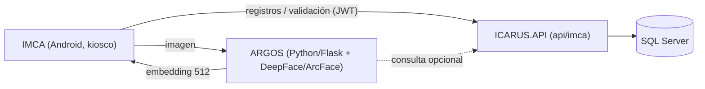

# 01 — Arquitectura de ARGOS

**Última actualización:** 2026-07-02 — validado contra código fuente
**Repositorio:** `dev/ARGOS` · Python 3.9/3.11 · Flask
**Puerto:** 5000 · **Modelo:** ArcFace (vía DeepFace)

---

## 1. Posición en la arquitectura



- IMCA captura el rostro y obtiene el embedding desde ARGOS.
- El embedding se compara con los `DatosBiometricos` almacenados y se registra el `RegistroAcceso`
  vía `IMCAController` (`api/imca/biometria/*`, `api/imca/registros/*`), en el repositorio `ICARUS`.
- ARGOS conoce la URL de la API mediante la variable de entorno `ICARUS_API_URL` (por defecto `http://localhost:5090`;
  en Docker de producción, `http://icarus-api:5090` sobre la red `trajano-shared-network`).

---

## 2. Stack y dependencias (`requirements.txt`)

| Categoría | Paquetes |
|-----------|----------|
| Web | `Flask >= 2.2.3`, `flask-cors >= 4.0.0` |
| Reconocimiento facial | `deepface >= 0.0.79`, `tf-keras >= 2.15.0` (modelo **ArcFace**) |
| Procesamiento de imagen | `opencv-python >= 4.8.0`, `numpy >= 1.24.0`, `pillow >= 10.0.0` |
| Cliente HTTP | `requests >= 2.28.0` |
| Utilidades | `python-dotenv >= 1.0.0` |
| Producción | `gunicorn` (instalado en el `Dockerfile`, no está en `requirements.txt`) |

---

## 3. Estructura del proyecto (raíz del repo `dev/ARGOS`)

```
ARGOS/                          (repo raíz)
├── ARGOS/
│   ├── __init__.py             # configuración Flask + DeepFace (define app y MODEL_NAME)
│   ├── views.py                # endpoints REST
│   ├── logger.py                # logging
│   ├── api_client.py            # cliente HTTP hacia ICARUS.API
│   ├── static/ · templates/
├── runserver.py                 # arranque: precarga el modelo ArcFace y levanta Flask
├── benchmark_lfw.py              # benchmark de precisión (dataset LFW)
├── requirements.txt
├── Dockerfile
├── deploy.sh                    # despliegue manual a VPS (venv + gunicorn)
├── deploy-production.sh          # despliegue manual a VPS (Docker)
├── .env.production               # variables de entorno para el contenedor de producción
├── .github/workflows/deploy-argos.yml  # CI/CD: build + deploy a VPS en push a main/master
└── README.md
```

> Antes del 2026-07-02 esta carpeta vivía en `ICARUS/MICROSERVICIOS/ARGOS/`. Las rutas de este documento
> ya reflejan la raíz del repositorio independiente `dev/ARGOS`.

---

## 4. Arranque

`runserver.py`:
- Precarga el modelo **ArcFace** al inicio (`DeepFace.build_model(MODEL_NAME)`).
- Lee variables de entorno: `SERVER_HOST` (def. `0.0.0.0`), `SERVER_PORT` (def. `5000`),
  `ICARUS_API_URL` (def. `http://localhost:5090`).

```bash
pip install -r requirements.txt
python runserver.py
# o con Docker:
docker build -t argos . && docker run -p 5000:5000 -e ICARUS_API_URL=http://host:5090 argos
```

### Despliegue a producción

- **CI/CD:** `.github/workflows/deploy-argos.yml` se dispara en cada push a `main`/`master` (o manualmente
  vía `workflow_dispatch`); construye la imagen Docker en el VPS y la levanta unida a la red externa
  `trajano-shared-network`, con `--env-file .env.production`.
- **Manual:** `deploy.sh` (instalación directa con venv + gunicorn) o `deploy-production.sh` (build y
  despliegue vía Docker desde la máquina local hacia el VPS por SSH/rsync).

---

## 5. Notas para agentes

- ARGOS es independiente del código .NET; vive en su propio repositorio (`dev/ARGOS`) y los contratos de
  integración están documentados también en `ICARUS.API/Controllers/Mobile/IMCAController.cs` (rutas
  `api/imca/biometria/*`), en el repositorio `ICARUS`.
- El embedding es un vector de **512 floats**; se persiste en la entidad `DatosBiometricos` (repo `ICARUS`).
- La comparación de identidad usa similitud (umbral configurable, `VERIFICATION_THRESHOLD` en
  `.env.production`). Revisa `ARGOS/views.py` para los endpoints exactos.
- Para tocar el contrato HTTP entre ARGOS e ICARUS.API hay que coordinar cambios en **dos repositorios**
  distintos (`dev/ARGOS` y `dev/ICARUS`).
