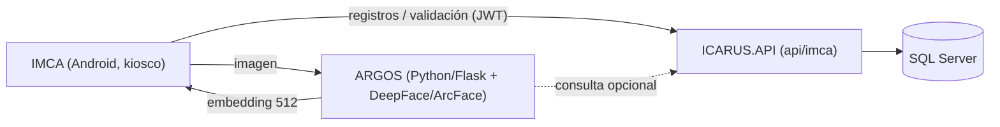

# ARGOS — Microservicio de Reconocimiento Facial

**Última actualización:** 2026-07-02 — validado contra código fuente
**Repositorio:** `dev/ARGOS` (independiente, hermano de `ICARUS`, `ICARUS_MOBILE` e `IMCA`)
**Stack:** Python 3.9/3.11 · Flask · DeepFace (ArcFace)

ARGOS es el microservicio de **reconocimiento facial** del ecosistema ICARUS. Identifica personas a partir
de su rostro generando **embeddings de 512 floats** con el modelo **ArcFace** (librería **DeepFace**).
Da soporte al módulo de Control de Acceso (kioscos **IMCA**).

> Nombre: ARGOS, en referencia al gigante de cien ojos de la mitología griega.

> **Historial:** hasta el 2026-07-02, ARGOS vivía dentro del repositorio de `ICARUS`, en
> `MICROSERVICIOS/ARGOS/`, registrado como proyecto Python (`ARGOS.pyproj`) dentro de `ICARUS.slnx`
> únicamente para agrupación visual en Visual Studio. Se extrajo a un repositorio propio porque su
> integración con `ICARUS.API` siempre fue exclusivamente vía HTTP/REST (sin acoplamiento de
> compilación), y mezclar un proyecto Python dentro de una solución .NET complicaba la
> containerización del entorno de desarrollo.

---

## Índice

| Documento | Contenido |
|-----------|-----------|
| [01-ARQUITECTURA.md](01-ARQUITECTURA.md) | Posición en la arquitectura, stack, estructura de carpetas, arranque, notas para agentes |

---

## Relación con el ecosistema



- **IMCA** captura el rostro y obtiene el embedding desde ARGOS.
- El embedding se compara con los `DatosBiometricos` almacenados y se registra el `RegistroAcceso`
  vía `IMCAController` (`api/imca/biometria/*`, `api/imca/registros/*`) en el repo `ICARUS`.
- ARGOS conoce la URL de la API mediante la variable de entorno `ICARUS_API_URL`.
- En producción, ARGOS e ICARUS.API se comunican por la red Docker externa `trajano-shared-network`
  (no comparten repositorio ni pipeline de despliegue).

---

## Cómo compilar y ejecutar

```bash
# Local, sin Docker
pip install -r requirements.txt
python runserver.py      # http://0.0.0.0:5000 ; precarga el modelo ArcFace

# Con Docker
docker build -t argos . && docker run -p 5000:5000 -e ICARUS_API_URL=http://host:5090 argos
```
