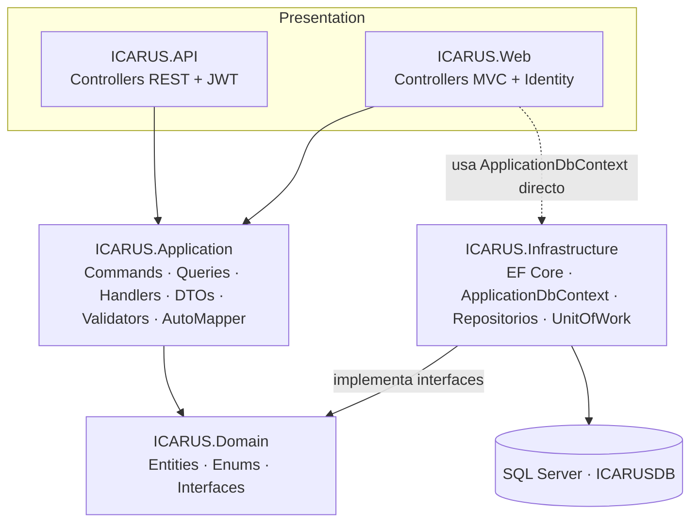

# ICARUS — Resumen Ejecutivo de Arquitectura

**Última actualización:** 2026-07-02 — validado contra código fuente
**Tecnología backend:** .NET 10 / ASP.NET Core 10 · EF Core 10 · SQL Server
**App móvil:** .NET MAUI (ICARUS_MOBILE — repositorio aparte)
**Microservicio facial:** Python 3.9 + Flask + DeepFace/ArcFace (ARGOS — repositorio aparte, `dev/ARGOS`)

---

## 1. Visión general

ICARUS es una plataforma de gestión empresarial **modular y multi-tenant** construida con
**Clean Architecture**. Componentes:

- **ICARUS.API** — Web API REST con JWT (consumida por las apps móviles y los kioscos biométricos).
- **ICARUS.Web** — ASP.NET Core MVC (Razor + Bootstrap + ASP.NET Identity) para administración y gestión.
- **ICARUS_MOBILE** — apps .NET MAUI: **IMGA** (gestión avícola) e **IMCA** (control de acceso).
- **ARGOS** — microservicio Python de reconocimiento facial. **Repositorio independiente** (`dev/ARGOS`),
  se comunica con `ICARUS.API` únicamente por HTTP/REST. Ver [`../ARGOS/`](../ARGOS/README.md).

---

## 2. Diagrama de capas (Clean Architecture)

**Regla de oro:** las capas internas (Domain) no dependen de las externas. Infrastructure implementa las
interfaces declaradas en Domain. (Variante pragmática: `ICARUS.Web` accede a `ApplicationDbContext`
directamente además de a través de MediatR.)

---

## 3. Stack técnico real

| Capa / Proyecto | Tecnologías y versiones |
|-----------------|-------------------------|
| `ICARUS.Domain` | C# / .NET 10, sin dependencias externas |
| `ICARUS.Application` | MediatR **12.5.0**, AutoMapper **12.0.1**, FluentValidation **12.0.0**, ClosedXML 0.105.0, SixLabors.ImageSharp 3.1.12, log4net 3.1.0 |
| `ICARUS.Infrastructure` | EF Core **10.0.0** (`Microsoft.EntityFrameworkCore.SqlServer`), Identity.EntityFrameworkCore 10.0.0, log4net 3.1.0 |
| `ICARUS.API` | ASP.NET Core 10, `JwtBearer` 10.0.0, `System.IdentityModel.Tokens.Jwt` 8.1.0, Swashbuckle **8.0.0** |
| `ICARUS.Web` | ASP.NET Core MVC 10, Razor, Bootstrap 5, jQuery, Identity.UI 10.0.0, ClosedXML |
| Tests | xUnit 2.9.3, Moq 4.20.72, FluentAssertions 8.8.0, Testcontainers.MsSql 4.4.0, EF InMemory 10.0.0 |
| `ARGOS` | Python 3.9, Flask, flask-cors, DeepFace (ArcFace), tf-keras, opencv-python, numpy, pillow |

---

## 4. Módulos funcionales

### 4.1. Gestión Avícola (`Entities/GestionAvicola/`, 24 archivos)

- **Producción**: `GestorAvicola` (granja) → `Galpon` → `RegistroProduccionDiario`, `RegistroMortalidad`.
- **Cronogramas y tareas**: `ProgramaVacunacion`/`CronogramaVacunacion`, `CronogramaIluminacion`,
  `CronogramaAlimentacion`, y sus tareas por galpón `GalponTareaVacunacion/Iluminacion/Alimentacion`.
- **Comercial / Contabilidad** (subdominio): `DespachoHuevo` + `DetalleDespachoHuevo`,
  `PedidoAlimento` + `DetallePedidoAlimento`, `PrecioHuevo`, `PrecioAlimento`,
  `PublicacionPrecioHuevo`, `PublicacionPrecioAlimento`, `BalanceCuenta`, `GestorCiclo`.

### 4.2. Control de Acceso (`Entities/ControlAcceso/`, 9 archivos)

`TrabajadorAcceso`, `RegistroAcceso`, `DatosBiometricos` (huella + embedding facial), `ZonaAcceso`,
`NotificacionAcceso`, `AlertaSeguridad`, `PoliticaAcceso`, `PoliticaZona`, **`Dispositivo`** (kiosco/terminal).

### 4.3. Core / compartido (`Entities/` raíz)

`Cliente`, `Trabajador`, `Modulo`, `ClienteModulo`, `TrabajadorModulo`, `UserModulo`, `RefreshToken`,
`MobileAppVersion`.

---

## 5. Autenticación

| Aplicación | Mecanismo |
|------------|-----------|
| **ICARUS.API** | JWT Bearer. `appsettings` sección `JwtSettings` (Issuer `ICARUS.API`, Audience `ICARUS_MOBIL`, expiración 12 h, refresh 30 días). Login en `api/mobile/auth/login` e `api/imca/auth/login`. |
| **ICARUS.Web** | ASP.NET Identity (cookies). `AddDefaultIdentity<IdentityUser>` + `AddRoles<IdentityRole>`. También configura JwtBearer para escenarios mixtos. |
| **ICARUS_MOBILE** | JWT consumido desde la API; token en `SecureStorage`. |

---

## 6. Patrones implementados

- **Clean Architecture** (4 capas + tests).
- **CQRS con MediatR**: `IRequest` / `IRequestHandler`, `IMediator.Send(...)`.
- **Repository + Unit of Work**: interfaces en `Domain/Interfaces`, implementación en `Infrastructure/Repositories`.
- **OperationResult\<T\>**: wrapper uniforme de éxito/error.
- **Pipeline behavior**: `ValidationBehavior` (FluentValidation) en el pipeline de MediatR.
- **Soft delete + audit trail** en `BaseEntity` + `ApplicationDbContext`.

---

## 7. Base de datos

- **Motor:** SQL Server (dev: contenedor `mcr.microsoft.com/mssql/server:2022-latest`, puerto 1433).
- **Base:** `ICARUSDB`.
- **Enfoque:** Code-First, EF Core 10, **una sola migración consolidada** (`InitialCreate`).
- **DbContext:** `ICARUS.Infrastructure/Data/ApplicationDbContext.cs` (40 propiedades `DbSet<>` para 37 entidades, hereda de `IdentityDbContext`).

---

## 8. Mapa de código (alto nivel)

| Concepto | Ruta |
|----------|------|
| Entidades de dominio | `ICARUS.Domain/Entities/` |
| Interfaces de repositorio | `ICARUS.Domain/Interfaces/` |
| Commands / Queries / Handlers | `ICARUS.Application/Features/<Modulo>/` |
| Behavior de validación | `ICARUS.Application/Behaviors/ValidationBehavior.cs` |
| DbContext y repositorios | `ICARUS.Infrastructure/Data/`, `ICARUS.Infrastructure/Repositories/` |
| Controllers REST | `ICARUS.API/Controllers/` |
| Arranque API | `ICARUS.API/Program.cs` |
| Controllers/Areas MVC | `ICARUS.Web/Controllers/`, `ICARUS.Web/Areas/` |
| Arranque Web | `ICARUS.Web/Program.cs` |
| Microservicio facial | Repositorio independiente `dev/ARGOS` (ver [`../ARGOS/`](../ARGOS/README.md)) |

Siguiente: **01-DOMAIN-ENTIDADES.md**.
