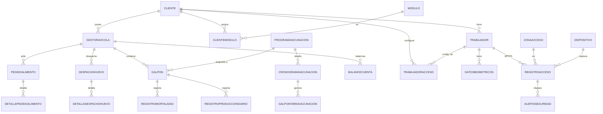

# 01 — ICARUS.Domain (Entidades, Enums, Interfaces)

**Última actualización:** 2026-06-29 — validado contra código fuente
**Capa:** `ICARUS.Domain` · **Dependencias externas:** ninguna

El Domain contiene el modelo de negocio puro: **42 archivos de entidad**, **17 enums** y **34 interfaces**
de repositorio/servicio. No referencia EF Core ni ASP.NET.

---

## 1. Estructura de carpetas

```
ICARUS.Domain/
├── Entities/
│   ├── BaseEntity.cs
│   ├── Cliente.cs · Trabajador.cs · Modulo.cs
│   ├── ClienteModulo.cs · TrabajadorModulo.cs · UserModulo.cs
│   ├── RefreshToken.cs · MobileAppVersion.cs
│   ├── GestionAvicola/   (24 archivos: producción, cronogramas, contabilidad/comercial)
│   └── ControlAcceso/    (9 archivos)
├── Enums/                (17 archivos)
├── Interfaces/           (34: IGenericRepository, IUnitOfWork, repos por módulo, servicios)
├── Constants/            (AuthRoles.cs, SystemRoles.cs)
└── Extensions/           (TipoAlimentoExtensions.cs, CategoriaAlimentoExtensions.cs)
```

---

## 2. Entidad base

`ICARUS.Domain/Entities/BaseEntity.cs`:

```csharp
public abstract class BaseEntity
{
    public int Id { get; set; }
    public DateTime FechaCreacion { get; set; }
    public DateTime? FechaModificacion { get; set; }
    public string? CreadoPor { get; set; }
    public string? ModificadoPor { get; set; }
    public bool EstaActivo { get; set; } = true;   // soft delete
}
```

Todas las entidades de negocio heredan de `BaseEntity`. El audit trail (`FechaCreacion`/`FechaModificacion`)
lo rellena `ApplicationDbContext.SaveChangesAsync`.

---

## 3. Entidades core / compartidas (`Entities/` raíz)

| Entidad | Propiedades clave (reales) |
|---------|----------------------------|
| `Cliente` | `RazonSocial`, `NombreComercial?`, `NIT?`, `Email`, `Telefono?`, `Direccion?`, `Ciudad?`, `Provincia?`, `EstadoCliente`, `UserId?` (FK a IdentityUser); colecciones de Trabajadores, ClienteModulos, ZonasAcceso, etc. |
| `Trabajador` | `Nombre`, `ApellidoPaterno`, `ApellidoMaterno?`, `Email`, `NumeroDocumento?`, `FotoUrl?`, `FechaIngreso`, `Estado` (`EstadoTrabajador`), `IdentityUserId?`, `IsActiveForLogin`, `ClienteId?` |
| `Modulo` | `Nombre`, `Descripcion`, `Tipo` (`ModuloTipo`), `Version`, `Precio`, `RequiereConfiguracion` |
| `ClienteModulo` / `TrabajadorModulo` / `UserModulo` | tablas de relación N:N (Cliente/Trabajador/Usuario ↔ Modulo) |
| `RefreshToken` | token de refresco JWT por trabajador |
| `MobileAppVersion` | control de versión mínima de las apps móviles (`api/mobile/check-version`) |

---

## 4. Módulo Gestión Avícola (`Entities/GestionAvicola/`)

### 4.1. Producción

| Entidad | Propiedades clave |
|---------|-------------------|
| `GestorAvicola` | granja: pertenece a un `Cliente`; contiene `Galpon`es |
| `Galpon` | `GestorAvicolaId`, `Numero`, `CapacidadMaxima`, `GallinasActuales`, `FechaNacimiento`, `Descripcion?`, `ProgramaVacunacionId?` |
| `RegistroProduccionDiario` | `Fecha`, `ClienteId`, `GalponId`, `NumeroRegistro`, `HoraRegistro`, `CantidadMaples`, `UnidadesIncompletas`, `GallinasMuertas`, `PorcentajeMortalidad`, `EficienciaProduccion`, `Observaciones?` |
| `RegistroMortalidad` | bajas de gallinas por galpón |
| `EstadisticasMortalidadGalpon` | proyección de estadísticas de mortalidad |
| `TipoReporte` | catálogo de tipos de reporte |

> Convención de huevos: 1 maple = 30 unidades. El total de huevos se calcula como
> `CantidadMaples * 30 + UnidadesIncompletas`.

### 4.2. Cronogramas y tareas

| Entidad | Descripción |
|---------|-------------|
| `ProgramaVacunacion` | programa maestro de vacunación (estado: `EstadoProgramaVacunacion`) |
| `CronogramaVacunacion` | detalle de cada vacuna del programa |
| `CronogramaIluminacion` | plan de iluminación |
| `CronogramaAlimentacion` | plan de alimentación |
| `GalponTareaVacunacion` | tarea por galpón (estado: `EstadoTarea` = Pendiente/Completada) |
| `GalponTareaIluminacion` | tarea de iluminación por galpón |
| `GalponTareaAlimentacion` | tarea de alimentación por galpón |

### 4.3. Subdominio Comercial / Contabilidad avícola

| Entidad | Propiedades clave |
|---------|-------------------|
| `DespachoHuevo` | `GestorAvicolaId`, `ClienteId`, `FechaDespacho`, `TotalAmarres`, `TotalHuevos`, `TotalBs`, `Estado` (`EstadoDespacho`), `ReciboFotoUrl?` + `Detalles` |
| `DetalleDespachoHuevo` | línea de despacho por tamaño de huevo |
| `PedidoAlimento` | `GestorAvicolaId`, `ClienteId`, `FechaPedido`, `NumeroSemana`, `Anio`, `TotalBs`, `TotalBolsas`, `TotalKg`, `Estado` (`EstadoPedido`), `TipoPedido` (`TipoPedidoAlimento`) + `Detalles` |
| `DetallePedidoAlimento` | línea de pedido por categoría de alimento |
| `PrecioHuevo` | `Tamano` (`TamanoHuevo`), `PrecioUnitario`, `Servicio`, `PrecioProductor`, `FechaEfectiva`, `PublicacionPrecioHuevoId?` |
| `PrecioAlimento` | precio por categoría de alimento |
| `PublicacionPrecioHuevo` / `PublicacionPrecioAlimento` | publicaciones (vigencias) de listas de precios |
| `BalanceCuenta` | `Semana`, `Anio`, `IngresoHuevos`, `EgresoAlimento`, `Saldo`, `SaldoAcumulado`, `Verificado`, `TieneDiscrepancia` |
| `GestorCiclo` | ciclo productivo del gestor (enums en `CiclosEnums.cs`) |

Enums embebidos en `ContabilidadEnums.cs`: `TamanoHuevo` (Extra/Primera/Segunda/Tercera/Cuarta/Quinta),
`EstadoDespacho` (Preparado/Despachado/Verificado), `EstadoPedido`
(Borrador/Solicitado/Recibido/Incompleto/Verificado), `TipoPedidoAlimento` (BolsaCerrada/Granel),
`CategoriaAlimento` (nomenclatura CAICI: `SJ_PRE`, `SJ_1B`, `SJ_1G`, …).

---

## 5. Módulo Control de Acceso (`Entities/ControlAcceso/`)

| Entidad | Propiedades clave |
|---------|-------------------|
| `TrabajadorAcceso` | configuración de acceso físico del trabajador: `CodigoTrabajador`, `NivelAcceso`, `ZonasPermitidas?`, `TarjetaRFID`, `PIN`, `RequiereBiometria`, `Activo` (FK `ClienteId`, `TrabajadorId`) |
| `RegistroAcceso` | log de acceso: `TrabajadorId`, `ZonaAccesoId?`, `DispositivoId?`, `ClienteId`, `FechaHoraAcceso`, `TipoAcceso`, `MetodoAutenticacion`, `Resultado` (`ResultadoAcceso`), `MotivoResultado?`, `RequiereRevision` |
| `DatosBiometricos` | dato biométrico del trabajador (FK `TrabajadorId`): `TipoBiometrico`, `TemplateBiometrico`, `EmbeddingMobileFaceNet?`, `AlgoritmoTemplate`, `CalidadDato`, bloqueo por intentos fallidos. ARGOS aporta el embedding facial en el flujo de reconocimiento. |
| `ZonaAcceso` | área física restringida con nivel de seguridad |
| `PoliticaAcceso` / `PoliticaZona` | reglas de acceso por cliente / por zona |
| `NotificacionAcceso` | notificaciones del módulo de acceso |
| `AlertaSeguridad` | alertas de seguridad (`TipoAlerta`, `NivelSeveridad`, `EstadoAlerta`) |
| `Dispositivo` | kiosco/terminal: `IdentificadorUnico`, `Modelo`, `SistemaOperativo`, `VersionApp`, `EnModoKiosco`, `TieneSensorHuella`, `TieneCamara`, `UltimoHeartbeat`, `CoordenadasGPS?` |

---

## 6. Enums (`Domain/Enums/`, 17)

| Enum | Valores |
|------|---------|
| `EstadoTarea` | Pendiente=0, Completada=1 |
| `EstadoTrabajador` | Activo=1, Inactivo=2, Suspendido=3, Despedido=4 |
| `EstadoCliente` | Activo=1, Inactivo=2, Suspendido=3 |
| `EstadoProgramaVacunacion` | Activo=1, Inactivo=2, Archivado=3 |
| `EstadoAlerta` | (estados de alerta de seguridad) |
| `TipoAcceso` | Entrada=1, Salida=2 |
| `TipoAlimento` | SjPre=1, Sj1=2, Sj2=3, Sj3=4, Sj4=5, Sj5=6 |
| `ModuloTipo` | FACTURA=1, IOT=2, ControlAcceso=3, GESTOR_AVICOLA=4 |
| `TipoAlerta`, `TipoBiometrico`, `TipoZona`, `TipoEventoAcceso` | clasificadores de control de acceso |
| `MetodoAutenticacion`, `ResultadoAcceso`, `NivelSeveridad`, `PrioridadNotificacion` | soporte de acceso/notificaciones |
| `CiclosEnums` | enums del ciclo productivo (archivo `CiclosEnums.cs`, dentro de los 17) |

Los 17 archivos de `Domain/Enums/` son: `CiclosEnums`, `EstadoAlerta`, `EstadoCliente`,
`EstadoProgramaVacunacion`, `EstadoTarea`, `EstadoTrabajador`, `MetodoAutenticacion`, `ModuloTipo`,
`NivelSeveridad`, `PrioridadNotificacion`, `ResultadoAcceso`, `TipoAcceso`, `TipoAlerta`, `TipoAlimento`,
`TipoBiometrico`, `TipoEventoAcceso`, `TipoZona`.

Enums **embebidos** (fuera de `Domain/Enums/`, dentro de `Entities/GestionAvicola/`):
`ContabilidadEnums.cs` (`TamanoHuevo`, `EstadoDespacho`, `EstadoPedido`, `TipoPedidoAlimento`,
`CategoriaAlimento`) — ver §4.3.

---

## 7. Interfaces (`Domain/Interfaces/`, 34)

- Genéricas: `IGenericRepository<T>`, `IUnitOfWork`.
- Servicios: `IJwtTokenService`, `ILoggingService`, `ILogCleanupService`.
- Por entidad raíz: `IClienteRepository`, `IClienteModuloRepository`, `IModuloRepository`,
  `ITrabajadorRepository`, `ITrabajadorModuloRepository`, `IUserModuloRepository`,
  `IRefreshTokenRepository`, `ITipoReporteRepository`.
- `Interfaces/GestionAvicola/`: `IGalponRepository`, `IGestorAvicolaRepository`,
  `IRegistroProduccionDiarioRepository`, `IRegistroMortalidadRepository`, `IProgramaVacunacionRepository`,
  `ICronograma*Repository` (×3), `IGalponTarea*Repository` (×3), `IGalponTareasInitializationService`.
- `Interfaces/ControlAcceso/`: `ITrabajadorAccesoRepository`, `IRegistroAccesoRepository`,
  `IDatosBiometricosRepository`, `IZonaAccesoRepository`, `IDispositivoRepository`,
  `INotificacionAccesoRepository`, `IAlertaSeguridadRepository`, `IPoliticaAccesoRepository`.
- `Interfaces/ContabilidadAvicola/IContabilidadRepositories.cs`: repos del subdominio comercial.

---

## 8. Diagrama ER simplificado



Ver el diagrama de clases con atributos en [diagramas/clases.md](diagramas/clases.md).

---

## 9. Mapa de código

| Concepto | Ruta |
|----------|------|
| Entidad base | `ICARUS.Domain/Entities/BaseEntity.cs` |
| Core | `ICARUS.Domain/Entities/*.cs` |
| Gestión Avícola | `ICARUS.Domain/Entities/GestionAvicola/*.cs` |
| Contabilidad (enums) | `ICARUS.Domain/Entities/GestionAvicola/ContabilidadEnums.cs` |
| Control de Acceso | `ICARUS.Domain/Entities/ControlAcceso/*.cs` |
| Enums | `ICARUS.Domain/Enums/*.cs` |
| Interfaces | `ICARUS.Domain/Interfaces/**/*.cs` |
| Constantes de roles | `ICARUS.Domain/Constants/AuthRoles.cs`, `SystemRoles.cs` |
