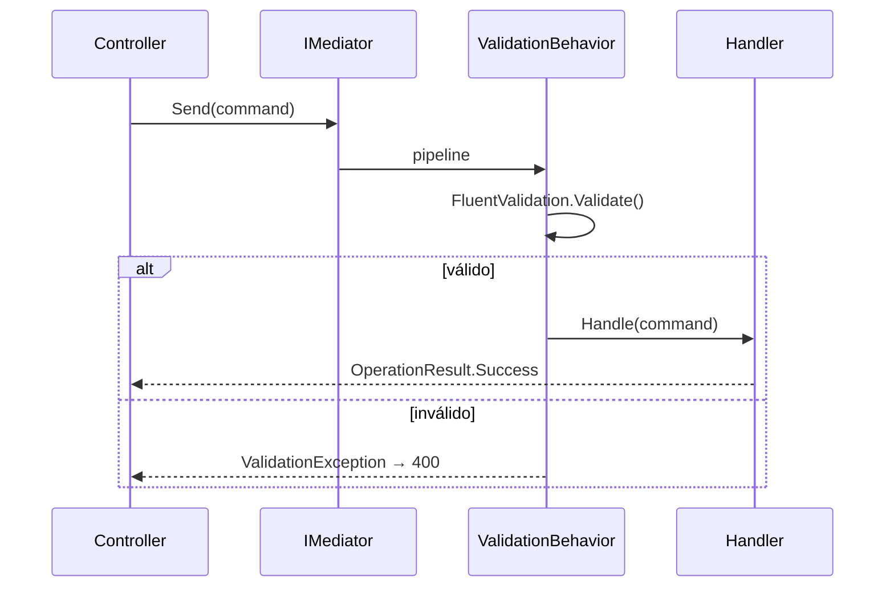

# 02 — ICARUS.Application (CQRS con MediatR)

**Última actualización:** 2026-06-29 — validado contra código fuente
**Capa:** `ICARUS.Application`

Implementa los casos de uso con **CQRS + MediatR 12.5.0**. Cifras reales:

| Elemento | Cantidad |
|----------|----------|
| Commands (`*Command.cs`) | **67** |
| CommandHandlers | 66 |
| Queries (`*Query.cs`) | **51** |
| QueryHandlers | 47 |
| Handlers totales | **124** |
| Features (módulos) | **9** |
| Behaviors MediatR | **1** (`ValidationBehavior`) |
| Perfiles AutoMapper | **7** |
| Validators (FluentValidation) | **10** |
| Archivos DTO | ~79 |

> AutoMapper **12.0.1**, FluentValidation **12.0.0**.

---

## 1. Estructura por Features

Todo se organiza bajo `ICARUS.Application/Features/<Modulo>/`. Los 9 Features:

```
Features/
├── Cliente/                # (existe junto a Clientes/ — solapamiento histórico)
├── Clientes/
├── ContabilidadAvicola/    # despachos, pedidos, precios, balance
├── ControlAcceso/          # incluye Services/ propios
├── GestionAvicola/         # el más grande: Galpones, Produccion, Vacunacion, Cronogramas, Notificaciones
├── Modulos/
├── Trabajador/             # (junto a Trabajadores/)
├── Trabajadores/
└── TrabajadorMobileAuth/   # login móvil + refresh token
```

> **Nota para agentes:** hay pares con nombre solapado (`Cliente`/`Clientes`,
> `Trabajador`/`Trabajadores`/`TrabajadorMobileAuth`). Al añadir código, comprueba ambos para no duplicar.
> No existe la carpeta "legacy" `Commands/`, `Queries/`, `Handlers/` en la raíz: todo vive en `Features/`.

Dentro de cada Feature, el patrón típico:

```
Features/GestionAvicola/
├── Commands/<SubModulo>/  CreateXCommand.cs + CreateXCommandHandler.cs
├── Queries/<SubModulo>/   GetXQuery.cs      + GetXQueryHandler.cs
├── DTOs/                  XDto.cs
├── Validators/            CreateXCommandValidator.cs
└── Mappings/              XMappingProfile.cs
```

---

## 2. Anatomía Command / Handler

```csharp
// Command (escritura)
public class CreateRegistroProduccionDiarioCommand
    : IRequest<OperationResult<RegistroProduccionDiarioDto>>
{
    public DateTime Fecha { get; set; }
    public int GalponId { get; set; }
    public int CantidadMaples { get; set; }
    public int UnidadesIncompletas { get; set; }
    public int GallinasMuertas { get; set; }
    public string? Observaciones { get; set; }
}

// Handler
public class CreateRegistroProduccionDiarioCommandHandler
    : IRequestHandler<CreateRegistroProduccionDiarioCommand, OperationResult<RegistroProduccionDiarioDto>>
{
    private readonly IUnitOfWork _unitOfWork;
    private readonly IMapper _mapper;
    // ... obtiene Galpon, valida, persiste vía UnitOfWork, mapea a DTO
}
```

Los handlers devuelven **siempre** `OperationResult<T>`.

---

## 3. OperationResult\<T\>

`ICARUS.Application/Common/OperationResult.cs` (ruta de referencia):

```csharp
public class OperationResult<T>
{
    public bool IsSuccess { get; set; }
    public bool IsFailure => !IsSuccess;
    public T? Data { get; set; }
    public string ErrorMessage { get; set; } = string.Empty;
    public List<string> Errors { get; set; } = new();

    public static OperationResult<T> Success(T? data) => new() { IsSuccess = true, Data = data };
    public static OperationResult<T> Failure(string error) => new() { IsSuccess = false, ErrorMessage = error };
}
```

Ventajas: no lanza excepciones para errores de negocio, fácil de testear, contrato uniforme con la API.

---

## 4. Pipeline: ValidationBehavior

Único behavior de MediatR: `ICARUS.Application/Behaviors/ValidationBehavior.cs`. Ejecuta los validators
de FluentValidation antes del handler; si fallan, corta el pipeline (en la API se traduce vía
`ValidationExceptionFilter`).



Registro (en `Program.cs` de API y Web): `AddMediatR(...)`, `AddValidatorsFromAssembly(...)`,
`AddTransient(typeof(IPipelineBehavior<,>), typeof(ValidationBehavior<,>))`.

---

## 5. Validators (10)

Mayoritariamente en `Features/GestionAvicola/.../Validators/` (ej. `CreateGalponCommandValidator`,
validators de producción, vacunación). Convención: una clase `*CommandValidator : AbstractValidator<TCommand>`
por command que requiera reglas.

---

## 6. Perfiles AutoMapper (7)

Perfiles `Profile` que mapean Entidad ↔ DTO (ej. Cliente, GestorAvicola, ProgramaVacunación, Notificaciones,
Modulo, Trabajador, Contabilidad). Se registran con `AddAutoMapper(...)` en cada host.

---

## 7. Servicios de aplicación

`ICARUS.Application` contiene servicios reutilizables además de los handlers:

| Servicio | Ruta real |
|----------|-----------|
| `ClienteModuloAccessService` (+ `IClienteModuloAccessService`) | `ICARUS.Application/Services/ClienteModuloAccessService.cs` |
| `IDatosBiometricosService` (interfaz) | `ICARUS.Application/Services/IDatosBiometricosService.cs` |
| `JwtTokenService` (aplicación) | `ICARUS.Application/Services/Auth/JwtTokenService.cs` |
| `ControlAccesoService`, `TrabajadorAccesoService`, `ZonaAccesoService` | `ICARUS.Application/Features/ControlAcceso/Services/` |

> Nota: la implementación `DatosBiometricosService` está **deshabilitada** como
> `ICARUS.Application/Services/DatosBiometricosService.cs.bak` (solo la interfaz `IDatosBiometricosService`
> está activa). Punto de deuda técnica.

---

## 8. Mapa de código

| Concepto | Ruta |
|----------|------|
| Features | `ICARUS.Application/Features/<Modulo>/` |
| Commands | `ICARUS.Application/Features/<Modulo>/Commands/**/*Command.cs` |
| Queries | `ICARUS.Application/Features/<Modulo>/Queries/**/*Query.cs` |
| Handlers | `**/*Handler.cs` (junto a su Command/Query) |
| DTOs | `**/DTOs/*Dto.cs` |
| Validators | `**/Validators/*Validator.cs` |
| AutoMapper | `**/Mappings/*Profile.cs` |
| Behavior | `ICARUS.Application/Behaviors/ValidationBehavior.cs` |
| OperationResult | `ICARUS.Application/Common/OperationResult.cs` |

Siguiente: **03-INFRASTRUCTURE.md**.
