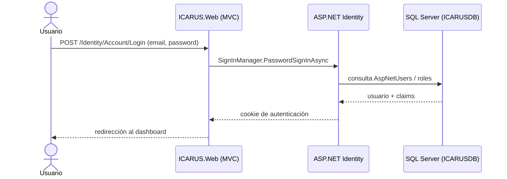
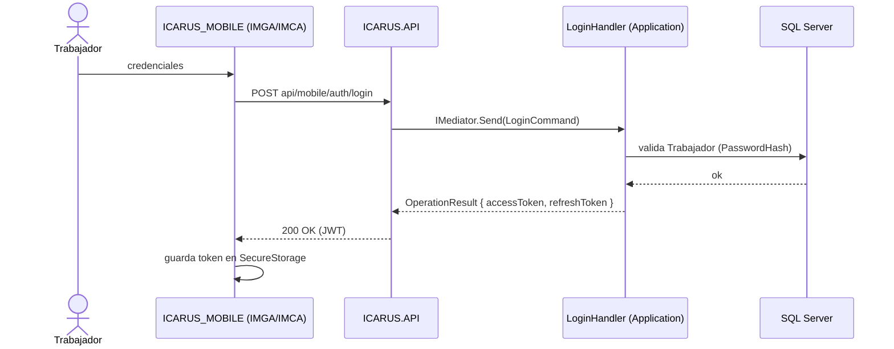
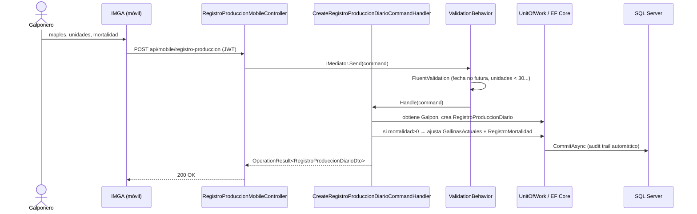
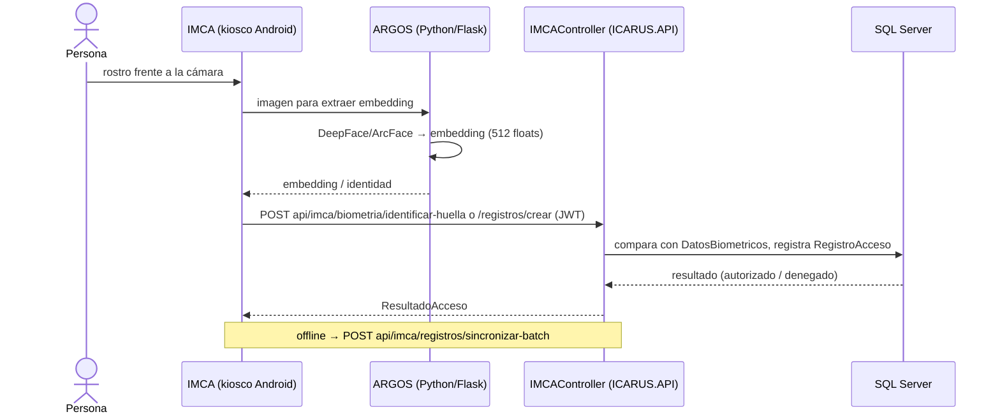
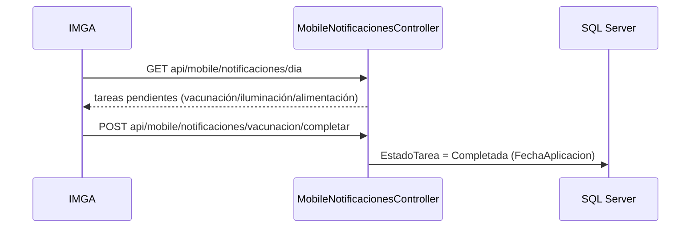

# 07 — Flujos de Negocio End-to-End

**Última actualización:** 2026-06-29 — validado contra código fuente

Casos de uso completos a través de las capas. Los diagramas reflejan el comportamiento **real** del código.

---

## Flujo 1 — Login en ICARUS.Web (Identity local, SIN API)

La Web autentica contra ASP.NET Identity usando el mismo `ApplicationDbContext`; **no** llama a `ICARUS.API`.



---

## Flujo 2 — Login móvil (JWT contra la API)



---

## Flujo 3 — Registro de producción diaria (IMGA → API → BD)



> Cálculo de huevos: `TotalHuevos = CantidadMaples * 30 + UnidadesIncompletas`.

---

## Flujo 4 — Control de acceso con reconocimiento facial (IMCA → ARGOS → API)



---

## Flujo 5 — Despacho de huevo (Comercial/Contabilidad)

```mermaid
sequenceDiagram
    actor Operador
    participant App as IMGA (móvil)
    participant API as DespachoHuevoController
    participant H as Handlers (ContabilidadAvicola)
    participant DB as SQL Server

    Operador->>API: GET api/mobile/contabilidad/despachos/precios
    API-->>Operador: lista de PrecioHuevo vigentes
    Operador->>API: POST .../despachos (detalles por tamaño)  [Estado=Preparado]
    API->>H: crea DespachoHuevo + DetalleDespachoHuevo
    Operador->>API: POST .../despachos/{id}/despachar          [Estado=Despachado]
    Operador->>API: PUT  .../despachos/{id}/foto-recibo
    API->>DB: persiste; alimenta BalanceCuenta
    API-->>Operador: OperationResult
```

El **pedido de alimento** (`api/mobile/contabilidad/pedidos`) sigue un ciclo análogo:
`Borrador → Solicitado → Recibido/Incompleto → Verificado`.

---

## Flujo 6 — Tareas/Notificaciones avícolas

A partir de un `ProgramaVacunacion` asignado a un `Galpon`, `GalponTareasInitializationService` genera
`GalponTareaVacunacion` (estado `Pendiente`). La app las consulta y las marca completadas:



Ver detalle en [SISTEMA-NOTIFICACIONES.md](SISTEMA-NOTIFICACIONES.md).

---

## Mapa de código de los flujos

| Flujo | Entrada (código) |
|-------|------------------|
| Login Web | `ICARUS.Web/Areas/Identity/` |
| Login móvil | `ICARUS.API/Controllers/Mobile/MobileAuthController.cs` + `Features/TrabajadorMobileAuth/` |
| Producción | `ICARUS.API/Controllers/Mobile/RegistroProduccionMobileController.cs` + `Features/GestionAvicola/` |
| Acceso facial | `ICARUS.API/Controllers/Mobile/IMCAController.cs` + `MICROSERVICIOS/ARGOS/` |
| Despacho / Pedido | `ICARUS.API/Controllers/Mobile/{DespachoHuevo,PedidoAlimento}Controller.cs` + `Features/ContabilidadAvicola/` |
| Notificaciones | `ICARUS.API/Controllers/Mobile/MobileNotificacionesController.cs` |
