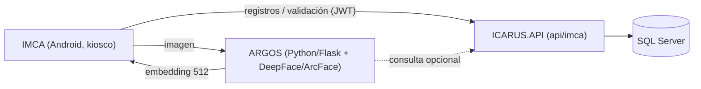

# 11 — ARGOS (Microservicio de Reconocimiento Facial)

**Última actualización:** 2026-06-29 — validado contra código fuente
**Proyecto:** `MICROSERVICIOS/ARGOS` (`ARGOS.pyproj`) · Python 3.9 · Flask
**Puerto:** 5000 · **Modelo:** ArcFace (vía DeepFace)

ARGOS es el microservicio de **reconocimiento facial** del ecosistema ICARUS. Identifica personas a partir
de su rostro generando **embeddings de 512 floats** con el modelo **ArcFace** (librería **DeepFace**).
Da soporte al módulo de Control de Acceso (kioscos **IMCA**).

> Nombre: ARGOS, en referencia al gigante de cien ojos de la mitología griega.

---

## 1. Posición en la arquitectura



- IMCA captura el rostro y obtiene el embedding desde ARGOS.
- El embedding se compara con los `DatosBiometricos` almacenados y se registra el `RegistroAcceso`
  vía `IMCAController` (`api/imca/biometria/*`, `api/imca/registros/*`).
- ARGOS conoce la URL de la API mediante la variable de entorno `ICARUS_API_URL` (por defecto `http://localhost:5090`).

---

## 2. Stack y dependencias (`requirements.txt`)

| Categoría | Paquetes |
|-----------|----------|
| Web | `Flask >= 2.2.3`, `flask-cors >= 4.0.0` |
| Reconocimiento facial | `deepface >= 0.0.79`, `tf-keras >= 2.15.0` (modelo **ArcFace**) |
| Procesamiento de imagen | `opencv-python >= 4.8.0`, `numpy >= 1.24.0`, `pillow >= 10.0.0` |
| Cliente HTTP | `requests >= 2.28.0` |
| Utilidades | `python-dotenv >= 1.0.0` |

---

## 3. Estructura del proyecto

```
MICROSERVICIOS/ARGOS/
├── ARGOS/
│   ├── __init__.py        # configuración Flask + DeepFace (define app y MODEL_NAME)
│   ├── views.py           # endpoints REST
│   ├── logger.py          # logging
│   ├── static/ · templates/
├── runserver.py           # arranque: precarga el modelo ArcFace y levanta Flask
├── benchmark_lfw.py       # benchmark de precisión (dataset LFW)
├── requirements.txt
├── Dockerfile
└── README.md
```

---

## 4. Arranque

`runserver.py`:
- Precarga el modelo **ArcFace** al inicio (`DeepFace.build_model(MODEL_NAME)`).
- Lee variables de entorno: `SERVER_HOST` (def. `0.0.0.0`), `SERVER_PORT` (def. `5000`),
  `ICARUS_API_URL` (def. `http://localhost:5090`).

```bash
cd MICROSERVICIOS/ARGOS
pip install -r requirements.txt
python runserver.py
# o con Docker:
docker build -t argos . && docker run -p 5000:5000 -e ICARUS_API_URL=http://host:5090 argos
```

---

## 5. Notas para agentes

- ARGOS es independiente del código .NET; los contratos de integración están en
  `ICARUS.API/Controllers/Mobile/IMCAController.cs` (rutas `api/imca/biometria/*`).
- El embedding es un vector de **512 floats**; se persiste en la entidad `DatosBiometricos`.
- La comparación de identidad usa similitud (umbral configurable). Revisa `ARGOS/views.py` para los endpoints exactos.
