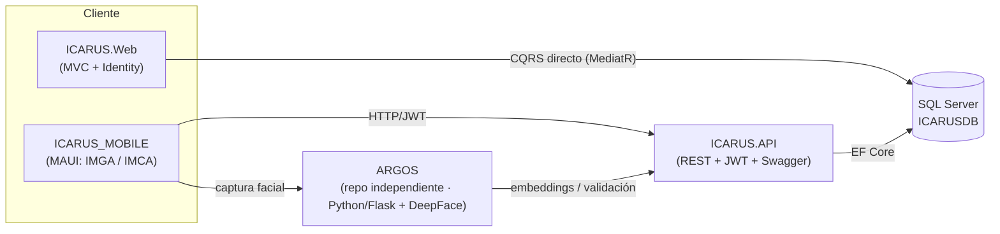

# ICARUS — Documentación Técnica (índice maestro)

**Última actualización:** 2026-06-29 — validado contra código fuente
**Stack:** .NET 10 · EF Core 10 · SQL Server · MediatR 12.5 · AutoMapper 12.0.1 · FluentValidation 12.0

> Esta documentación está optimizada para ser leída tanto por personas como por **agentes de IA**.
> Cada documento incluye tablas **"Mapa de código"** que enlazan cada concepto con su ruta real de archivo
> dentro de la solución `ICARUS/`. Cuando busques implementar o modificar algo, empieza por el mapa de código
> del documento correspondiente.

---

## 1. ¿Qué es ICARUS?

ICARUS es una plataforma empresarial **modular y multi-tenant** para agroindustria, construida con
**Clean Architecture** en **.NET 10**. Soporta varios clientes (empresas), a cada uno se le asignan
módulos según su contrato. Los dos módulos funcionales implementados son:

- **Gestión Avícola**: granjas, galpones, producción de huevos, mortalidad, cronogramas
  (vacunación / iluminación / alimentación) y un subdominio **Comercial/Contabilidad avícola**
  (despachos de huevo, pedidos de alimento, precios, publicaciones de precios, balance de cuenta).
- **Control de Acceso**: control físico de personal con **reconocimiento facial y huella**,
  zonas, políticas, dispositivos/kioscos y registros de acceso.

El ecosistema completo se compone de:



> **Nota (2026-07-02):** ARGOS ya **no** forma parte de este repositorio ni de `ICARUS.slnx`. Vive en su
> propio repositorio git, `dev/ARGOS`, hermano de `ICARUS`. Su documentación está en
> [`../ARGOS/`](../ARGOS/README.md). La integración entre ambos sigue siendo exclusivamente HTTP/REST.

> **Importante:** `ICARUS.Web` **NO** consume `ICARUS.API`. La Web es una aplicación MVC que ejecuta
> CQRS (MediatR) **directamente** sobre el mismo `ApplicationDbContext` y usa **ASP.NET Identity local
> (cookies)**. La API REST existe principalmente para las apps móviles y los kioscos biométricos.

---

## 2. Proyectos de la solución (`ICARUS.slnx`)

| Proyecto | Tipo | TargetFramework | Responsabilidad |
|----------|------|-----------------|-----------------|
| `ICARUS.Domain` | classlib | net10.0 | Entidades, enums, interfaces de repositorio (sin dependencias externas) |
| `ICARUS.Application` | classlib | net10.0 | CQRS (MediatR), DTOs, handlers, validators, AutoMapper, servicios de aplicación |
| `ICARUS.Infrastructure` | classlib | net10.0 | EF Core, `ApplicationDbContext`, repositorios, UnitOfWork, migración, servicios de infra |
| `ICARUS.API` | web | net10.0 | API REST + JWT + Swagger (móviles y kioscos) |
| `ICARUS.Web` | web | net10.0 | MVC + Razor + Bootstrap + ASP.NET Identity (admin/gestión) |
| `ICARUS.UnitTests` | xunit | net10.0 | Tests unitarios (handlers, dominio, controllers) |
| `ICARUS.IntegrationTests` | xunit | net10.0 | Tests E2E con WebApplicationFactory + Testcontainers (SQL real) |

> `ARGOS` (microservicio de reconocimiento facial) ya no es parte de esta solución; ver
> [`../ARGOS/`](../ARGOS/README.md).

Flujo de dependencias (regla Clean Architecture: las capas internas no conocen a las externas):

```
API / Web  →  Application  →  Domain  ←  Infrastructure (implementa interfaces del Domain)
```

> Nota de implementación: `ICARUS.Application.csproj` referencia tanto a `Domain` como a `Infrastructure`,
> y `ICARUS.Web` accede al `ApplicationDbContext` directamente. Es una variante pragmática de Clean
> Architecture, no la forma canónica estricta.

---

## 3. Métricas reales del backend

| Métrica | Valor real |
|---------|-----------|
| Archivos de entidad (`Domain/Entities`) | **42** (9 raíz + 24 GestionAvicola + 9 ControlAcceso) |
| Enums (`Domain/Enums`) | **17** (+ enums embebidos en `ContabilidadEnums.cs` / `CiclosEnums.cs`) |
| Interfaces de dominio | **34** |
| Commands (`*Command.cs`) | **67** |
| Queries (`*Query.cs`) | **51** |
| Handlers totales | **124** |
| Behaviors MediatR | **1** (`ValidationBehavior`) |
| Perfiles AutoMapper | **7** |
| Validators (FluentValidation) | **10** |
| Features (Application) | **9** |
| Repositorios (Infrastructure) | **30** |
| Migraciones EF Core | **1** (consolidada: `InitialCreate`) |
| DbSets en `ApplicationDbContext` | **40** propiedades (37 entidades; 3 duplicadas) |
| Controllers API | **10** |
| Areas Web | **3** con controllers (GestionAvicola, ControlAcceso, Identity) |
| Controllers Web base | **8** |

---

## 4. Índice de documentos

| # | Documento | Contenido |
|---|-----------|-----------|
| 00 | [00-RESUMEN-EJECUTIVO-ARQUITECTURA.md](00-RESUMEN-EJECUTIVO-ARQUITECTURA.md) | Visión general, stack, diagrama de capas, patrones |
| 01 | [01-DOMAIN-ENTIDADES.md](01-DOMAIN-ENTIDADES.md) | 42 entidades, 17 enums, interfaces, diagrama ER |
| 02 | [02-APPLICATION-CQRS.md](02-APPLICATION-CQRS.md) | 67 commands / 51 queries / 124 handlers / Features / AutoMapper / validators |
| 03 | [03-INFRASTRUCTURE.md](03-INFRASTRUCTURE.md) | DbContext, repositorios, UnitOfWork, migración, servicios, comandos EF |
| 04 | [04-API-ENDPOINTS.md](04-API-ENDPOINTS.md) | 10 controllers, endpoints, JWT, Swagger, CORS |
| 05 | [05-WEB-MVC.md](05-WEB-MVC.md) | Areas, controllers, vistas, Identity, patrón CQRS-directo |
| 06 | [06-MOBILE-ARQUITECTURA.md](06-MOBILE-ARQUITECTURA.md) | App MAUI (IMGA / IMCA), MVVM (referencia, fuera de este repo) |
| 07 | [07-FLUJOS-NEGOCIO.md](07-FLUJOS-NEGOCIO.md) | Casos de uso end-to-end con diagramas de secuencia |
| — | [SISTEMA-NOTIFICACIONES.md](SISTEMA-NOTIFICACIONES.md) | Detalle del sistema de notificaciones/tareas avícolas |
| — | [SISTEMA-NOTIFICACIONES-MOBILE.md](SISTEMA-NOTIFICACIONES-MOBILE.md) | Notificaciones en la app móvil |
| — | [SISTEMA-REGISTRO-PRODUCCION-MOBILE.md](SISTEMA-REGISTRO-PRODUCCION-MOBILE.md) | Registro de producción en la app móvil |
| diag | [diagramas/clases.md](diagramas/clases.md) · [diagramas/secuencia.md](diagramas/secuencia.md) · [diagramas/estado.md](diagramas/estado.md) | Diagramas Mermaid |

---

## 5. Cómo ejecutar

### 5.1. Base de datos de desarrollo (Docker)

```bash
# Levantar SQL Server 2022 en contenedor (puerto 1433)
docker compose -f docker-compose.dev.yml up -d
# Connection string resultante:
#   Server=localhost,1433;Database=ICARUSDB;User Id=sa;Password=Icarus@Dev2024!;TrustServerCertificate=True;MultipleActiveResultSets=true
```

### 5.2. Migraciones EF Core

```bash
# La migración vive en ICARUS.Infrastructure; el proyecto de arranque es ICARUS.Web
dotnet ef database update --project ICARUS.Infrastructure --startup-project ICARUS.Web
```

### 5.3. Ejecutar las aplicaciones .NET

```bash
dotnet run --project ICARUS.Web    # MVC (admin/gestión)  → http://localhost:5090
dotnet run --project ICARUS.API    # API REST (móviles)   → http://localhost:5000 (Swagger en la raíz)
```

### 5.4. Producción (Docker Compose)

`docker-compose.yml` publica `icarus-web` (puerto 8080) e `icarus-api` (puerto 8081) sobre la red
externa `trajano-shared-network`. Dockerfiles: `Dockerfile.web`, `Dockerfile.api`.

### 5.5. Tests

```bash
dotnet test ICARUS.UnitTests
dotnet test ICARUS.IntegrationTests   # requiere Docker (Testcontainers.MsSql)
```

### 5.6. ARGOS (reconocimiento facial)

ARGOS vive en su propio repositorio (`dev/ARGOS`, hermano de este). Ver
[`../ARGOS/01-ARQUITECTURA.md`](../ARGOS/01-ARQUITECTURA.md) para cómo compilarlo y ejecutarlo.

---

## 6. Convenciones globales (para humanos y agentes)

- **Idioma del dominio:** español (entidades, propiedades y rutas en español).
- **Entidad base:** toda entidad hereda de `BaseEntity` (`Id`, `FechaCreacion`, `FechaModificacion`, `CreadoPor`, `ModificadoPor`, `EstaActivo`).
- **Soft delete:** nunca `Remove()` físico; se marca `EstaActivo = false`.
- **Audit trail:** `ApplicationDbContext.SaveChangesAsync` rellena `FechaCreacion` / `FechaModificacion` automáticamente.
- **Respuestas:** los handlers devuelven `OperationResult<T>` (no lanzan excepciones para errores de negocio).
- **Logging:** `log4net` en todos los proyectos (`ILoggingService` / `LogManager`).
- **CQRS:** Commands escriben, Queries leen; ambos viajan por `IMediator.Send(...)`.
- **Validación:** FluentValidation + `ValidationBehavior` en el pipeline de MediatR.

---

## 7. Deuda técnica detectada (en el código real, no inventada)

Hallazgos verificados contra el código fuente al 2026-06-29. No bloquean el funcionamiento, pero conviene
limpiarlos. Un agente que trabaje el código debe tenerlos presentes para no duplicar ni romper.

| # | Hallazgo | Ubicación real |
|---|----------|----------------|
| 1 | Features con nombre solapado: `Cliente` **y** `Clientes` | `ICARUS.Application/Features/Cliente/`, `.../Clientes/` |
| 2 | Features con nombre solapado: `Trabajador`, `Trabajadores` y `TrabajadorMobileAuth` | `ICARUS.Application/Features/Trabajador*/` |
| 3 | Tres archivos `JwtTokenService.cs` (1 en Application, 2 en Infrastructure) | `ICARUS.Application/Services/Auth/`, `ICARUS.Infrastructure/Services/Auth/`, `ICARUS.Infrastructure/Services/` |
| 4 | Controllers Web casi homónimos: `ProgramaVacunacionController` (singular) y `ProgramasVacunacionController` (plural) | `ICARUS.Web/Areas/GestionAvicola/Controllers/` |
| 5 | Repositorio residual con sufijo `_fixed` | `ICARUS.Infrastructure/Repositories/ControlAcceso/TrabajadorAccesoRepository_fixed.cs` |
| 6 | 3 pares de `DbSet<>` duplicados con nombre alterno (40 propiedades para 37 entidades): Cronograma{Vacunacion,Iluminacion,Alimentacion} singular vs plural | `ICARUS.Infrastructure/Data/ApplicationDbContext.cs` |
| 7 | Implementación `DatosBiometricosService` deshabilitada como `.bak` (solo activa la interfaz) | `ICARUS.Application/Services/DatosBiometricosService.cs.bak` |
| 8 | Controller Web `ControlAccesoController` existe tanto en `Controllers/` base como en `Areas/ControlAcceso/Controllers/` | `ICARUS.Web/Controllers/`, `ICARUS.Web/Areas/ControlAcceso/Controllers/` |

> El módulo de Fumigación/Agricultura que aparecía en documentación previa (`Campo`, cultivos) **no existe
> en el código** (cero referencias en Domain/Application/API/Web); por eso se eliminó esa documentación.
