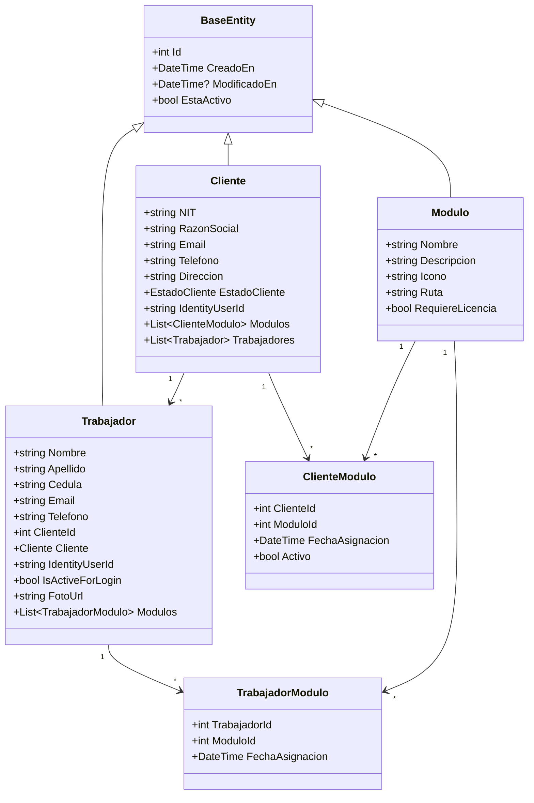
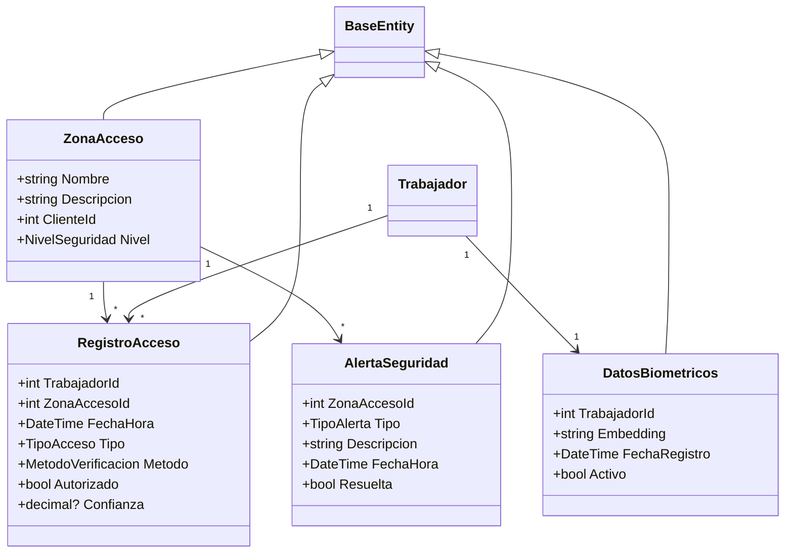
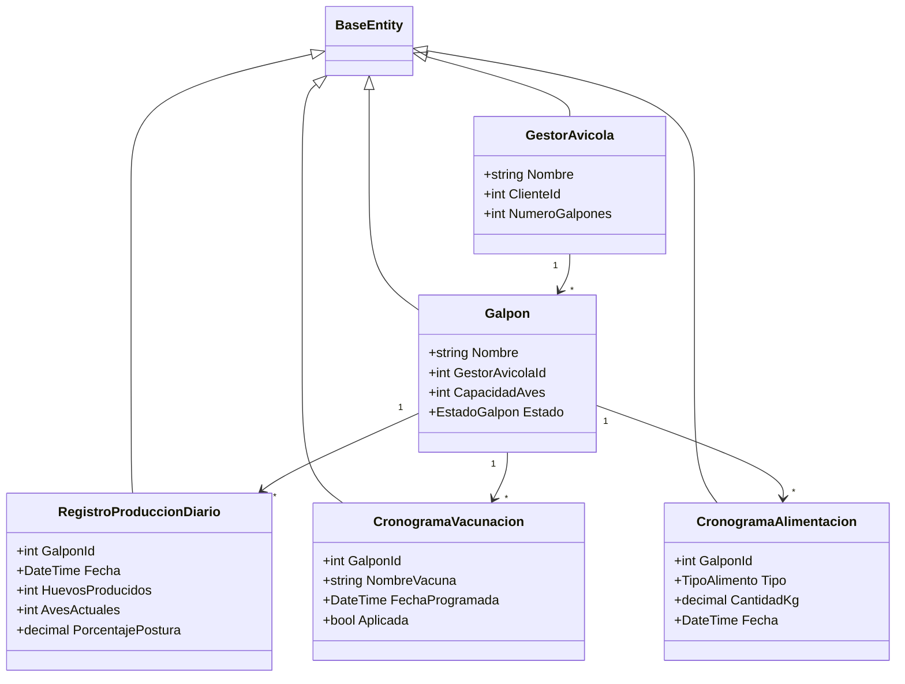

# Diagrama de Clases - ICARUS Domain

## Entidades Principales

```mermaid
classDiagram
    class BaseEntity {
        +int Id
        +DateTime CreadoEn
        +DateTime? ModificadoEn
        +bool EstaActivo
    }
    
    class Cliente {
        +string NIT
        +string RazonSocial
        +string Email
        +string Telefono
        +string Direccion
        +EstadoCliente EstadoCliente
        +string IdentityUserId
        +List~ClienteModulo~ Modulos
        +List~Trabajador~ Trabajadores
    }
    
    class Trabajador {
        +string Nombre
        +string Apellido
        +string Cedula
        +string Email
        +string Telefono
        +int ClienteId
        +Cliente Cliente
        +string IdentityUserId
        +bool IsActiveForLogin
        +string FotoUrl
        +List~TrabajadorModulo~ Modulos
    }
    
    class Modulo {
        +string Nombre
        +string Descripcion
        +string Icono
        +string Ruta
        +bool RequiereLicencia
    }
    
    class ClienteModulo {
        +int ClienteId
        +int ModuloId
        +DateTime FechaAsignacion
        +bool Activo
    }
    
    class TrabajadorModulo {
        +int TrabajadorId
        +int ModuloId
        +DateTime FechaAsignacion
    }
    
    BaseEntity <|-- Cliente
    BaseEntity <|-- Trabajador
    BaseEntity <|-- Modulo
    
    Cliente "1" --> "*" ClienteModulo
    Cliente "1" --> "*" Trabajador
    Modulo "1" --> "*" ClienteModulo
    Trabajador "1" --> "*" TrabajadorModulo
    Modulo "1" --> "*" TrabajadorModulo
```

## Control de Acceso

```mermaid
classDiagram
    class ZonaAcceso {
        +string Nombre
        +string Descripcion
        +int ClienteId
        +NivelSeguridad Nivel
    }
    
    class RegistroAcceso {
        +int TrabajadorId
        +int ZonaAccesoId
        +DateTime FechaHora
        +TipoAcceso Tipo
        +MetodoVerificacion Metodo
        +bool Autorizado
        +decimal? Confianza
    }
    
    class DatosBiometricos {
        +int TrabajadorId
        +string Embedding
        +DateTime FechaRegistro
        +bool Activo
    }
    
    class AlertaSeguridad {
        +int ZonaAccesoId
        +TipoAlerta Tipo
        +string Descripcion
        +DateTime FechaHora
        +bool Resuelta
    }
    
    BaseEntity <|-- ZonaAcceso
    BaseEntity <|-- RegistroAcceso
    BaseEntity <|-- DatosBiometricos
    BaseEntity <|-- AlertaSeguridad
    
    Trabajador "1" --> "*" RegistroAcceso
    Trabajador "1" --> "1" DatosBiometricos
    ZonaAcceso "1" --> "*" RegistroAcceso
    ZonaAcceso "1" --> "*" AlertaSeguridad
```

## Gestión Avícola

```mermaid
classDiagram
    class GestorAvicola {
        +string Nombre
        +int ClienteId
        +int NumeroGalpones
    }
    
    class Galpon {
        +string Nombre
        +int GestorAvicolaId
        +int CapacidadAves
        +EstadoGalpon Estado
    }
    
    class RegistroProduccionDiario {
        +int GalponId
        +DateTime Fecha
        +int HuevosProducidos
        +int AvesActuales
        +decimal PorcentajePostura
    }
    
    class CronogramaVacunacion {
        +int GalponId
        +string NombreVacuna
        +DateTime FechaProgramada
        +bool Aplicada
    }
    
    class CronogramaAlimentacion {
        +int GalponId
        +TipoAlimento Tipo
        +decimal CantidadKg
        +DateTime Fecha
    }
    
    BaseEntity <|-- GestorAvicola
    BaseEntity <|-- Galpon
    BaseEntity <|-- RegistroProduccionDiario
    BaseEntity <|-- CronogramaVacunacion
    BaseEntity <|-- CronogramaAlimentacion
    
    GestorAvicola "1" --> "*" Galpon
    Galpon "1" --> "*" RegistroProduccionDiario
    Galpon "1" --> "*" CronogramaVacunacion
    Galpon "1" --> "*" CronogramaAlimentacion
```
