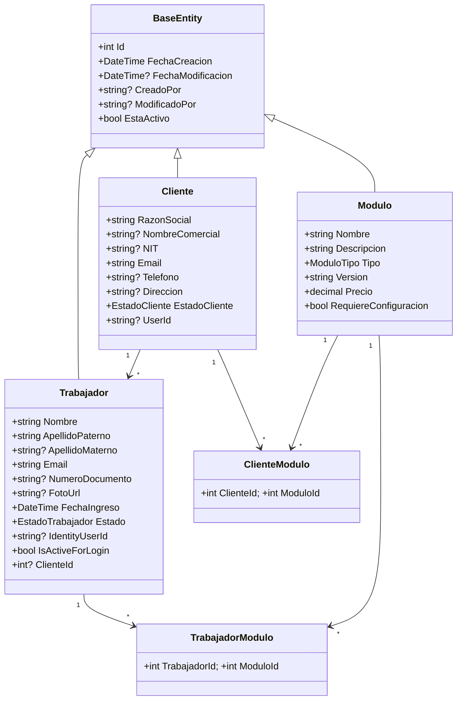
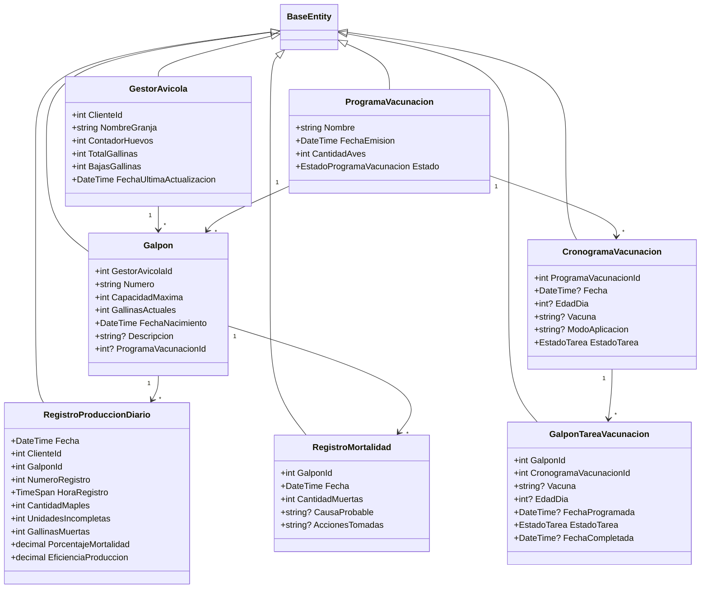
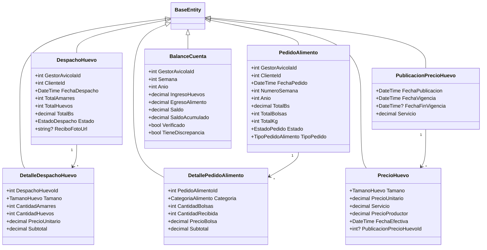
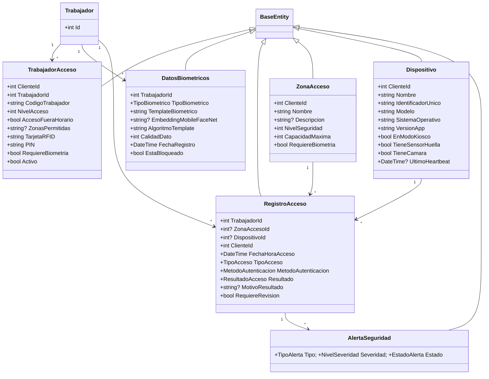

# Diagrama de Clases — ICARUS Domain

**Última actualización:** 2026-06-29 — validado contra código fuente

Atributos y nombres tomados de `ICARUS.Domain/Entities/`. Toda entidad hereda de `BaseEntity`
(`Id`, `FechaCreacion`, `FechaModificacion?`, `CreadoPor?`, `ModificadoPor?`, `EstaActivo`).

## Core / compartido

## Gestión Avícola — producción y cronogramas

## Gestión Avícola — Comercial / Contabilidad

## Control de Acceso

> Nota de modelado: `DatosBiometricos` y `RegistroAcceso` referencian `TrabajadorId` (FK a `Trabajador`),
> **no** a `TrabajadorAcceso`. `TrabajadorAcceso` es la configuración de acceso del trabajador (RFID, PIN,
> nivel, zonas) y se relaciona con `Cliente` y `Trabajador`.
