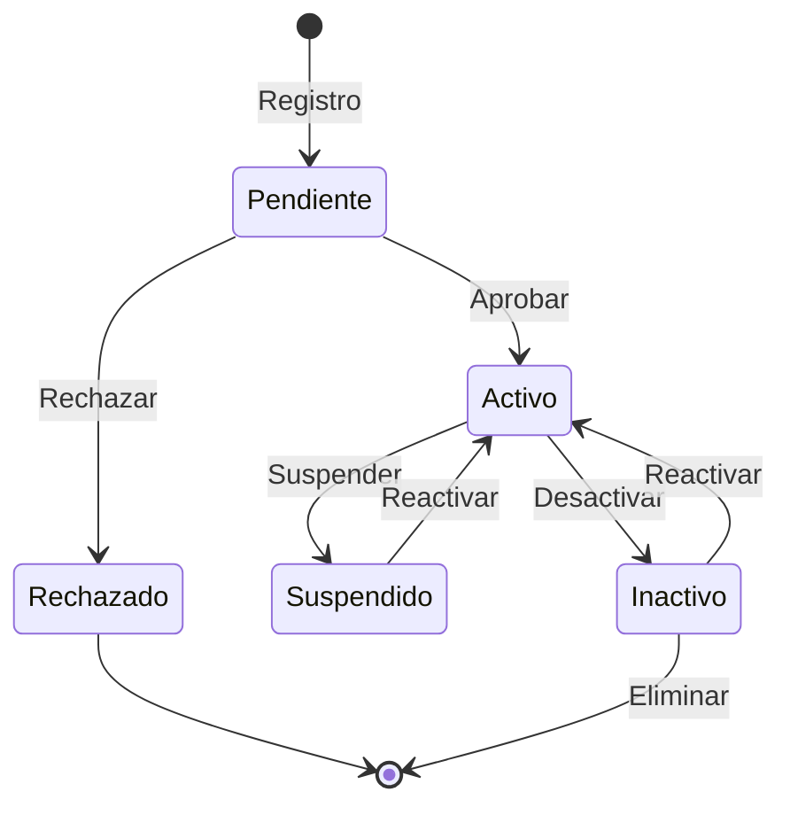
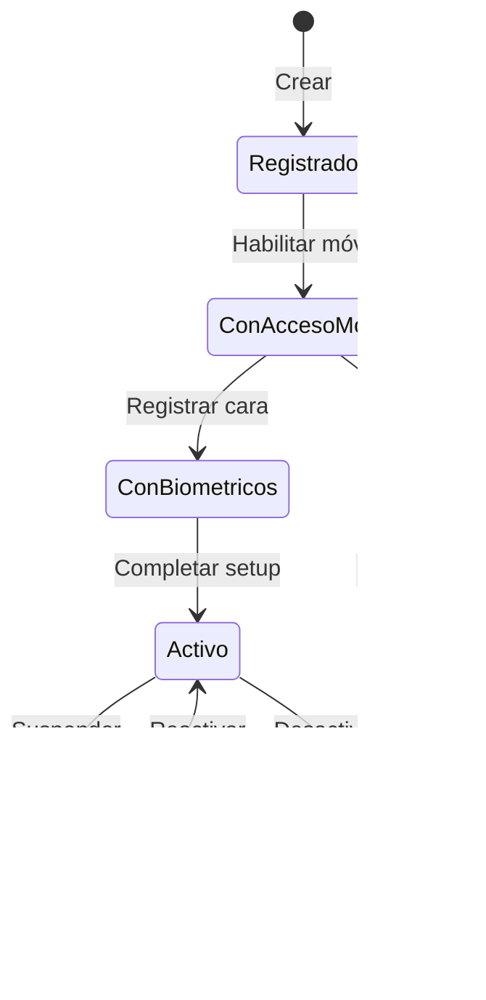
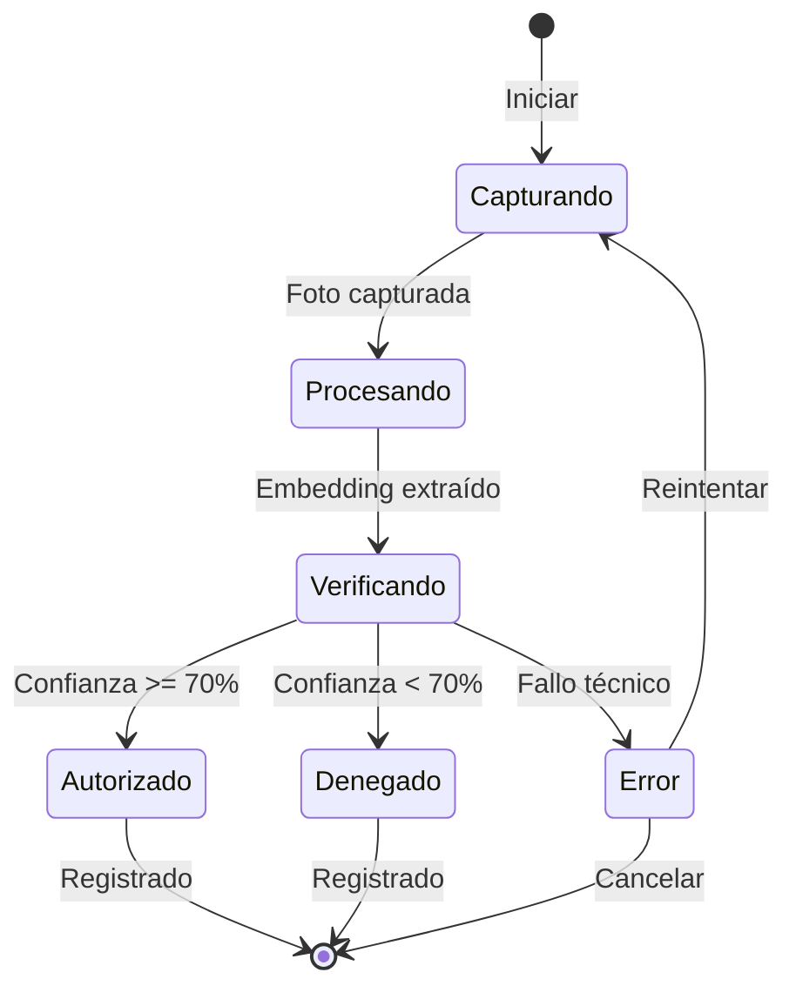
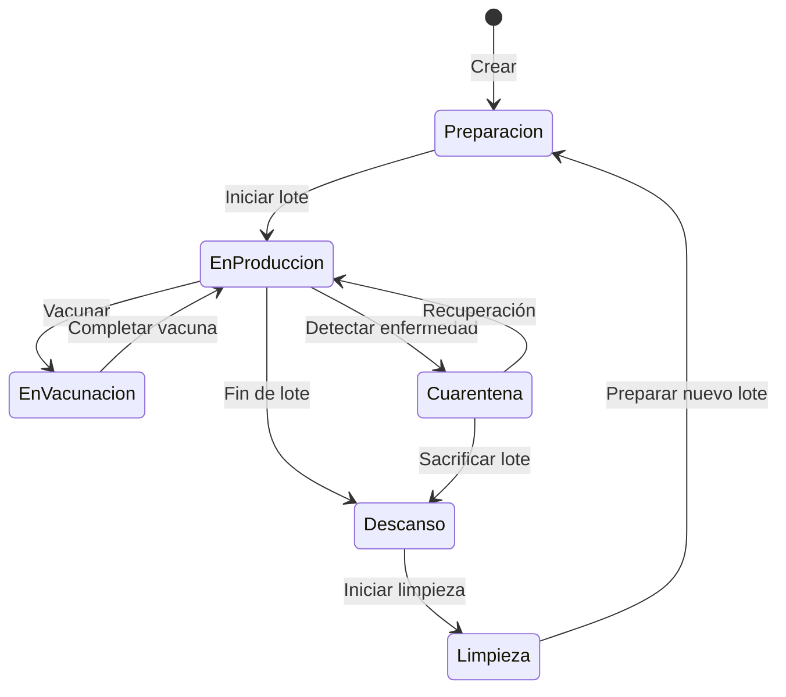
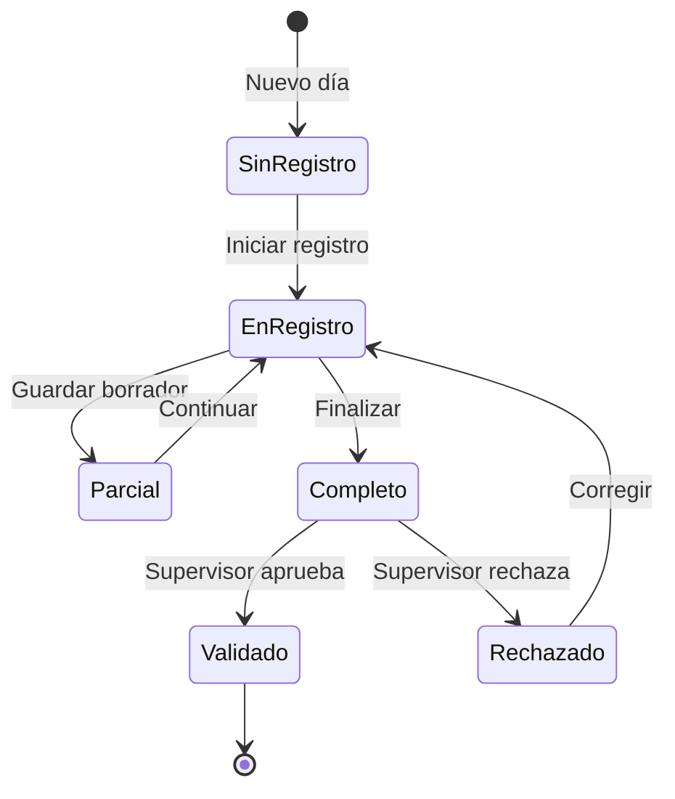

# Diagramas de Estado - ICARUS

## Estado de Cliente

```mermaid
stateDiagram-v2
    [*] --> Pendiente: Registro
    Pendiente --> Activo: Aprobar
    Pendiente --> Rechazado: Rechazar
    Activo --> Suspendido: Suspender
    Suspendido --> Activo: Reactivar
    Activo --> Inactivo: Desactivar
    Inactivo --> Activo: Reactivar
    Rechazado --> [*]
    Inactivo --> [*]: Eliminar
```

## Estado de Trabajador

```mermaid
stateDiagram-v2
    [*] --> Registrado: Crear
    Registrado --> ConAccesoMovil: Habilitar móvil
    ConAccesoMovil --> ConBiometricos: Registrar cara
    ConBiometricos --> Activo: Completar setup
    
    Activo --> Suspendido: Suspender
    Suspendido --> Activo: Reactivar
    
    Activo --> Inactivo: Desactivar
    ConAccesoMovil --> Inactivo: Desactivar
    
    Inactivo --> [*]: Eliminar
```

## Estado de Registro de Acceso

```mermaid
stateDiagram-v2
    [*] --> Capturando: Iniciar
    Capturando --> Procesando: Foto capturada
    Procesando --> Verificando: Embedding extraído
    
    Verificando --> Autorizado: Confianza >= 70%
    Verificando --> Denegado: Confianza < 70%
    Verificando --> Error: Fallo técnico
    
    Autorizado --> [*]: Registrado
    Denegado --> [*]: Registrado
    Error --> Capturando: Reintentar
    Error --> [*]: Cancelar
```

## Estado de Galpon

```mermaid
stateDiagram-v2
    [*] --> Preparacion: Crear
    Preparacion --> EnProduccion: Iniciar lote
    EnProduccion --> EnVacunacion: Vacunar
    EnVacunacion --> EnProduccion: Completar vacuna
    EnProduccion --> Descanso: Fin de lote
    Descanso --> Limpieza: Iniciar limpieza
    Limpieza --> Preparacion: Preparar nuevo lote
    
    EnProduccion --> Cuarentena: Detectar enfermedad
    Cuarentena --> EnProduccion: Recuperación
    Cuarentena --> Descanso: Sacrificar lote
```

## Flujo de Producción Diaria

```mermaid
stateDiagram-v2
    [*] --> SinRegistro: Nuevo día
    SinRegistro --> EnRegistro: Iniciar registro
    EnRegistro --> Parcial: Guardar borrador
    Parcial --> EnRegistro: Continuar
    EnRegistro --> Completo: Finalizar
    Completo --> Validado: Supervisor aprueba
    Validado --> [*]
    
    Completo --> Rechazado: Supervisor rechaza
    Rechazado --> EnRegistro: Corregir
```
