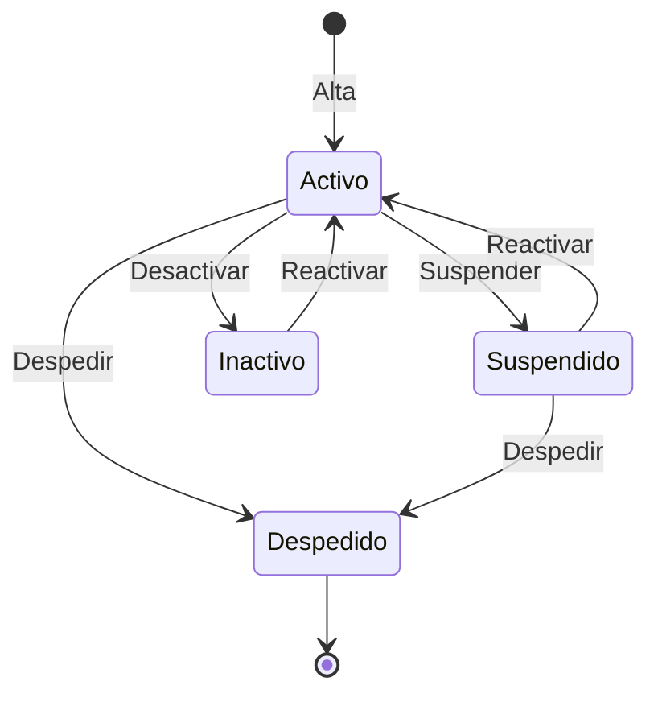
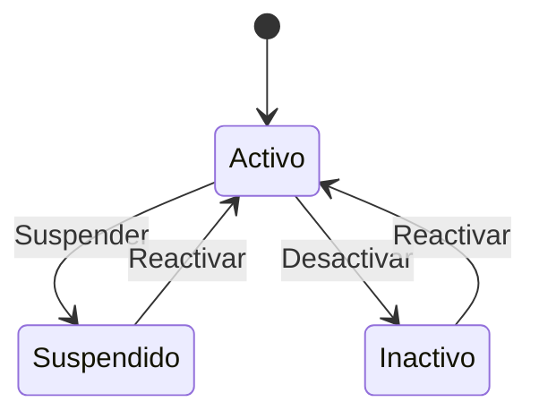
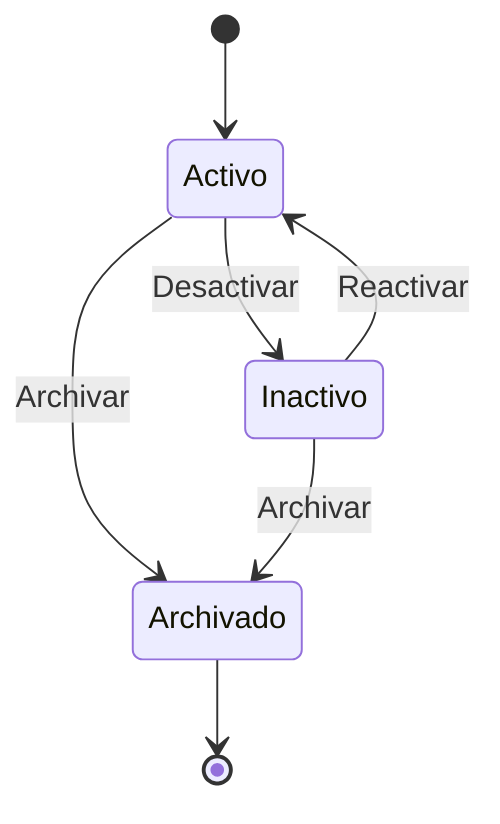
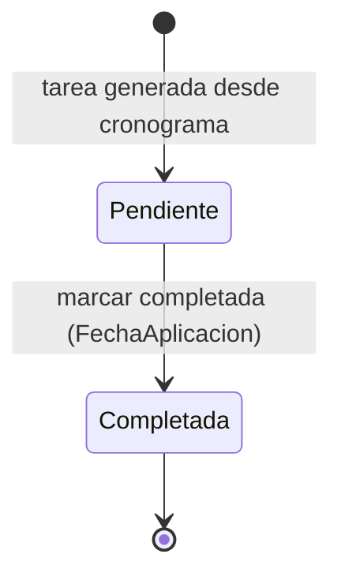
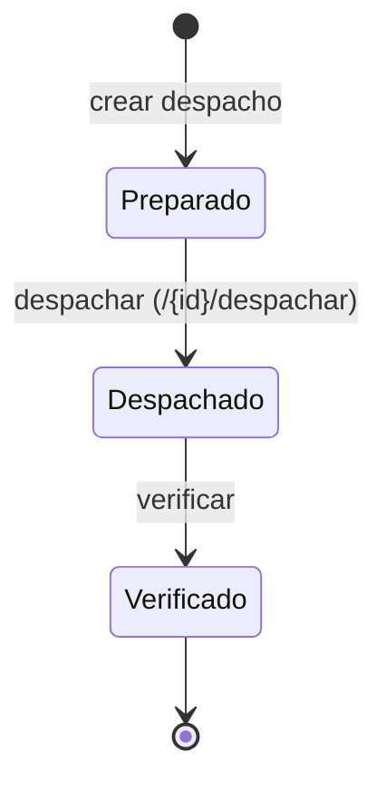
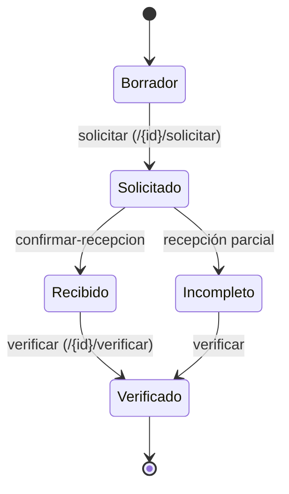

# Diagramas de Estado — ICARUS

**Última actualización:** 2026-06-29 — validado contra código fuente

> Solo se incluyen entidades con un **enum de estado real** en `ICARUS.Domain`. No se inventan estados
> que no existan en el código.

## Estado de Trabajador (`EstadoTrabajador`)

Valores reales: `Activo=1`, `Inactivo=2`, `Suspendido=3`, `Despedido=4`.

## Estado de Cliente (`EstadoCliente`)

Valores reales: `Activo=1`, `Inactivo=2`, `Suspendido=3`.

## Estado de Programa de Vacunación (`EstadoProgramaVacunacion`)

Valores reales: `Activo=1`, `Inactivo=2`, `Archivado=3`.

## Estado de Tarea de Galpón (`EstadoTarea`)

Valores reales: `Pendiente=0`, `Completada=1`.

## Estado de Despacho de Huevo (`EstadoDespacho`)

Valores reales: `Preparado=0`, `Despachado=1`, `Verificado=2`.

## Estado de Pedido de Alimento (`EstadoPedido`)

Valores reales: `Borrador=0`, `Solicitado=1`, `Recibido=3`, `Incompleto=4`, `Verificado=5`
(el valor `2`/`EnTransito` fue eliminado en el código).

