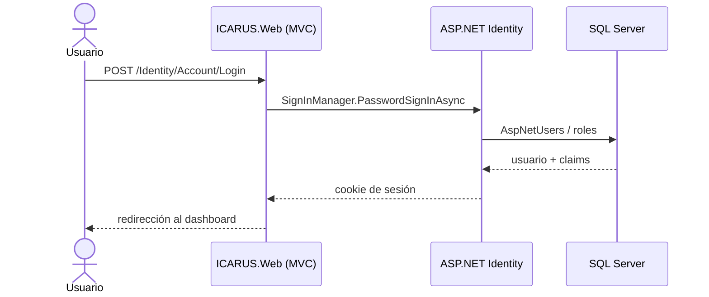
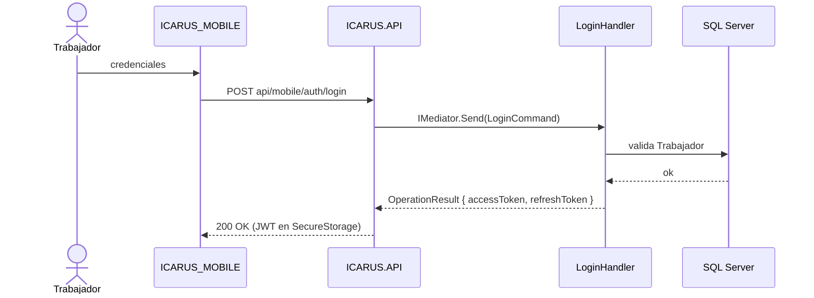
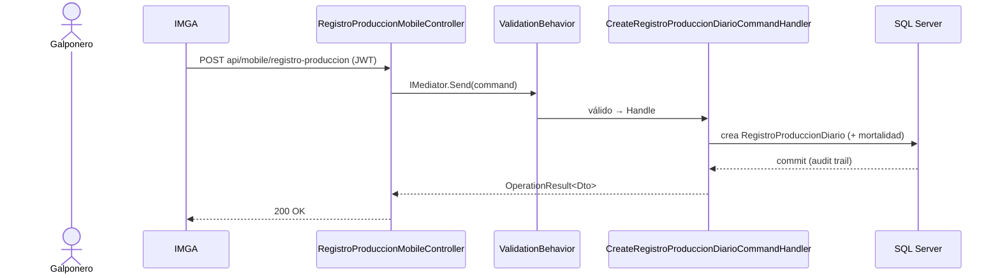
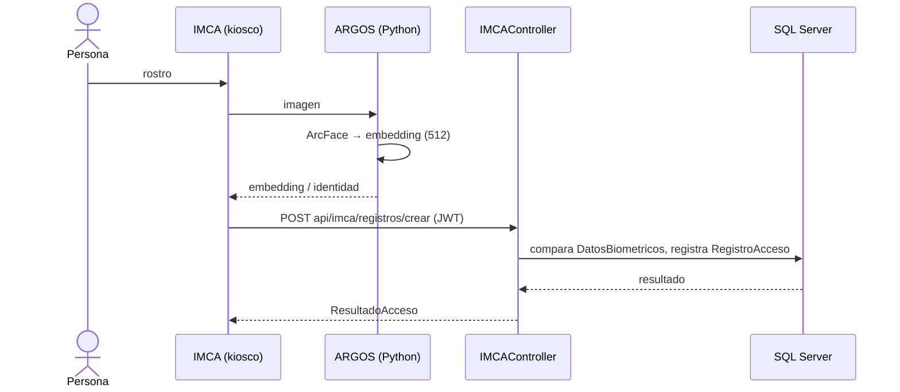

# Diagramas de Secuencia — ICARUS

**Última actualización:** 2026-06-29 — validado contra código fuente

> Reflejan el comportamiento real: la **Web autentica con Identity local** (no llama a la API),
> la **móvil usa la API con JWT**, y el **reconocimiento facial pasa por ARGOS**.

## 1. Login en ICARUS.Web (Identity local, sin API)

## 2. Login móvil (JWT contra la API)

## 3. Registro de producción (CQRS)

## 4. Control de acceso facial (IMCA → ARGOS → API)

