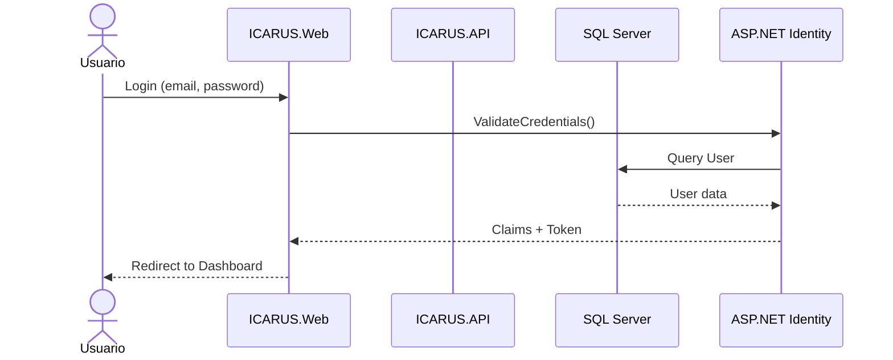
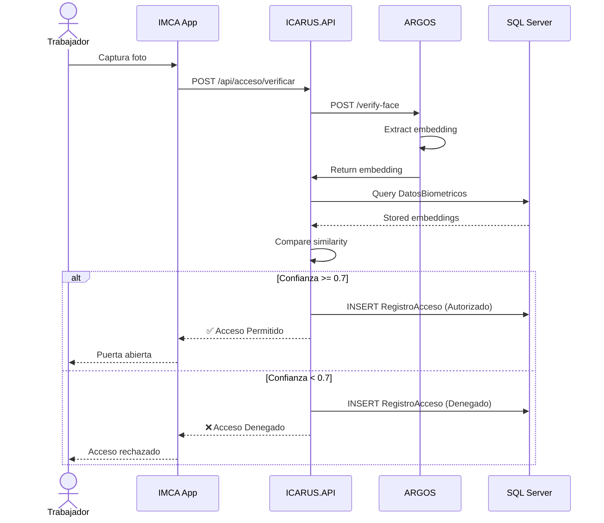
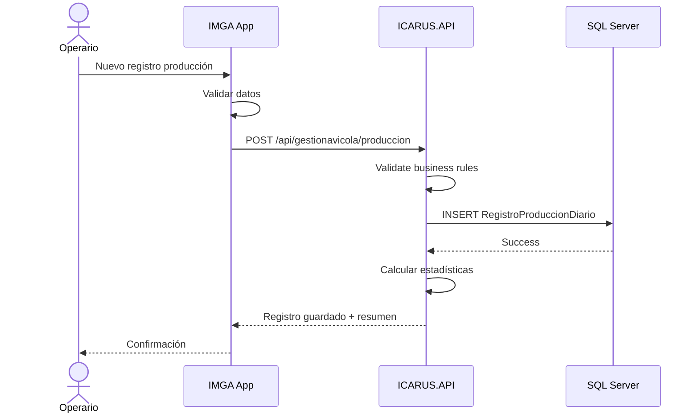
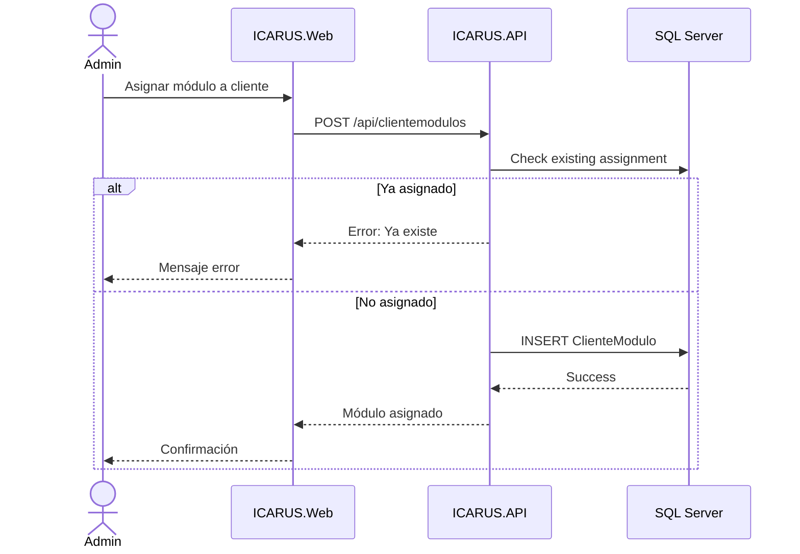

# Diagramas de Secuencia - ICARUS

## Flujo de Autenticación

## Flujo de Control de Acceso (Reconocimiento Facial)

## Flujo de Registro de Producción Avícola

## Flujo de Asignación de Módulos

