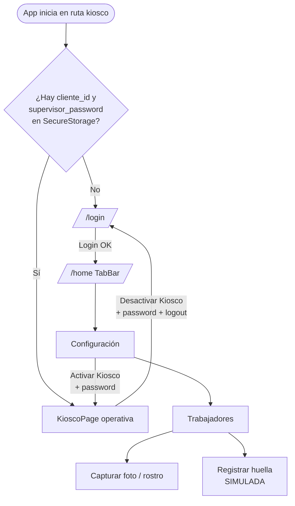
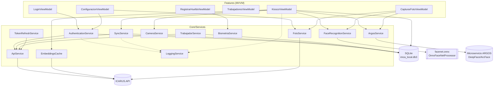

# IMCA — Arquitectura

**Última actualización:** 2026-06-29 — validado contra código fuente

---

## 1. Patrón general

IMCA es una app **.NET MAUI (.NET 10)** organizada con **MVVM feature-based**:

- **MVVM** con `CommunityToolkit.Mvvm` 8.3.2 (`ObservableObject`, `[ObservableProperty]`,
  `[RelayCommand]`). Cada pantalla tiene un par `XxxPage.xaml` + `XxxViewModel.cs`.
- **Feature-based**: el código de UI se agrupa por funcionalidad en `Features/`, no por capa.
- **Core/** contiene la infraestructura transversal: base de datos, modelos y servicios.
- **No hay capa de repositorios formal.** Los ViewModels consumen directamente `LocalDatabase`
  y los servicios inyectados. La lógica de negocio compleja (verificación facial, sync) vive
  en servicios y, en parte, en el `KioscoViewModel`.

```
Features/<Feature>/  →  ViewModel  →  Core/Services/*  →  ApiService / ARGOS / ONNX
                                   →  Core/Database/LocalDatabase  →  SQLite (imca_local.db3)
```

---

## 2. Inyección de dependencias (`MauiProgram.cs`)

Todo se registra en `MauiProgram.CreateMauiApp()`:

- **Singletons**: `LocalDatabase`, `HttpClient` (configurado a mano, sin
  `Microsoft.Extensions.Http`), `AppShell`, y los **9 servicios con interfaz**:
  `LoggingService`, `ApiService`, `AuthenticationService`, `TrabajadorService`,
  `BiometriaService`, `FaceRecognitionService`, `CameraService`, `ArgosService`,
  `SyncService`, `FotoService` (registrados por su interfaz `I…`).
- **Transient**: todos los ViewModels y todas las Pages.
- `HttpClient` se crea con `BaseAddress = Constants.ApiBaseUrl` y timeout
  `Constants.HttpTimeoutSeconds` (30 s).
- `UseMauiCommunityToolkit()` activa CommunityToolkit.Maui.

> **NO registrados en DI** (de los 13 servicios de la tabla §4):
> - `EmbeddingsCache` → lo instancia el `KioscoViewModel` en su constructor
>   (`new EmbeddingsCache(loggingService)`).
> - `OnnxFaceNetProcessor` → clase nativa de Android, instanciada desde `FaceRecognitionService`.
> - `TokenRefreshService` → presente en el código pero **no registrado ni invocado** (sin cablear).

---

## 3. Navegación (Shell)

Definida en `AppShell.xaml`. `FlyoutBehavior` deshabilitado (sin menú lateral).

| Ruta | Contenido | Visible en TabBar |
|---|---|---|
| `kiosco` | `KioscoPage` | No (página inicial) |
| `login` | `LoginPage` | No |
| `main` → `home` | `HomePage` | Sí ("Inicio") |
| `main` → `configuracion` | `ConfiguracionPage` | Sí ("Configuración") |
| `main` → `trabajadores` | `TrabajadoresPage` | Sí ("Trabajadores") |

Flujo de navegación típico:



Las páginas sin TabBar (`kiosco`, `login`) se navegan con rutas absolutas `//login`,
`//home`; dentro de `Trabajadores` se usa navegación relativa (`GoToAsync("..")`).

---

## 4. Servicios (`Core/Services/` — 13 implementaciones, 10 interfaces)

| Servicio | Interfaz | Responsabilidad |
|---|---|---|
| `ApiService` | `IApiService` | Cliente HTTP genérico a ICARUS.API (`GetAsync<T>`, `PostAsync`, `PutAsync`); inyecta el JWT como `Bearer`. |
| `AuthenticationService` | `IAuthenticationService` | Login de supervisor, logout, validez de sesión, `GetClienteIdAsync`. Persiste token y datos en SecureStorage + SQLite. |
| `ArgosService` | `IArgosService` | Cliente del microservicio **ARGOS** (DeepFace/ArcFace): health, register, identify, extract-embedding. |
| `FaceRecognitionService` | `IFaceRecognitionService` | Reconocimiento facial **local ONNX** (delega a `OnnxFaceNetProcessor` en Android). |
| `OnnxFaceNetProcessor` | — *(clase Android)* | Carga `facenet.onnx`, preprocesa la imagen y genera el embedding. Solo Android. |
| `EmbeddingsCache` | — *(no en DI)* | Cache en memoria de embeddings descargados del backend (TTL 5 min). Verificación 1:1 por similitud coseno. |
| `BiometriaService` | `IBiometriaService` | Huella dactilar Android (BiometricPrompt). **Template SIMULADO** — no productivo. |
| `CameraService` | `ICameraService` | Captura de foto (MediaPicker, cámara frontal) y compresión con SkiaSharp. |
| `FotoService` | `IFotoService` | Captura/subida de fotos de trabajadores y guardado local. |
| `SyncService` | `ISyncService` | Sincronización batch de registros offline con reintentos exponenciales; chequeo de conectividad. |
| `TokenRefreshService` | — | Renueva el JWT (`EnsureValidTokenAsync`) re-logueando con las credenciales guardadas. ⚠️ **No registrado en DI ni invocado**: código presente pero sin cablear. |
| `TrabajadorService` | `ITrabajadorService` | Cache SQLite de trabajadores y sincronización desde la API. |
| `LoggingService` | `ILoggingService` | Logging a archivo (`logs/imca.log`), thread-safe. |

Detalle funcional de cada servicio: ver `03-RECONOCIMIENTO-FACIAL.md`,
`04-MODO-KIOSCO-Y-OFFLINE.md` y `05-AUTENTICACION.md`.

---

## 5. Diagrama de componentes



---

## 6. Mapa de código (concepto → ruta real)

| Concepto | Ruta en el repo de código |
|---|---|
| Punto de entrada / DI | `IMCA/MauiProgram.cs` |
| Navegación Shell | `IMCA/AppShell.xaml` |
| Constantes, URLs, claves | `IMCA/Helpers/Constants.cs` |
| Base de datos local | `IMCA/Core/Database/LocalDatabase.cs` |
| Modelos / entidades | `IMCA/Core/Models/*.cs` |
| DTOs | `IMCA/Core/Models/DTOs/*.cs` |
| Servicios | `IMCA/Core/Services/*.cs` + `Interfaces/*.cs` |
| Reconocimiento facial Android | `IMCA/Platforms/Android/Services/OnnxFaceNetProcessor.cs` |
| Modo Kiosco | `IMCA/Features/Kiosco/KioscoViewModel.cs` |
| Login supervisor | `IMCA/Features/Login/LoginViewModel.cs` |
| Activar/desactivar kiosco | `IMCA/Features/Configuracion/ConfiguracionViewModel.cs` |
| Registro de rostro | `IMCA/Features/Trabajadores/CapturarFotoViewModel.cs` |
| Registro de huella (simulada) | `IMCA/Features/Trabajadores/RegistrarHuellaViewModel.cs` |
| Tests | `IMCA.Tests/Services/*.cs` |

---

## 7. Tests (`IMCA.Tests`)

- Proyecto **xUnit** (`net10.0`): xUnit 2.9.3, Moq 4.20.72, coverlet, Microsoft.NET.Test.Sdk 17.14.1.
- **No referencia `IMCA.csproj`** (conflictos con MAUI, documentado en el propio `.csproj`).
  Por eso los tests **reimplementan la lógica pura** que validan, en lugar de invocar el código real.
- Cobertura actual (mínima):
  - `EmbeddingsCacheTests.cs`: similitud coseno (idénticos = 1, ortogonales = 0, etc.).
  - `SyncServiceTests.cs`: delay exponencial `2^n × 60s` y omisión de registros con ≥ 5 intentos.
