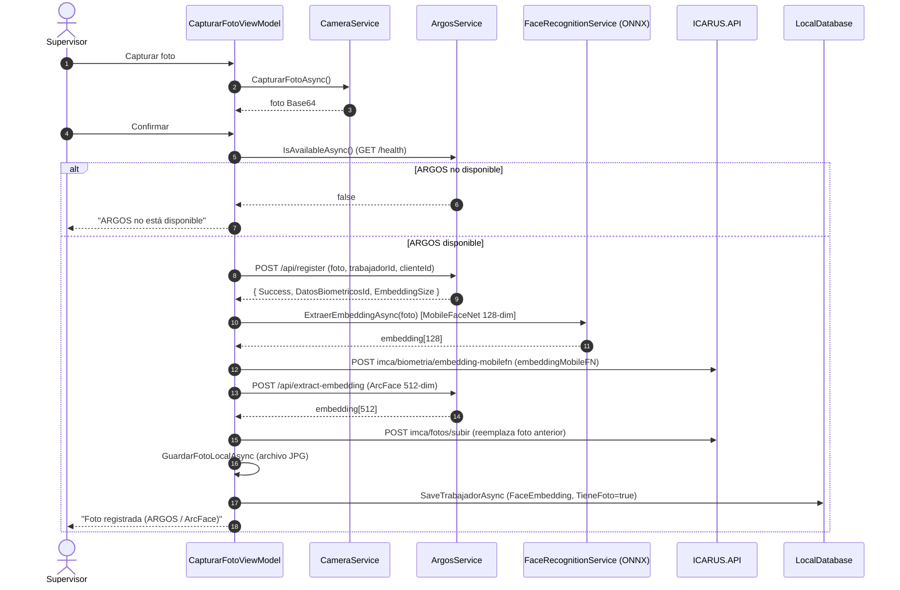

# IMCA — Reconocimiento Facial (FaceID)

**Última actualización:** 2026-06-29 — validado contra código fuente

El **reconocimiento facial es el pilar real de IMCA** (no la huella). Se implementa con una
arquitectura **dual**:

1. **ONNX local** (`facenet.onnx` + `OnnxFaceNetProcessor`): rápido, offline, sobre el
   dispositivo. Genera embeddings **MobileFaceNet de 128 dimensiones**.
2. **ARGOS** (microservicio Python externo con DeepFace/ArcFace): más preciso, usado como
   **fallback** y para el **registro** de rostros. Genera embeddings **ArcFace de 512 dimensiones**.

La comparación de embeddings se hace siempre con **similitud coseno**.

---

## 1. Componentes y rutas de código

| Concepto | Ruta real |
|---|---|
| Reconocimiento local (cross-platform) | `IMCA/Core/Services/FaceRecognitionService.cs` |
| Motor ONNX (solo Android) | `IMCA/Platforms/Android/Services/OnnxFaceNetProcessor.cs` |
| Modelo ONNX empaquetado | `IMCA/Platforms/Android/Assets/facenet.onnx` |
| Cache de embeddings + verificación 1:1 | `IMCA/Core/Services/EmbeddingsCache.cs` |
| Cliente ARGOS | `IMCA/Core/Services/ArgosService.cs` |
| Captura de cámara | `IMCA/Core/Services/CameraService.cs` |
| Registro de rostro (UI) | `IMCA/Features/Trabajadores/CapturarFotoViewModel.cs` |
| Verificación en fichaje | `IMCA/Features/Kiosco/KioscoViewModel.cs` |

---

## 2. EmbeddingsCache

`EmbeddingsCache` mantiene en memoria un `Dictionary<int TrabajadorApiId, float[] embedding>`.

- Se llena con `RefreshCacheAsync(clienteId)` → `GET imca/biometria/embeddings/{clienteId}`.
- Usa el campo **`embeddingMobile` (MobileFaceNet 128-dim)** de la respuesta para ser
  compatible con el ONNX local.
- **TTL = 5 minutos** (`CACHE_TTL_MINUTES = 5`). `NeedsRefresh()` indica si caducó.
- Tiene su propio `HttpClient` (timeout 10 s) y **no se registra en DI** (lo instancia el
  `KioscoViewModel`).

### Umbrales de verificación (valores REALES del código)

`VerificarTrabajadorAsync(embedding, trabajadorId)` compara el embedding capturado contra el
del trabajador **seleccionado** (verificación 1:1) y devuelve una zona:

| Similitud coseno | Zona (`VerificacionZona`) | Acción |
|---|---|---|
| **≥ 75 %** | `Verificado` | ✅ Match directo con ONNX local |
| **40 % – 75 %** | `ZonaGris` | ⚠️ Fallback a ARGOS para confirmar |
| **< 40 %** | `Rechazado` | ❌ Rechazo directo |
| *(sin embedding en cache)* | `SinEmbedding` | Fallback a ARGOS |

> ⚠️ **Comentario obsoleto en el código:** los comentarios XML del enum `VerificacionZona`
> mencionan "60–75 %" y "< 60 %". Eso **NO** coincide con la lógica real. El `switch` de
> `VerificarTrabajadorAsync` usa **75 % y 40 %** (valores aquí documentados). La fuente de
> verdad es el `switch`, no los comentarios.

> `IdentificarAsync()` (búsqueda 1:N contra todo el cache, umbral por defecto 60 %) existe en
> `EmbeddingsCache`, pero **el flujo de fichaje del kiosco NO lo usa**: el kiosco hace
> verificación 1:1 contra el trabajador seleccionado manualmente (ver `04-MODO-KIOSCO-Y-OFFLINE.md`).

---

## 3. OnnxFaceNetProcessor (Android)

`Platforms/Android/Services/OnnxFaceNetProcessor.cs`:

- Carga `facenet.onnx` (asset) en una `InferenceSession` de `Microsoft.ML.OnnxRuntime` 1.17.0.
- Preprocesado (`PreprocessImage`): redimensiona a **112×112**, normaliza cada canal RGB a
  **[-1, 1]** (`pixel / 127.5 - 1.0`), arma el tensor `[1, 3, 112, 112]` en formato **NCHW**.
  Si la imagen entra muy grande, hace un *center-crop* previo.
- Tras la inferencia, aplica **normalización L2** al embedding (`NormalizeEmbedding`).
- `FaceRecognitionService` decodifica el JPEG/Base64 a bitmap y delega en este procesador.
  **Fuera de Android, `FaceRecognitionService.ExtraerEmbeddingAsync` devuelve `null`.**

> ⚠️ **Inconsistencia interna a vigilar:** el **código C# NO fija la dimensión de salida** —
> `GenerateEmbeddingAsync` devuelve el tensor con la longitud que produzca el modelo
> (`results.First().AsEnumerable<float>().ToArray()`). Los comentarios del archivo dicen
> "embedding de 512 dimensiones / ArcFace", pero el `EmbeddingsCache` y el flujo de
> verificación esperan **MobileFaceNet 128-dim** (campo `embeddingMobile`). La dimensión real
> la determina exclusivamente el `facenet.onnx` empaquetado; antes de modificar este código
> conviene confirmar qué modelo está realmente embebido y qué dimensión emite (debe ser **128**
> para casar con el cache). Es una inconsistencia del propio código, no de esta documentación.

---

## 4. ArgosService

Cliente HTTP de un microservicio externo (DeepFace + ArcFace). **URL independiente de ICARUS.API.**

### Endpoints ARGOS

| Método | Endpoint | Uso |
|---|---|---|
| `GET` | `/health` | `IsAvailableAsync()` — comprobar disponibilidad antes de usar ARGOS |
| `POST` | `/api/register` | `RegistrarRostroAsync()` — alta del rostro (embedding ArcFace) en backend |
| `POST` | `/api/identify` | `IdentificarRostroAsync()` — identificación facial (threshold ≈ 0.68) |
| `POST` | `/api/extract-embedding` | `ExtraerEmbeddingAsync()` — devolver el embedding ArcFace (512-dim) |

### URLs de ARGOS por entorno

| Entorno | URL |
|---|---|
| Debug (emulador Android) | `http://10.0.2.2:5000` |
| Debug (dispositivo físico) | `http://192.168.1.109:5000` *(IP de desarrollo, configurable en `ArgosService`)* |
| Release (producción) | `https://argos.icarus.trajano.online` |

---

## 5. Registro de rostro de un trabajador

Pantalla `CapturarFotoViewModel` (en `Features/Trabajadores`). **ARGOS es obligatorio** para
registrar; si no está disponible, el registro se aborta.

Notas del flujo de registro:

- El embedding **MobileFaceNet** se envía a la API con `POST imca/biometria/embedding-mobilefn`
  para alimentar el cache de identificación local del kiosco.
- El embedding **ArcFace** (de `extract-embedding`) se guarda localmente en
  `TrabajadorLocalModel.FaceEmbedding` como respaldo.
- La foto física se guarda como **archivo JPG** local (no en SQLite).

---

## 6. Verificación en el fichaje (resumen)

En el modo kiosco la verificación es **1:1** contra el trabajador seleccionado manualmente,
con **escalado forzado a ARGOS al 3.er intento** (`INTENTOS_ANTES_ARGOS_FORZADO = 2`). El
flujo completo (con diagrama de secuencia) está en
[`04-MODO-KIOSCO-Y-OFFLINE.md`](04-MODO-KIOSCO-Y-OFFLINE.md) y en
`Diagramas Mermaid/Secuencia/Modo Kiosco - Selección Manual de Trabajador.mmd`.

---

## 7. Huella dactilar — estado real

- `BiometriaService` (Android, `Xamarin.AndroidX.Biometric` 1.1.0.30) y
  `RegistrarHuellaViewModel` existen y tienen UI.
- **El template biométrico es SIMULADO**: se genera una cadena tipo
  `FINGERPRINT_{deviceId}_{timestamp}` codificada en Base64, no una plantilla real de huella.
- En consecuencia, la huella **no es un mecanismo de identificación productivo**. Está
  pendiente de implementación real. La identificación operativa es **facial**.
