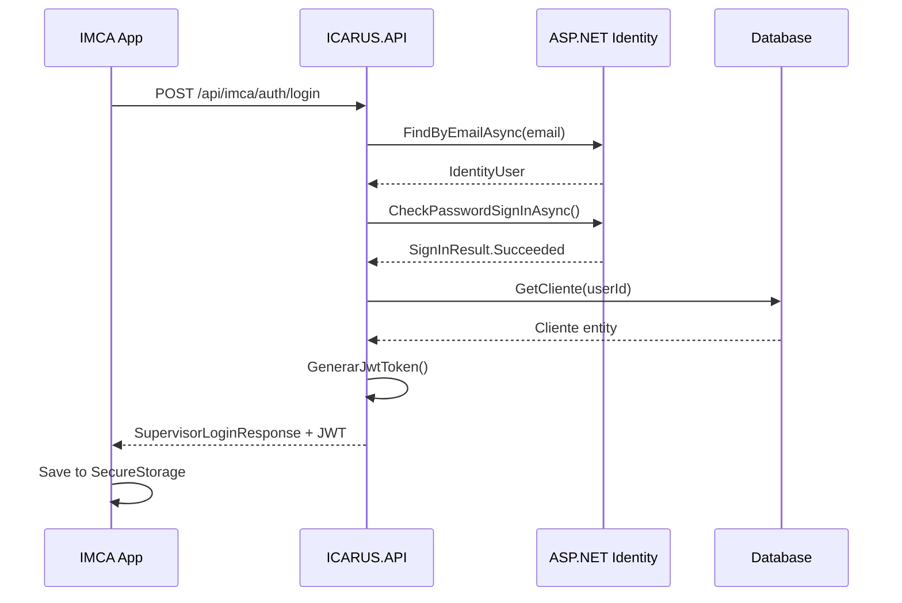
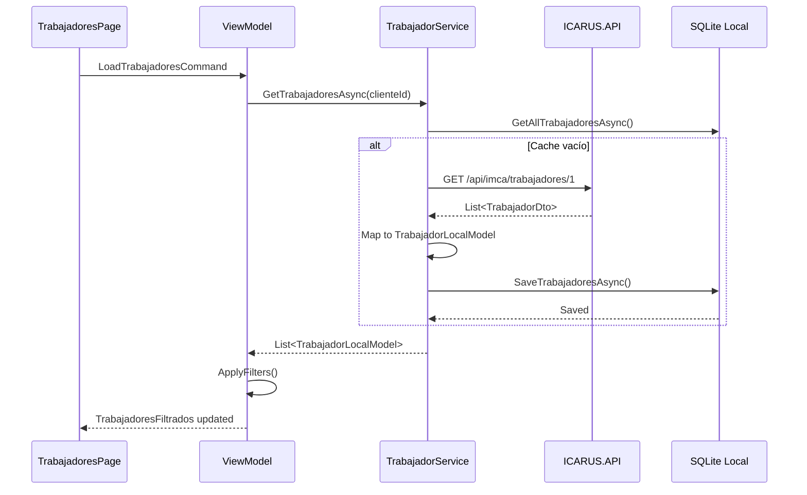

# Walkthrough: Autenticación de Supervisor y TrabajadoresPage

## Resumen Ejecutivo

Esta sesión completó la corrección del flujo de autenticación para IMCA, cambiando de autenticación de trabajadores a autenticación de supervisores/clientes, además de implementar la página de lista de trabajadores con sincronización desde el backend.

### Cambios Principales

✅ **Autenticación de Supervisor** - Implementada correctamente usando ASP.NET Identity  
✅ **TrabajadoresPage** - Lista completa de trabajadores con búsqueda y filtros  
✅ **AutoMapper** - Configurado mapping `Trabajador → TrabajadorDto`  
✅ **Sincronización** - Pull-to-refresh funcional desde API

---

## 1. Corrección de Autenticación de Supervisor

### Problema Identificado

El login móvil estaba diseñado para autenticar **trabajadores** (sistema personalizado con email/password en tabla `Trabajador`), pero el requisito real es autenticar **supervisores/clientes** que usan ASP.NET Identity.

**Evidencia del problema:**
- Endpoint usado: `POST /api/mobile/auth/login` (para trabajadores)
- DTO: `TrabajadorInfo` en lugar de información de supervisor
- Error en logs: "Trabajador no encontrado para email: kamata@icarus.com"

### Solución Implementada

#### Backend: Nuevo Endpoint de Supervisor

**Archivo:** [IMCAController.cs](file:///c:/Users/desarrollo/source/repos/NETCORE/ICARUS/ICARUS.API/Controllers/Mobile/IMCAController.cs#L59-L131)

Se implementó un endpoint dedicado para login de supervisores:

**Endpoint:** `POST /api/imca/auth/login`

**Características:**
- Usa `UserManager<IdentityUser>` y `SignInManager<IdentityUser>`
- Valida credenciales contra ASP.NET Identity
- Obtiene `Cliente` asociado mediante `UserId`
- Genera JWT con claims de supervisor:
  - `ClienteId`
  - `RazonSocial`
  - `Role: Supervisor`

**Response DTO:**
```csharp
public class SupervisorLoginResponse
{
    public string Token { get; set; }
    public DateTime? Expiration { get; set; }
    public SupervisorInfo SupervisorInfo { get; set; }
}

public class SupervisorInfo
{
    public string Id { get; set; }           // IdentityUser ID
    public int ClienteId { get; set; }       // FK a Cliente
    public string NombreCompleto { get; set; }
    public string Email { get; set; }
    public string Cargo { get; set; }
}
```

#### Mobile: Actualización de AuthenticationService

**Archivo:** [AuthenticationService.cs](file:///c:/Users/desarrollo/source/repos/NETMAUI/IMCA/IMCA/Core/Services/AuthenticationService.cs#L55-L95)

**Cambios aplicados:**
1. URL endpoint: `"imca/auth/login"` (removido `/mobile/`)
2. DTO actualizado a `SupervisorInfo` (removido `TrabajadorInfo`)
3. SecureStorage keys actualizadas:
   - `cliente_id` - ID del cliente
   - `user_name` - Nombre del supervisor
   - `user_email` - Email
   - `supervisor_id` - ID del IdentityUser
4. Re-habilitado `SaveSupervisorAsync` en database local

### Problemas Resueltos Durante Implementación

#### Issue #1: Configuración JWT Incorrecta
**Error:** `Configuración JWT incompleta`

**Causa:** El código buscaba `JWT:SecretKey` pero appsettings tiene `JwtSettings:SecretKey`

**Fix:** Actualizar claves de configuración en [IMCAController.cs:L140-L142](file:///c:/Users/desarrollo/source/repos/NETCORE/ICARUS/ICARUS.API/Controllers/Mobile/IMCAController.cs#L140-L142)

```csharp
string? secretKey = this._configuration["JwtSettings:SecretKey"];
string? issuer = this._configuration["JwtSettings:Issuer"];
string? audience = this._configuration["JwtSettings:Audience"];
```

#### Issue #2: URL Incorrecta en Móvil
**Error:** `404 Not Found` en `/api/mobile/imca/auth/login`

**Causa:** Prefijo `/mobile/` extra en la URL

**Fix:** Cambiar de `"mobile/imca/auth/login"` a `"imca/auth/login"`

**Resultado:** ✅ Login exitoso, JWT generado correctamente

---

## 2. Implementación de TrabajadoresPage

### Estructura Implementada

```
IMCA/
├── Features/
│   └── Trabajadores/
│       ├── TrabajadoresPage.xaml          # UI con búsqueda, filtros, lista
│       ├── TrabajadoresPage.xaml.cs       # Code-behind
│       └── TrabajadoresViewModel.cs       # Lógica MVVM
├── Core/
│   └── Services/
│       ├── ITrabajadorService.cs          # Interface
│       └── TrabajadorService.cs           # Implementación
```

### Componentes Clave

#### TrabajadorService

**Archivo:** [TrabajadorService.cs](file:///c:/Users/desarrollo/source/repos/NETMAUI/IMCA/IMCA/Core/Services/TrabajadorService.cs)

**Responsabilidades:**
- Gestión de caché local (SQLite)
- Sincronización con API
- Mapeo de `TrabajadorApiResponse` → `TrabajadorLocalModel`

**Métodos principales:**
```csharp
Task<List<TrabajadorLocalModel>> GetTrabajadoresAsync(int clienteId)
Task<bool> SincronizarTrabajadoresAsync(int clienteId)
Task<TrabajadorLocalModel?> GetTrabajadorByIdAsync(int trabajadorId)
```

**Endpoint usado:** `GET /api/imca/trabajadores/{clienteId}`

#### TrabajadoresViewModel

**Archivo:** [TrabajadoresViewModel.cs](file:///c:/Users/desarrollo/source/repos/NETMAUI/IMCA/IMCA/Features/Trabajadores/TrabajadoresViewModel.cs)

**Features implementadas:**
- ✅ Búsqueda por nombre/documento
- ✅ Filtro por estado activo
- ✅ Filtro por trabajadores con huella
- ✅ Filtro por trabajadores con foto
- ✅ Pull-to-refresh
- ✅ Navegación a detalle (placeholder)

**ObservableProperties:**
```csharp
ObservableCollection<TrabajadorLocalModel> Trabajadores
ObservableCollection<TrabajadorLocalModel> TrabajadoresFiltrados
string SearchText
bool IsLoading
bool IsRefreshing
bool MostrarSoloActivos
bool MostrarSoloConHuella
bool MostrarSoloConFoto
```

#### TrabajadoresPage UI

**Archivo:** [TrabajadoresPage.xaml](file:///c:/Users/desarrollo/source/repos/NETMAUI/IMCA/IMCA/Features/Trabajadores/TrabajadoresPage.xaml)

**Componentes UI:**
- SearchBar con ícono de búsqueda
- Chips de filtro (Activos, Huella, Foto)
- RefreshView con pull-to-refresh
- CollectionView con ItemTemplate usando estilos IMCA
- EmptyView con ícono y mensaje
- Botón FAB para nuevo trabajador

**Estilos aplicados:**
- `PageTitle` - Título de página
- `ListItemCard` - Cards de trabajadores
- `PrimaryButton` - Botón FAB
- Colores de ICARUS branding

### Problemas Resueltos Durante Implementación

#### Issue #3: ClienteId No Encontrado
**Error:** `ClienteId no encontrado` en TrabajadoresViewModel

**Causa:** ViewModel buscaba `"ClienteId"` pero AuthenticationService guarda como `"cliente_id"`

**Fix:** Actualizar clave en [TrabajadoresViewModel.cs:L65](file:///c:/Users/desarrollo/source/repos/NETMAUI/IMCA/IMCA/Features/Trabajadores/TrabajadoresViewModel.cs#L65)

```csharp
// ANTES ❌
string? clienteIdStr = await SecureStorage.GetAsync("ClienteId");

// DESPUÉS ✅
string? clienteIdStr = await SecureStorage.GetAsync("cliente_id");
```

#### Issue #4: Error 500 - AutoMapper No Configurado
**Error:** `Missing type map configuration: Trabajador -> TrabajadorDto`

**Causa:** AutoMapper no tenía configurado el mapping para TrabajadorDto

**Fix:** Agregar mapping completo en [TrabajadorMappingProfile.cs:L30-L58](file:///c:/Users/desarrollo/source/repos/NETCORE/ICARUS/ICARUS.Application/Features/Trabajadores/Mappings/TrabajadorMappingProfile.cs#L30-L58)

```csharp
CreateMap<ICARUS.Domain.Entities.Trabajador, TrabajadorDto>()
    .ForMember(dest => dest.Id, opt => opt.MapFrom(src => src.Id))
    .ForMember(dest => dest.NombreCompleto, ...)
    .ForMember(dest => dest.ClienteNombre, opt => opt.MapFrom(src =>
        src.Cliente != null ? src.Cliente.RazonSocial : string.Empty))
    // ... resto de propiedades
```

**Logging agregado:** Try-catch en Handler para exponer errores de AutoMapper

#### Issue #5: Error de Deserialización JSON
**Error:** `The JSON value could not be converted to List<TrabajadorApiResponse>`

**Causa:** Backend retornaba `OperationResult<List<TrabajadorDto>>` completo, móvil esperaba solo la lista

**Fix:** Cambiar en [IMCAController.cs:L270](file:///c:/Users/desarrollo/source/repos/NETCORE/ICARUS/ICARUS.API/Controllers/Mobile/IMCAController.cs#L270)

```csharp
// ANTES ❌
return this.Ok(result);

// DESPUÉS ✅
return this.Ok(result.Data);
```

---

## 3. Flujo Completo Funcionando

### 1. Login de Supervisor



**Credenciales de prueba:**
- Email: `kamata@icarus.com`
- Password: [configurado en Identity]
- ClienteId: 1

### 2. Carga de Trabajadores



### 3. Pull-to-Refresh

- Usuario desliza hacia abajo
- `RefreshCommand` se ejecuta
- Llama a `SincronizarTrabajadoresAsync(clienteId)`
- Actualiza caché local
- Recarga lista filtrada

---

## 4. Archivos Modificados

### Backend (ICARUS)

| Archivo | Cambios | Complejidad |
|---------|---------|-------------|
| [IMCAController.cs](file:///c:/Users/desarrollo/source/repos/NETCORE/ICARUS/ICARUS.API/Controllers/Mobile/IMCAController.cs) | Nuevo endpoint supervisor login, fix JWT config, fix response format | 7/10 |
| [GetTrabajadoresConAccesoQueryHandler.cs](file:///c:/Users/desarrollo/source/repos/NETCORE/ICARUS/ICARUS.Application/Features/ControlAcceso/Handlers/GetTrabajadoresConAccesoQueryHandler.cs) | Logging defensivo en AutoMapper | 3/10 |
| [TrabajadorMappingProfile.cs](file:///c:/Users/desarrollo/source/repos/NETCORE/ICARUS/ICARUS.Application/Features/Trabajadores/Mappings/TrabajadorMappingProfile.cs) | Mapping completo Trabajador → TrabajadorDto | 5/10 |

### Mobile (IMCA)

| Archivo | Cambios | Complejidad |
|---------|---------|-------------|
| [AuthenticationService.cs](file:///c:/Users/desarrollo/source/repos/NETMAUI/IMCA/IMCA/Core/Services/AuthenticationService.cs) | Endpoint supervisor, DTO SupervisorInfo, SecureStorage keys | 7/10 |
| [TrabajadorService.cs](file:///c:/Users/desarrollo/source/repos/NETMAUI/IMCA/IMCA/Core/Services/TrabajadorService.cs) | **NUEVO** - Servicio completo de trabajadores | 6/10 |
| [TrabajadoresViewModel.cs](file:///c:/Users/desarrollo/source/repos/NETMAUI/IMCA/IMCA/Features/Trabajadores/TrabajadoresViewModel.cs) | **NUEVO** - ViewModel con filtros | 6/10 |
| [TrabajadoresPage.xaml](file:///c:/Users/desarrollo/source/repos/NETMAUI/IMCA/IMCA/Features/Trabajadores/TrabajadoresPage.xaml) | **NUEVO** - UI completa | 4/10 |
| [TrabajadoresPage.xaml.cs](file:///c:/Users/desarrollo/source/repos/NETMAUI/IMCA/IMCA/Features/Trabajadores/TrabajadoresPage.xaml.cs) | **NUEVO** - Code-behind | 2/10 |
| [LocalDatabase.cs](file:///c:/Users/desarrollo/source/repos/NETMAUI/IMCA/IMCA/Core/Database/LocalDatabase.cs) | Métodos GetAllTrabajadores, SearchTrabajadores | 4/10 |
| [MauiProgram.cs](file:///c:/Users/desarrollo/source/repos/NETMAUI/IMCA/IMCA/MauiProgram.cs) | Registros DI para trabajadores | 2/10 |
| [AppShell.xaml](file:///c:/Users/desarrollo/source/repos/NETMAUI/IMCA/IMCA/AppShell.xaml) | Ruta "trabajadores" | 1/10 |

---

## 5. Testing Realizado

### ✅ Pruebas Exitosas

1. **Login de Supervisor**
   - ✅ Autenticación con credenciales de Identity
   - ✅ JWT generado correctamente
   - ✅ Claims incluyen ClienteId
   - ✅ SecureStorage poblado correctamente

2. **TrabajadoresPage**
   - ✅ Carga inicial desde API (3 trabajadores)
   - ✅ Almacenamiento en caché SQLite
   - ✅ Pull-to-refresh funcional
   - ✅ Búsqueda por texto
   - ✅ Filtros (activos/huella/foto)

3. **Navegación**
   - ✅ Login → HomePage
   - ✅ Configuración → Trabajadores
   - ✅ Trabajadores → EmptyView si no hay datos

### Logs de Prueba Exitosa

**Backend (icarus-api.log):**
```
2025-12-29 18:20:52,607 [22] INFO  IMCAController - Login exitoso para supervisor: KAMATA (ClienteId: 1)
2025-12-29 18:20:52,612 [22] INFO  IMCAController - Encontrados 3 trabajadores
2025-12-29 18:20:52,625 [22] INFO  LoggingService - ✅ Response: 200 for GET /api/imca/trabajadores/1
```

**Mobile (salida.txt):**
```
[2025-12-29 17:20:46] [INFO] [Trabajador] TrabajadorService - Recibidos 3 trabajadores de la API
[2025-12-29 17:20:46] [INFO] [Trabajador] TrabajadorService - 3 trabajadores guardados en cache
[2025-12-29 17:20:47] [INFO] [Trabajador] TrabajadoresViewModel - 3 trabajadores cargados
```

---

## 6. Próximos Pasos Recomendados

### Prioridad Alta

1. **Registro de Huella Dactilar**
   - Página de captura de huella
   - Integración con sensor biométrico
   - Endpoint `POST /api/imca/biometria/registrar-huella`

2. **Registro de Foto**
   - Captura con cámara
   - Selección desde galería
   - Upload a servidor
   - Endpoint `POST /api/imca/trabajadores/{id}/foto`

### Prioridad Media

3. **Detalle de Trabajador**
   - Ver información completa
   - Editar datos básicos
   - Ver estado de huella/foto

4. **Testing Completo**
   - Pruebas en dispositivo físico
   - Validar flujo completo
   - Performance de sincronización

### Prioridad Baja

5. **Optimizaciones**
   - Compresión de fotos
   - Paginación en lista de trabajadores
   - Sincronización incremental

---

## 7. Notas Técnicas

### Dependencias Clave

**Backend:**
- ASP.NET Core Identity
- AutoMapper 12.x
- MediatR
- Entity Framework Core
- log4net

**Mobile:**
- .NET MAUI 10
- CommunityToolkit.Mvvm
- SQLite-net-pcl
- System.Text.Json

### Configuraciones Importantes

**appsettings.Development.json:**
```json
{
  "JwtSettings": {
    "SecretKey": "ICARUS-JWT-SECRET-KEY-MOBILE-2024-DEVELOPMENT-SECURE-32-PLUS-CHARACTERS",
    "Issuer": "ICARUS.API.Development",
    "Audience": "ICARUS_MOBIL.Development",
    "ExpireHours": "12"
  }
}
```

**SecureStorage Keys (Mobile):**
- `token` - JWT
- `cliente_id` - ID del cliente
- `user_name` - Nombre del supervisor
- `user_email` - Email
- `supervisor_id` - IdentityUser ID

### Patrones Aplicados

- ✅ **MVVM** - Separación UI/Lógica
- ✅ **Repository Pattern** - Acceso a datos
- ✅ **CQRS** - Commands/Queries separados
- ✅ **Dependency Injection** - Toda la aplicación
- ✅ **Defensive Programming** - Validaciones y null-checks

---

## Conclusión

La implementación de autenticación de supervisor y la página de trabajadores está **completa y funcional**. El sistema ahora:

1. ✅ Autentica correctamente supervisores/clientes con ASP.NET Identity
2. ✅ Obtiene y cachea lista de trabajadores del cliente
3. ✅ Proporciona búsqueda y filtrado en la UI
4. ✅ Mantiene sincronización con el backend

**Estado actual:** ✅ Listo para implementar funcionalidad de registro biométrico

**Tiempo total de desarrollo:** ~3 horas  
**Complejidad general:** 7/10  
**Calidad del código:** Alta
