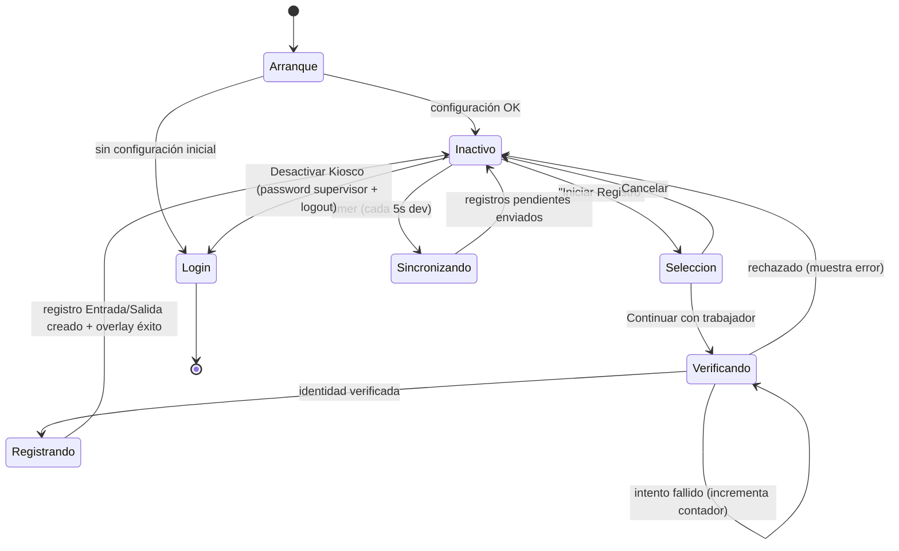
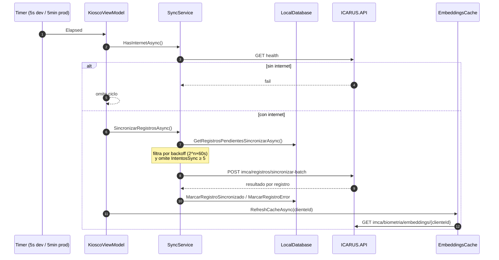

# IMCA — Modo Kiosco y Operación Offline

**Última actualización:** 2026-06-29 — validado contra código fuente

El **Modo Kiosco** es el estado operativo principal de IMCA: el dispositivo queda fijo en una
pantalla donde los trabajadores fichan Entrada/Salida por reconocimiento facial. Funciona
**offline-first**: cada fichaje se guarda en SQLite y se sincroniza con el backend cuando hay red.

Código principal: `IMCA/Features/Kiosco/KioscoViewModel.cs`,
`IMCA/Features/Configuracion/ConfiguracionViewModel.cs`, `IMCA/Core/Services/SyncService.cs`.

---

## 1. Activación del Modo Kiosco

Desde `ConfiguracionViewModel.ActivarModoKioscoAsync()`:

1. Muestra un **popup modal personalizado** con un `Entry` de password (`IsPassword = true`)
   — se usa popup propio porque `DisplayPromptAsync` no oculta el texto.
2. Valida el password contra `supervisor_password` guardado en `SecureStorage`.
3. Si es correcto: marca `ConfiguracionAppModel.ModoKioscoActivo = true`, fija
   `SupervisorEmail`, `FechaActivacionKiosco` y `DispositivoId`, y navega a la ruta `kiosco`.
4. El **token JWT sigue válido** durante el turno (login de kiosco pide token de larga duración;
   ver `05-AUTENTICACION.md`).

## 2. Arranque en Modo Kiosco

`KioscoViewModel.VerificarConfiguracionInicialAsync()` (en el constructor):

- Si **no** hay `cliente_id` + `supervisor_password` en SecureStorage → muestra aviso de
  "Configuración inicial requerida" y redirige a `//login`.
- Si hay configuración → restaura el token JWT desde la BD
  (`GetSupervisorConTokenValidoAsync`, que no exige `EstaAutenticado`), carga la configuración
  y los registros del día, **arranca el timer de sincronización** y precarga el cache de embeddings.

---

## 3. Flujo de fichaje (selección manual + verificación 1:1)

> **IMPORTANTE:** NO es identificación facial 1:N automática. El trabajador **se selecciona a
> sí mismo de una lista** y luego el sistema **verifica 1:1** que el rostro corresponde al
> trabajador seleccionado.

Pasos (`KioscoViewModel`):

1. **"Iniciar Registro"** → `CapturarEIdentificarAsync()` carga los trabajadores locales
   (`GetTrabajadoresAsync`) y muestra un selector con búsqueda.
2. El trabajador selecciona su nombre y pulsa **Continuar**
   (`ContinuarConTrabajadorAsync` → `VerificarIdentidadSeleccionadaAsync`).
   Al cambiar de trabajador se **reinicia el contador de intentos fallidos**.
3. Se captura una foto con la **cámara frontal** (comprimida).
4. **Verificación según número de intentos previos**
   (`INTENTOS_ANTES_ARGOS_FORZADO = 2`):
   - **Intentos 1–2:** ONNX local. `EmbeddingsCache.VerificarTrabajadorAsync` devuelve una zona:
     - `Verificado` (≥ 75 %) → ✅ aceptado.
     - `ZonaGris` (40–75 %) → confirmar con **ARGOS** (`POST /api/identify`), exigiendo que
       ARGOS identifique **al mismo trabajador** seleccionado.
     - `Rechazado` (< 40 %) → ❌ y se incrementa el contador.
     - `SinEmbedding` → intentar ARGOS.
   - **Intento 3+:** se **fuerza ARGOS** directamente, ignorando ONNX; luego se reinicia el contador.
5. Si la identidad queda verificada:
   - Se determina **Entrada/Salida** según el último registro del día del trabajador
     (`GetUltimoRegistroTrabajadorAsync`): sin registro previo o último = Salida ⇒ **Entrada**;
     último = Entrada hoy ⇒ **Salida**.
   - Se inserta un `RegistroLocalModel` con `Sincronizado = false`.
   - Se muestra un overlay full-screen de éxito (autocierre 3 s).

Diagrama de secuencia detallado (validado contra el código):
`Diagramas Mermaid/Secuencia/Modo Kiosco - Selección Manual de Trabajador.mmd`.

### Umbrales (recordatorio — valores reales)

| Similitud | Zona | Acción |
|---|---|---|
| ≥ 75 % | Verificado | Aceptar (ONNX) |
| 40–75 % | ZonaGris | Confirmar con ARGOS |
| < 40 % | Rechazado | Rechazar |

(Los comentarios viejos del código que dicen "60 %" están obsoletos; ver `03-RECONOCIMIENTO-FACIAL.md`.)

---

## 4. Diagrama de estados del Modo Kiosco

---

## 5. Sincronización offline (`SyncService`)

- **Estrategia:** batch. `SincronizarRegistrosAsync()` envía los registros pendientes con
  `POST imca/registros/sincronizar-batch` (cuerpo: lista de `RegistroSincronizarDto`).
- **Conectividad:** `HasInternetAsync()` combina `Connectivity.Current.NetworkAccess` con un
  `GET health` contra ICARUS.API.
- **Reintentos exponenciales:** el delay para reintentar un registro es
  **`2^IntentosSync × 60` segundos**, medido desde `UltimoIntentoSync`:
  - `IntentosSync == 0` (primer intento) → se envía **de inmediato, sin delay**.
  - `IntentosSync == 1` → 120 s (2 min); `== 2` → 4 min; `== 3` → 8 min; `== 4` → 16 min.
  - **`IntentosSync ≥ 5`** → el registro se **omite** (no se reintenta más hasta intervención manual).
  > El comentario del código (`// 1min, 2min, 4min, 8min, 16min`) es engañoso: el primer envío
  > (n=0) no espera, y el primer **reintento** (n=1) ya son 2 min. La fórmula es la indicada arriba.
- Tras sincronizar OK: `MarcarRegistroSincronizadoAsync(id, registroIdBackend)`.
  Si falla: `MarcarRegistroErrorAsync(id, error)` (incrementa `IntentosSync`).

### Timer de sincronización automática

`IniciarTimerSincronizacion()` crea un `System.Timers.Timer`.

> ⚠️ **Valor actual = 5 segundos (PRUEBA).** En el código está hardcodeado `new Timer(5000)`
> con un `TODO` explícito: *"producción: 300000ms = 5 min"*. **Antes de release hay que
> cambiarlo a 5 minutos.** Documentado como inconsistencia conocida.

En cada ciclo del timer (`SincronizarAutomaticoAsync`): verifica internet, sincroniza
pendientes, actualiza la UI y **refresca el cache de embeddings** para detectar trabajadores
nuevos.

---

## 6. Desactivación del Modo Kiosco

`KioscoViewModel.DesactivarModoKioscoAsync()`:

1. Pide el password del supervisor y lo valida contra `supervisor_password`.
2. Si hay registros pendientes:
   - Con internet → intenta sincronizar; si quedan fallidos, pide confirmación al usuario.
   - Sin internet → avisa y pide confirmación para desactivar igualmente.
3. Detiene y libera el timer de sincronización.
4. Marca `ModoKioscoActivo = false` (limpia `SupervisorEmail` y `FechaActivacionKiosco`).
5. Hace **logout** (`AuthenticationService.LogoutAsync`) y navega a `//login`.

---

## 7. Mapa de código del Modo Kiosco

| Concepto | Ruta real |
|---|---|
| ViewModel del kiosco | `IMCA/Features/Kiosco/KioscoViewModel.cs` |
| Página del kiosco | `IMCA/Features/Kiosco/KioscoPage.xaml` |
| Activar kiosco | `ConfiguracionViewModel.ActivarModoKioscoAsync()` |
| Sincronización | `IMCA/Core/Services/SyncService.cs` |
| Cache de embeddings | `IMCA/Core/Services/EmbeddingsCache.cs` |
| Registros locales | `LocalDatabase` (tabla `RegistroLocal`) |
