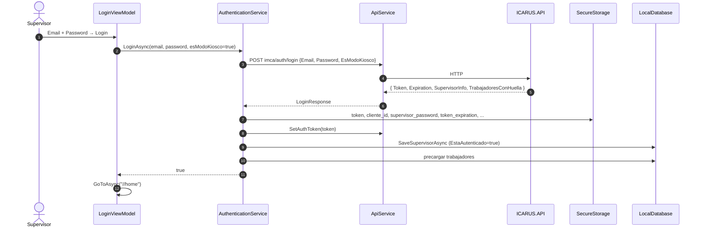

# IMCA — Autenticación

**Última actualización:** 2026-06-29 — validado contra código fuente

IMCA autentica **supervisores/clientes** (no trabajadores). El supervisor inicia sesión, y a
partir de ese momento configura el dispositivo y activa el Modo Kiosco. Los **trabajadores no
se autentican con credenciales**: se identifican por rostro durante el fichaje (ver
`03-RECONOCIMIENTO-FACIAL.md`).

Código principal: `IMCA/Features/Login/LoginViewModel.cs`,
`IMCA/Core/Services/AuthenticationService.cs`, `IMCA/Core/Services/ApiService.cs`,
`IMCA/Core/Services/TokenRefreshService.cs`.

---

## 1. Login de supervisor

`LoginViewModel.LoginAsync()` → `AuthenticationService.LoginAsync(email, password, esModoKiosco)`.

- IMCA es exclusivamente app de kiosco, así que el login **siempre** pide
  `esModoKiosco = true` (token de larga duración, ~30 días).
- Llama a **`POST imca/auth/login`** con el cuerpo `{ Email, Password, EsModoKiosco }`.
- Backend (ICARUS.API): valida contra **ASP.NET Identity** (`UserManager`/`SignInManager`),
  resuelve el `Cliente` asociado y emite un **JWT** con claims de supervisor
  (`ClienteId`, `RazonSocial`, `Role: Supervisor`).

### Forma de la respuesta (`LoginResponse`)

| Campo | Descripción |
|---|---|
| `Token` | JWT del supervisor |
| `Expiration` | Fecha de expiración del token (la fija el servidor) |
| `SupervisorInfo` | `{ Id, ClienteId, NombreCompleto, Email }` |
| `TrabajadoresConHuella` | Lista de trabajadores del cliente (para precargar SQLite) |

### Tras un login correcto

1. Guarda en **SecureStorage**: token, `cliente_id`, `user_name`, `user_email`,
   `supervisor_id`, **`supervisor_password`** (para validar activación/desactivación de kiosco
   y refresco de token), y `token_expiration` (ISO 8601).
2. Inyecta el token en `ApiService.SetAuthToken()` (header `Authorization: Bearer`).
3. Guarda el `SupervisorModel` en SQLite (`EstaAutenticado = true`).
4. Precarga los **trabajadores** del cliente en SQLite (con `PlantillaBiometrica`,
   `FaceEmbedding` si viene, `FotoUrl`, etc.), para operar offline.
5. Navega a `//home`.

---

## 2. Persistencia de sesión y token

| Dato | Dónde se guarda |
|---|---|
| Token JWT | SecureStorage (`auth_token`) **y** `SupervisorModel.Token` en SQLite |
| Expiración | SecureStorage (`token_expiration`, ISO 8601) **y** `SupervisorModel.TokenExpiration` |
| Password supervisor | SecureStorage (`supervisor_password`) |
| ClienteId | SecureStorage (`cliente_id`) |

- En el arranque del kiosco, el token se **restaura** desde SQLite con
  `LocalDatabase.GetSupervisorConTokenValidoAsync()` (busca un supervisor con token **no
  expirado**, sin exigir `EstaAutenticado = true`) y se reinyecta en `ApiService`.
- `IsAuthenticatedAsync()` comprueba la presencia y validez del token en SecureStorage.

---

## 3. Refresco de token (`TokenRefreshService`)

En sesiones de kiosco de varios días el token puede caducar. `TokenRefreshService` implementa
`EnsureValidTokenAsync(horasAnticipacion = 2)`, que renueva el JWT reutilizando las credenciales
guardadas (`user_email` + `supervisor_password`) mediante un nuevo login silencioso. Por eso el
password del supervisor se conserva en SecureStorage.

> ⚠️ **Estado real:** `TokenRefreshService` **no está registrado en DI ni se invoca** desde
> ningún ViewModel/servicio (verificado en el código). Es funcionalidad presente pero **sin
> cablear**. Hoy la restauración del token en el arranque del kiosco la hace
> `KioscoViewModel.RestaurarTokenAsync()` leyendo el token válido desde SQLite
> (`GetSupervisorConTokenValidoAsync`), no este servicio.

---

## 4. Logout

`AuthenticationService.LogoutAsync()`:

- Limpia el token de SecureStorage y marca el supervisor como no autenticado en SQLite
  (`CerrarSesionSupervisorAsync`).
- Se invoca desde Configuración ("Cerrar sesión") y al **desactivar el Modo Kiosco**.

---

## 5. Claves de SecureStorage (referencia para agentes IA)

Definidas/usadas a lo largo del código. `Constants.SecureStorageKeys` define un set formal,
pero varios servicios usan claves literales adicionales:

| Clave | Origen | Uso |
|---|---|---|
| `auth_token` | `AuthenticationService.TokenKey` | JWT |
| `cliente_id` | login | ID de cliente para llamadas API |
| `user_email` | login | Email del supervisor (refresh / UI) |
| `user_name` | login | Nombre del supervisor (UI) |
| `supervisor_id` | login | ID Identity del supervisor |
| `supervisor_password` | login | Validar kiosco + refresco de token |
| `token_expiration` | login | Caducidad del token (ISO 8601) |
| `device_id` | configuración | Id de dispositivo (al activar kiosco) |
| `imca_auth_token`, `imca_cliente_id`, `imca_cliente_nombre`, `imca_dispositivo_id` | `Constants.SecureStorageKeys` | Set formal de claves (parcialmente usado) |

> ⚠️ **Nota para agentes:** hay convivencia entre claves "formales" de
> `Constants.SecureStorageKeys` (prefijo `imca_`) y claves literales (`auth_token`,
> `cliente_id`, `supervisor_password`, etc.) usadas directamente en los servicios. Al leer/
> escribir SecureStorage, **verificar la clave exacta** en el servicio correspondiente.

---

## 6. Endpoints de ICARUS.API usados por la app

| Método | Endpoint | Servicio que lo usa |
|---|---|---|
| `POST` | `imca/auth/login` | `AuthenticationService` |
| `GET` | `imca/trabajadores/{clienteId}` | `TrabajadorService` |
| `GET` | `imca/biometria/embeddings/{clienteId}` | `EmbeddingsCache` |
| `POST` | `imca/biometria/embedding-mobilefn` | `CapturarFotoViewModel` |
| `POST` | `imca/biometria/registrar-huella` | `RegistrarHuellaViewModel` *(flujo de huella SIMULADA)* |
| `POST` | `imca/fotos/subir` | `FotoService` |
| `POST` | `imca/registros/sincronizar-batch` | `SyncService` |
| `GET` | `health` | `SyncService` / `ApiService` (chequeo de conectividad) |

> `FotoService` también referencia (comentado/pendiente) `GET imca/fotos/descargar/{clienteId}`.
> La descarga de fotos en producción la hace `ConfiguracionViewModel.ActualizarFotosAsync`
> usando la `FotoUrl` de cada trabajador (archivos estáticos), no este endpoint.

> El `HttpClient` se crea con `BaseAddress = Constants.ApiBaseUrl`, que ya incluye `/api/`,
> por lo que las rutas relativas anteriores no llevan el prefijo `api/`.

### URLs de ICARUS.API por entorno (`Helpers/Constants.cs`)

| Entorno | URL base |
|---|---|
| Debug (emulador Android) | `http://10.0.2.2:5090/api/` |
| Debug (dispositivo físico) | `http://192.168.1.109:5090/api/` *(IP de desarrollo configurable)* |
| Release (producción) | `https://api.icarus.trajano.online/api/` |

(Las URLs de ARGOS, distintas, están en `03-RECONOCIMIENTO-FACIAL.md`.)
