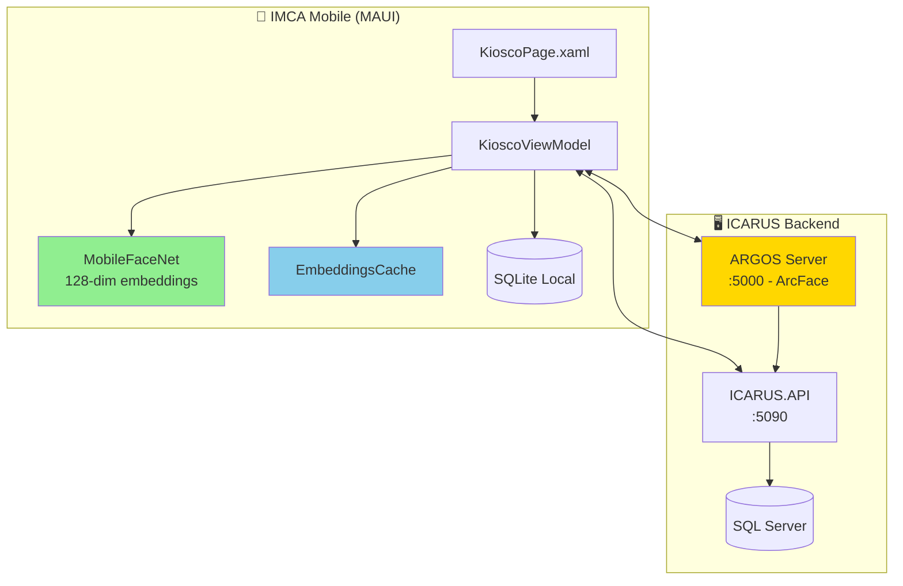
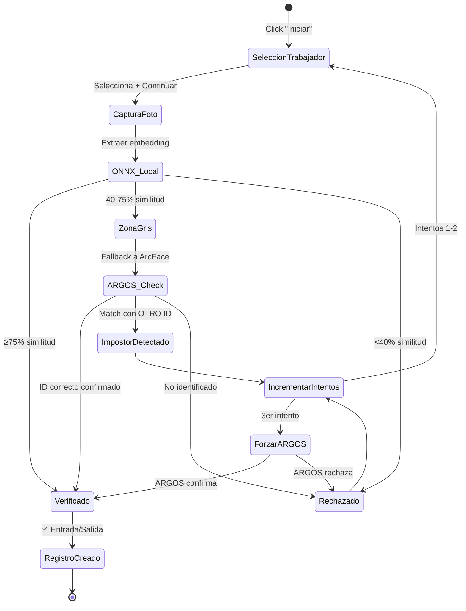
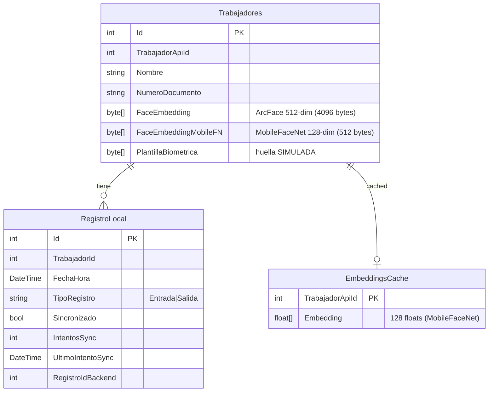
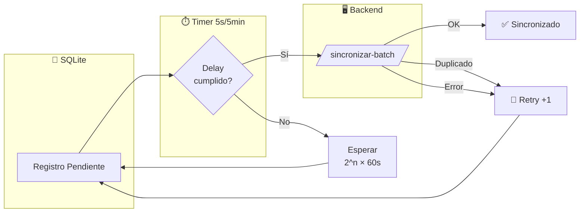

# 📱 IMCA Kiosco - Contexto Técnico FaceID

> **Última actualización:** 2026-06-29 — validado contra código fuente
> **Estado**: ✅ Validado contra el código real (los umbrales y el flujo coinciden)

---

## 🏗️ Arquitectura del Sistema

---

## 🔐 Flujo de Verificación Facial

---

## ⚙️ Configuración Validada

### Umbrales de Verificación

| Zona | Rango | Motor | Acción |
|------|-------|-------|--------|
| **Verificado** | ≥75% | ONNX Local | ✅ Registro directo |
| **Zona Gris** | 40-75% | ONNX → ARGOS | ⚠️ Fallback a ArcFace |
| **Rechazado** | <40% | ONNX Local | ❌ Rechazo directo |

### Resultados de Pruebas Reales (2026-01-15)

| Escenario | ONNX | ARGOS | Resultado |
|-----------|------|-------|-----------|
| Victor (real) | 88-92% | - | ✅ Verificado directo |
| Victor (ángulo difícil) | 49-71% | 65% | ✅ Verificado vía ARGOS |
| Impostor similar | 60-71% | 22% (match ID=7) | ❌ Rechazado |

---

## 📊 Modelo de Datos

> Nombres reales de tabla/campo: ver `02-MODELO-DATOS.md`. La relación es lógica
> (`TrabajadorApiId` ↔ `RegistroLocal.TrabajadorId`), sin FK declarada en SQLite.

---

## 🔄 Sincronización

### Backoff Exponencial
- Intento 1: 2 min delay
- Intento 2: 4 min delay  
- Intento 3: 8 min delay
- Máximo: 5 intentos (registros con `IntentosSync ≥ 5` se omiten)

> ⚠️ **Timer de sincronización:** actualmente hardcodeado a **5 segundos (valor de PRUEBA)**
> en `KioscoViewModel.IniciarTimerSincronizacion()`, con un `TODO` para pasarlo a 5 min
> (300000 ms) en producción.

---

## 📁 Archivos Clave

| Archivo | Propósito |
|---------|-----------|
| `Features/Kiosco/KioscoViewModel.cs` | Lógica principal, contador intentos |
| `Features/Kiosco/KioscoPage.xaml` | UI del kiosco |
| `Core/Services/EmbeddingsCache.cs` | Cache + umbrales verificación |
| `Core/Services/ArgosService.cs` | Cliente ARGOS (ArcFace) |
| `Core/Services/SyncService.cs` | Sincronización con backoff |
| `IMCA.Tests/` | Tests de lógica pura (`EmbeddingsCacheTests`, `SyncServiceTests`) |

---

## 🎯 Decisiones de Diseño

1. **Por qué 40% para zona gris**: Permite que casos borderline pasen a ARGOS (más preciso) sin rechazar automáticamente.

2. **Por qué 3 intentos antes de forzar ARGOS**: Balance entre UX (evitar bloquear usuario legítimo) y seguridad.

3. **Por qué backoff exponencial**: Evita saturar API en caso de errores, permite recuperación gradual.

4. **ONNX vs ARGOS**:
   - ONNX (MobileFaceNet): Rápido (~400ms), 128-dim, suficiente para matches claros
   - ARGOS (ArcFace): Lento (~3s), 512-dim, más preciso para casos difíciles

---

## 🐛 Problemas Conocidos

| Issue | Estado | Workaround |
|-------|--------|------------|
| Registros duplicados en sync | ✅ Manejado | API rechaza, cliente hace retry |
| ARGOS timeout ocasional | ✅ Manejado | Incrementa contador, retry |
| Skipped frames en Android | ⚠️ Cosmético | No afecta funcionalidad |
