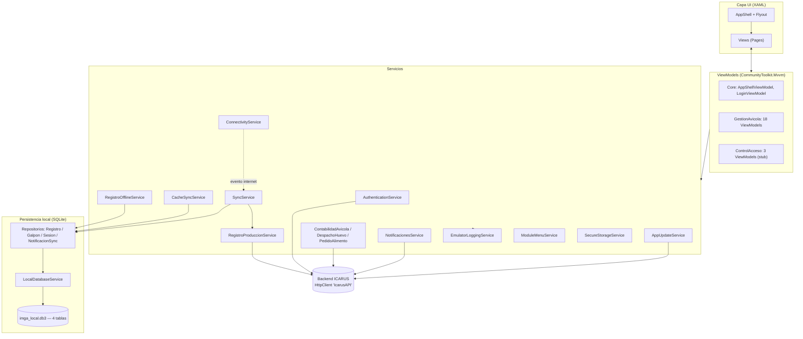
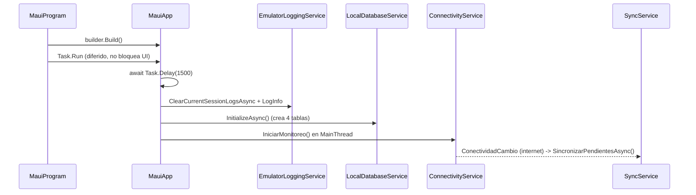
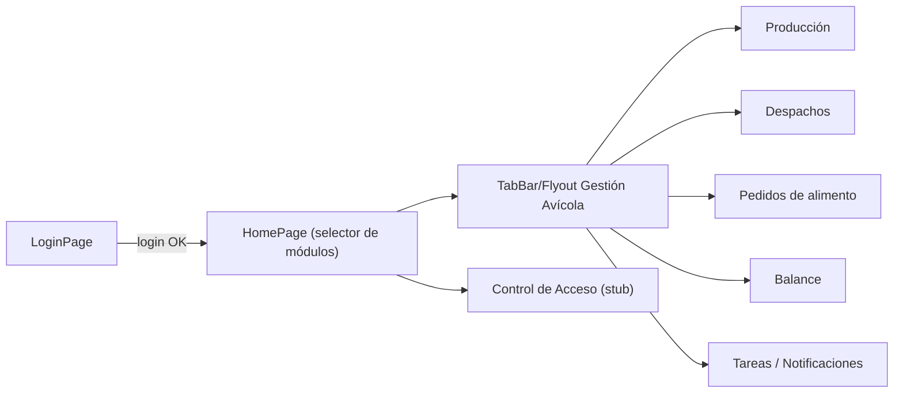

# 01 — Arquitectura

**Última actualización:** 2026-06-29 — validado contra código fuente

## Visión general

IMGA es una app **.NET MAUI (solo Android, net10.0-android)** que sigue el patrón
**MVVM** (con `CommunityToolkit.Mvvm` 8.4.0) sobre una arquitectura **offline-first**:
toda la operación crítica (registrar producción, editar) funciona sin conexión gracias
a una base de datos **SQLite local** y un servicio de **sincronización** que sube los
cambios al backend ICARUS cuando hay internet.

Tres pilares que distinguen el código real:

1. **Offline-first** — SQLite (`imga_local.db3`) + repositorios + `SyncService` +
   `ConnectivityService` (ver [04-SINCRONIZACION-OFFLINE.md](04-SINCRONIZACION-OFFLINE.md)).
2. **Módulo GestionAvicola amplio** — 5 submódulos (Producción, Despachos, Pedidos,
   Balance, Tareas), 18 ViewModels y 18 Views (ver [03-MODULO-GESTION-AVICOLA.md](03-MODULO-GESTION-AVICOLA.md)).
3. **Suite de pruebas** — `IMGA.UnitTests` con 58 tests xUnit (ver [06-PRUEBAS.md](06-PRUEBAS.md)).

---

## Diagrama de componentes

---

## Inyección de dependencias (`MauiProgram.cs`)

La composición raíz está en `MauiProgram.CreateMauiApp()`. Configura cultura `es-ES`,
fuentes, CommunityToolkit y SkiaSharp, registra servicios y difiere la inicialización
pesada (SQLite, monitoreo de conectividad) a un `Task.Run` con `Task.Delay(1500)` para
evitar ANR en el arranque de Android.

### Ciclos de vida registrados

| Ciclo de vida | Servicios / tipos |
|---------------|-------------------|
| **Singleton** | `IEmulatorLoggingService`, `IModuleMenuService`, `INotificacionesService`, `IAppUpdateService`, `ILocalDatabaseService`, `IConnectivityService`, `ISecureStorageService`, `AppShell`, `App` |
| **Transient** | `IAuthenticationService`, `IRegistroProduccionService`, `IContabilidadAvicolaService`, `IDespachoHuevoService`, `IPedidoAlimentoService`, `ISyncService`, `ICacheSyncService`, `IRegistroOfflineService`, los 4 repositorios SQLite, `HttpClient`, y **todos** los ViewModels y Pages |

> Nota: el `HttpClient` se registra como named client `"IcarusAPI"` vía
> `AddHttpClient` y además como `Transient<HttpClient>` que resuelve ese cliente
> mediante `IHttpClientFactory`. Detalles en [05-AUTENTICACION-API.md](05-AUTENTICACION-API.md).

### Arranque diferido

---

## Navegación: Shell + Flyout dinámico

- `AppShell` (singleton) define la estructura de navegación con `Shell`/`TabBar`.
- El menú **Flyout** se construye dinámicamente según los módulos asignados al
  trabajador tras el login: `ModuleMenuService.UpdateAssignedModules(...)` recibe la
  lista `AssignedModules` de la respuesta de login y `AppShellViewModel` arma el menú.
- Modelos del flyout en `Core/Models/FlyoutModels.cs`; plantillas en
  `Resources/Styles/FlyoutTemplates.xaml`; cabecera en `Core/Views/FlyoutHeaderView.xaml`.

---

## Mapa de código — infraestructura

| Concepto | Ruta real |
|----------|-----------|
| Composición raíz / DI / startup | `MauiProgram.cs` |
| App y Shell | `App.xaml(.cs)`, `AppShell.xaml(.cs)` |
| Servicios de infraestructura | `Core/Services/*.cs` (+ `Core/Services/Interfaces/`) |
| Persistencia SQLite | `Core/Data/` (`LocalDatabaseService`, repositorios, `Models/`, `Interfaces/`) |
| DTOs compartidos | `Core/Models/*.cs` |
| ViewModels núcleo | `Core/ViewModels/AppShellViewModel.cs`, `LoginViewModel.cs` |
| Views núcleo | `Core/Views/LoginPage`, `HomePage`, `FlyoutHeaderView` |
| Módulo avícola | `Modules/GestionAvicola/{Models,Services,ViewModels,Views}` |
| Módulo control de acceso (stub) | `Modules/ControlAcceso/{ViewModels,Views}` |
| Converters XAML | `Converters/*.cs` |
| Estilos / recursos | `Resources/Styles/*.xaml`, `Resources/{Fonts,Images,Splash,Raw}` |

---

## Converters XAML (17 archivos)

Ubicados en `Converters/` (17 archivos `.cs`). Transforman datos del ViewModel para enlace en XAML.

| Converter | Propósito (resumen) |
|-----------|---------------------|
| `BoolToColorConverter` | bool → color |
| `BoolToExpandIconConverter` | bool → icono expandir/colapsar |
| `BoolToPasswordIconConverter` | bool → icono ojo de contraseña |
| `BoolToTextConverter` | bool → texto configurable |
| `InvertedBoolConverter` | invierte un bool |
| `IsNotNullConverter` | objeto → bool (no nulo) |
| `IsEditableDateConverter` | fecha → editable solo si es HOY |
| `NumberToBoolConverter` | número → bool (>0) |
| `NumberToColorConverter` | número → color por umbral |
| `PercentToProgressConverter` | porcentaje → progreso 0..1 |
| `EfficiencyToColorConverter` | eficiencia → color (verde/naranja/rojo) |
| `StringToBoolConverter` | string → bool |
| `StringToColorConverter` | estado textual → color |
| `EstadoSyncToColorConverter` | `EstadoSync` → color |
| `EstadoSyncToIconConverter` | `EstadoSync` → icono |
| `TipoNotificacionToColorConverter` | `TipoNotificacionSync` → color |
| `CommonConverters` | converters utilitarios agrupados |

> Total: 17 archivos `.cs` en `Converters/`. `CommonConverters.cs` agrupa varios
> converters utilitarios, por lo que el número de clases convertidoras es mayor que 17.

---

## Logging

`EmulatorLoggingService` (`Core/Services/EmulatorLoggingService.cs`, singleton) ofrece
logging asíncrono en background hacia archivo local con niveles Info/Debug/Warn/Error
y categoría. Es una dependencia transversal usada por casi todos los servicios y
ViewModels. Se inicializa y limpia la sesión previa en el arranque diferido.
