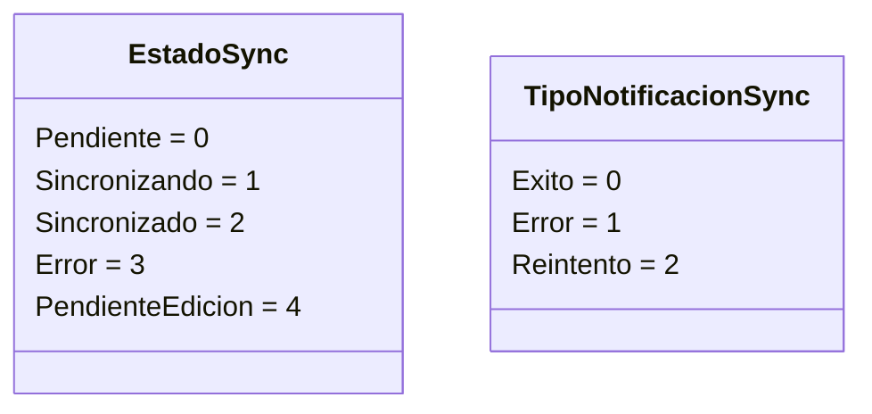
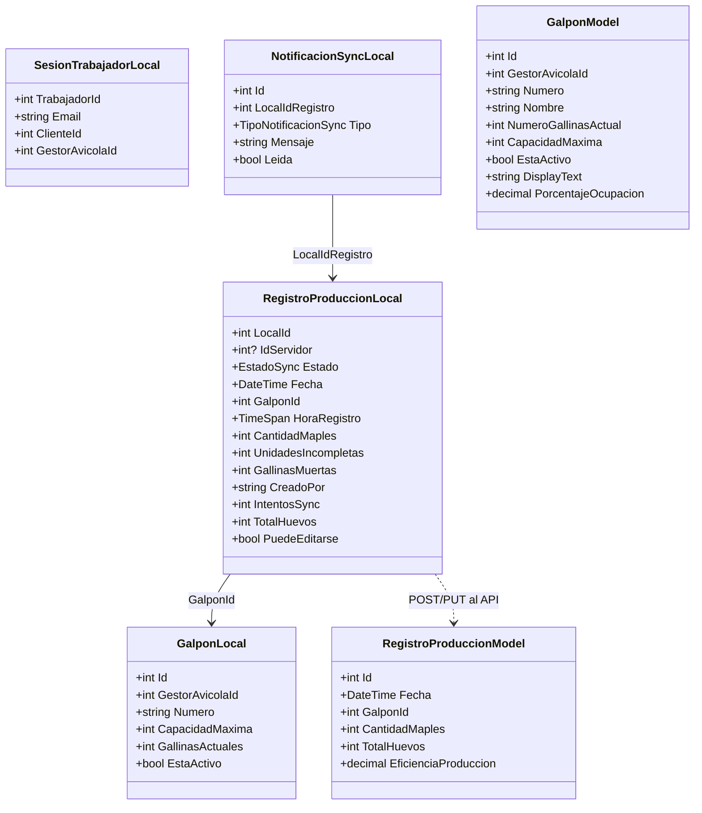

# 02 — Modelo de datos

**Última actualización:** 2026-06-29 — validado contra código fuente

La app maneja dos familias de modelos:

1. **DTOs de API / dominio** (`Core/Models/`, `Modules/GestionAvicola/Models/`) —
   serializados con `Newtonsoft.Json`.
2. **Modelos de persistencia SQLite** (`Core/Data/Models/`) — anotados con atributos de
   `sqlite-net-pcl` (`[Table]`, `[PrimaryKey]`, `[AutoIncrement]`, `[NotNull]`,
   `[MaxLength]`, `[Ignore]`).

---

## Modelos `Core/Models`

### `LoginRequest`
| Campo | Tipo | Notas |
|-------|------|-------|
| `Email` | string | `[Required][EmailAddress][StringLength(150)]` |
| `Password` | string | `[Required][StringLength(100, Min=6)]` |
| `RememberMe` | bool | default `false` |

### `LoginResponse` (+ `WorkerInfo`)
Mapeado con `[JsonProperty]` a los nombres del backend:

| Campo (móvil) | JSON backend | Tipo |
|---------------|--------------|------|
| `AccessToken` | `token` | string |
| `TokenType` | — | string (default `"Bearer"`) |
| `ExpiresIn` | — | int |
| `RefreshToken` | `refreshToken` | string? |
| `Worker` | `trabajadorInfo` | `WorkerInfo` |
| `AssignedModules` | `assignedModules` | `List<ModuleModel>` |
| `IsSuccess` | — | bool (lo fija el servicio) |
| `Message` | — | string |

`WorkerInfo`: `Id` (`id`), `FullName` (`nombreCompleto`), `Email` (`email`),
`Status`, `ClienteId` (`clienteId`, int?), `ClienteName` (`clienteNombre`).

### `ApiResponse<T>`
Envoltura estándar de resultado: `IsSuccess`, `Data` (T?), `ErrorMessage`,
`StatusCode` (int), `ErrorDetails`. Métodos estáticos `Success(data, statusCode=200)` y
`Error(message, statusCode=500, details=null)`.

### Otros
- `ModuleModel` — módulo asignado (`Id`, `Nombre`, …) usado por el menú dinámico.
- `AppVersionInfo` — respuesta de verificación de versión para `AppUpdateService`.
- `FlyoutModels` — modelos de presentación del menú Flyout.

---

## Modelos SQLite (`Core/Data/Models`)

Las 4 tablas creadas por `LocalDatabaseService.InitializeAsync()`:

### `RegistroProduccionLocal` — tabla `RegistrosProduccion`
Espejo de `CreateRegistroProduccionDiarioCommand` + metadatos de sincronización.

| Campo | Tipo | Atributos / notas |
|-------|------|-------------------|
| `LocalId` | int | `[PrimaryKey, AutoIncrement]` — PK local |
| `IdServidor` | int? | ID asignado por el servidor; NULL = no sincronizado |
| `EstadoInt` | int | `[NotNull]` default `Pendiente` |
| `Estado` | `EstadoSync` | `[Ignore]` acceso tipado sobre `EstadoInt` |
| `Fecha` | DateTime | `[NotNull]` |
| `GalponId` | int | `[NotNull]` |
| `NumeroRegistro` | int | 0 = pendiente de asignar por servidor |
| `HoraRegistroTicks` | string | `[NotNull][MaxLength(20)]` formato `hh:mm:ss` |
| `HoraRegistro` | TimeSpan | `[Ignore]` acceso tipado sobre `HoraRegistroTicks` |
| `CantidadMaples` | int | `[NotNull]` (1 maple = 30 huevos) |
| `UnidadesIncompletas` | int | `[NotNull]` (0–29) |
| `GallinasMuertas` | int | `[NotNull]` |
| `Observaciones` | string? | `[MaxLength(500)]` |
| `CausaProbableMortalidad` | string? | `[MaxLength(500)]` |
| `AccionesTomadasMortalidad` | string? | `[MaxLength(500)]` |
| `CreadoPor` | string | `[NotNull][MaxLength(256)]` email del trabajador |
| `FechaCreacionLocal` | DateTime | `[NotNull]` |
| `FechaSincronizacion` | DateTime? | NULL = no sincronizado |
| `IntentosSync` | int | máx. 3 antes de marcar Error |
| `ErrorSync` | string? | `[MaxLength(1000)]` último error |
| `EsPendiente` | bool | `[Ignore]` (Pendiente o PendienteEdicion) |
| `EstaSincronizado` | bool | `[Ignore]` (`IdServidor` y Estado=Sincronizado) |
| `PuedeEditarse` | bool | `[Ignore]` (`Fecha.Date == Today`) |
| `TotalHuevos` | int | `[Ignore]` `= CantidadMaples*30 + UnidadesIncompletas` |

### `GalponLocal` — tabla `GalponesCache`
Caché de galpones (espejo de `GalponDto`) para operar offline.

| Campo | Tipo | Notas |
|-------|------|-------|
| `Id` | int | `[PrimaryKey]` (viene del servidor, no autoincrement) |
| `GestorAvicolaId` | int | `[NotNull]` |
| `Numero` | string | `[NotNull][MaxLength(50)]` |
| `CapacidadMaxima` | int | `[NotNull]` |
| `GallinasActuales` | int | `[NotNull]` |
| `FechaNacimiento` | DateTime | |
| `Descripcion` | string? | `[MaxLength(500)]` |
| `EstaActivo` | bool | `[NotNull]` |
| `NombreGranja` | string? | `[MaxLength(256)]` |
| `UltimaActualizacion` | DateTime | control de frescura del caché |

### `SesionTrabajadorLocal` — tabla `SesionTrabajador`
Datos de sesión alineados con `WorkerInfo` y claims del JWT.

| Campo | Tipo | Notas |
|-------|------|-------|
| `TrabajadorId` | int | `[PrimaryKey]` (no autoincrement) |
| `Email` | string | `[NotNull][MaxLength(256)]` se usa como `CreadoPor`/`ModificadoPor` |
| `NombreCompleto` | string | `[NotNull][MaxLength(256)]` |
| `ClienteId` | int | `[NotNull]` |
| `ClienteNombre` | string | `[MaxLength(256)]` |
| `GestorAvicolaId` | int | claim JWT |
| `FechaLogin` | DateTime | vigencia de datos cacheados |

### `NotificacionSyncLocal` — tabla `NotificacionesSync`
Feedback visual al trabajador sobre el estado de sus registros.

| Campo | Tipo | Notas |
|-------|------|-------|
| `Id` | int | `[PrimaryKey, AutoIncrement]` |
| `LocalIdRegistro` | int | `[NotNull]` FK lógica → `RegistrosProduccion.LocalId` |
| `TipoInt` | int | `[NotNull]` |
| `Tipo` | `TipoNotificacionSync` | `[Ignore]` acceso tipado |
| `Mensaje` | string | `[NotNull][MaxLength(500)]` |
| `FechaNotificacion` | DateTime | `[NotNull]` |
| `Leida` | bool | `[NotNull]` |
| `GalponNumero` | string | `[MaxLength(50)]` |

### Enums

---

## Diagrama de clases (persistencia + DTOs clave)

---

## Modelos de GestionAvicola (`Modules/GestionAvicola/Models`)

| Modelo | Propósito |
|--------|-----------|
| `GalponModel` | Galpón para Pickers/listas. **`DisplayText => Nombre`** (solo el nombre). Campos: `Id`, `GestorAvicolaId`, `Numero`, `Nombre`, `NumeroGallinasActual`, `CapacidadMaxima`, `EstaActivo`; calculada `PorcentajeOcupacion`. |
| `GrupoGalponModel` | Agrupación de galpones |
| `RegistroProduccionModel` | Registro completo recibido del API (incluye `EficienciaProduccion`, `PorcentajeMortalidad`, `TotalHuevos`) |
| `RegistroProduccionRequest` | Contiene `CreateRegistroProduccionRequest` y `UpdateRegistroProduccionRequest`, ambos con `EsValido()` y campos `CreadoPor`/`ModificadoPor` |
| `HistorialRegistrosModels` | `FiltrosHistorialRegistros` (skip/take, fechas, galponId) y `HistorialRegistrosResponse` |
| `DespachoHuevoModel` / `CreateDespachoRequest` | Despachos de huevo (contabilidad) |
| `PedidoAlimentoModel` | Pedidos de alimento |
| `ResumenSemanalModel` | Balance semanal |
| `TareaDelDia`, `TareaAlimentacion`, `TareaIluminacion` | Tareas del día |
| `NotificacionResponse` | Respuesta de tareas/notificaciones del día |
| `CompletarTareaRequestDto`, `CompletarAlimentacionRequestDto`, `CompletarIluminacionRequestDto`, `ActivarIluminacionRequestDto`, `RegistrarAlimentacionRequestDto` | DTOs de acciones sobre tareas |

> **Corrección respecto a documentación previa:** `GalponModel.DisplayText` devuelve
> únicamente `Nombre` (no `"{Numero} - {Nombre} (...)"`).

### `CreateRegistroProduccionRequest` (campos y validación reales)
Campos: `Fecha` (default `Today`), `GalponId`, `HoraRegistro` (default `Now.TimeOfDay`),
`CantidadMaples`, `UnidadesIncompletas`, `GallinasMuertas`, `Observaciones?`,
`CausaProbableMortalidad?`, `AccionesTomadasMortalidad?`, **`CreadoPor`** (string),
calculada `TotalHuevos`. `EsValido()` exige `GalponId>0`, `Fecha<=Today`, numéricos `>=0`,
`UnidadesIncompletas<30` y `CreadoPor` no vacío.

`UpdateRegistroProduccionRequest` añade `Id` y `ModificadoPor`.

> El campo **`CreadoPor` ya está implementado y validado** en el código actual (el
> antiguo análisis de compatibilidad que lo reportaba como faltante quedó obsoleto).

### Mapa de código — modelos

| Concepto | Ruta real |
|----------|-----------|
| DTOs compartidos | `Core/Models/{LoginRequest,LoginResponse,ApiResponse,ModuleModel,AppVersionInfo,FlyoutModels}.cs` |
| Modelos SQLite | `Core/Data/Models/{RegistroProduccionLocal,GalponLocal,SesionTrabajadorLocal,NotificacionSyncLocal,EstadoSync,TipoNotificacionSync}.cs` |
| Modelos avícolas | `Modules/GestionAvicola/Models/*.cs` |
