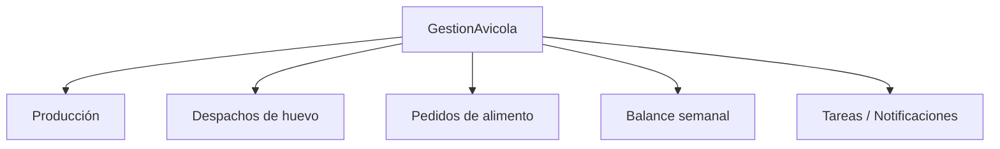

# 03 — Módulo Gestión Avícola (y Control de Acceso)

**Última actualización:** 2026-06-29 — validado contra código fuente

`Modules/GestionAvicola/` es el módulo funcional real de la app. Agrupa **5 submódulos**
con un total de **18 ViewModels**, **18 Views** y **5 servicios** (con sus interfaces).
`Modules/ControlAcceso/` es un **stub no funcional** (ver final del documento).

---

## Submódulo 1 — Registro de Producción

Permite a los trabajadores crear, editar y consultar registros diarios de producción de
huevos y mortalidad por galpón. **Funciona offline** (ver
[04-SINCRONIZACION-OFFLINE.md](04-SINCRONIZACION-OFFLINE.md)): al crear/editar se persiste
en SQLite y se sincroniza con el backend cuando hay internet.

- **ViewModels:** `CrearRegistroProduccionViewModel`, `EditarRegistroProduccionViewModel`,
  `HistorialRegistrosViewModel`, `WelcomeViewModel`.
- **Views:** `CrearRegistroProduccionPage`, `EditarRegistroProduccionPage`,
  `HistorialRegistrosPage`, `WelcomePage`.
- **Servicio:** `RegistroProduccionService` (`IRegistroProduccionService`).

### Reglas de negocio reales
- 1 maple = 30 huevos; `TotalHuevos = CantidadMaples*30 + UnidadesIncompletas`.
- `UnidadesIncompletas` debe estar en 0–29.
- Solo se pueden editar registros de **HOY** (`PuedeEditarse => Fecha.Date == Today`;
  converter `IsEditableDateConverter`).
- El campo `CreadoPor` (email del trabajador) es **obligatorio** y se valida en
  `EsValido()`. En edición se envía además `ModificadoPor`.
- El servicio fija el header `Authorization: Bearer {token}` por petición vía
  `EnsureAuthenticationAsync()`.

### Endpoints (`RegistroProduccionService`)
Base: `mobile/registro-produccion`

| Operación | Método | Endpoint |
|-----------|--------|----------|
| Listar galpones | GET | `mobile/registro-produccion/galpones` |
| Crear registro | POST | `mobile/registro-produccion` |
| Obtener por ID | GET | `mobile/registro-produccion/{id}` |
| Actualizar | PUT | `mobile/registro-produccion/{id}` |
| Eliminar | DELETE | `mobile/registro-produccion/{id}` |
| Historial | GET | `mobile/registro-produccion/historial?skip&take&fechaInicio&fechaFin&galponId` |

> La serialización de fechas usa `DateTimeZoneHandling.Unspecified` para evitar
> desplazamientos a UTC. Los errores de validación del backend (FluentValidation) se
> extraen con `ExtractErrorMessage(...)`.

---

## Submódulo 2 — Despachos de huevo (Contabilidad)

Gestión de despachos de huevo: creación, listado, detalle, edición, ejecución del
despacho y adjuntar foto de recibo.

- **ViewModels:** `CrearDespachoViewModel`, `DespachosViewModel`, `ListaDespachosViewModel`,
  `DetalleDespachoViewModel`, `EditarDespachoViewModel`, `DespacharDespachoViewModel`,
  `HistorialDespachosViewModel`.
- **Views:** `CrearDespachoPage`, `DespachosPage`, `ListaDespachosPage`,
  `DetalleDespachoPage`, `EditarDespachoPage`, `DespacharDespachoPage`,
  `HistorialDespachosPage`.
- **Servicios:** `ContabilidadAvicolaService` (`IContabilidadAvicolaService`),
  `DespachoHuevoService` (`IDespachoHuevoService`).

### Endpoints (`DespachoHuevoService`, base `mobile/contabilidad/despachos`)

| Operación | Método | Endpoint |
|-----------|--------|----------|
| Precios de referencia | GET | `mobile/contabilidad/despachos/precios` |
| Listar despachos | GET | `mobile/contabilidad/despachos?...` |
| Detalle de despacho | GET | `mobile/contabilidad/despachos/{id}` |
| Balance | GET | `mobile/contabilidad/despachos/balance` (con query opcional `?...`) |
| Crear despacho | POST | `mobile/contabilidad/despachos` |
| Actualizar despacho | PUT | `mobile/contabilidad/despachos/{id}` |
| Ejecutar despacho | POST | `mobile/contabilidad/despachos/{id}/despachar` |
| Subir foto de recibo | PUT | `mobile/contabilidad/despachos/{id}/foto-recibo` |
| Eliminar despacho | DELETE | `mobile/contabilidad/despachos/{id}` |

> `ContabilidadAvicolaService` cubre crear (POST), listar (GET `?skip&take`) y balance
> (GET `/balance`) sobre el mismo recurso, pero con `BaseEndpoint = "api/mobile/contabilidad/despachos"`
> (con prefijo `api/`). Ver la nota de inconsistencia en el submódulo Balance.

---

## Submódulo 3 — Pedidos de alimento

Solicitud y seguimiento de pedidos de alimento, con confirmación de recepción.

- **ViewModels:** `ListaPedidosAlimentoViewModel`, `CrearPedidoAlimentoViewModel`,
  `EditarPedidoAlimentoViewModel`, `DetallePedidoAlimentoViewModel`.
- **Views:** `ListaPedidosAlimentoPage`, `CrearPedidoAlimentoPage`,
  `EditarPedidoAlimentoPage`, `DetallePedidoAlimentoPage`.
- **Servicio:** `PedidoAlimentoService` (`IPedidoAlimentoService`).

### Endpoints
Base: `mobile/contabilidad/pedidos`

| Operación | Método | Endpoint |
|-----------|--------|----------|
| Precios | GET | `mobile/contabilidad/pedidos/precios` |
| Listar pedidos | GET | `mobile/contabilidad/pedidos` (con query opcional `?...`) |
| Detalle de pedido | GET | `mobile/contabilidad/pedidos/{id}` |
| Crear pedido | POST | `mobile/contabilidad/pedidos` |
| Actualizar pedido | PUT | `mobile/contabilidad/pedidos/{id}` |
| Solicitar pedido | POST | `mobile/contabilidad/pedidos/{id}/solicitar` |
| Confirmar recepción | POST | `mobile/contabilidad/pedidos/{id}/confirmar-recepcion` |
| Eliminar pedido | DELETE | `mobile/contabilidad/pedidos/{id}` |

---

## Submódulo 4 — Balance semanal

Vista de balance/resumen semanal de la actividad.

- **ViewModel:** `BalanceViewModel`. **View:** `BalancePage`.
- **Servicio:** `ContabilidadAvicolaService` (`IContabilidadAvicolaService`).
- **Endpoint:** GET `{BaseEndpoint}/balance`. Nota: `ContabilidadAvicolaService` define
  `BaseEndpoint = "api/mobile/contabilidad/despachos"` (incluye el prefijo `api/`),
  por lo que su ruta es `api/mobile/contabilidad/despachos/balance` y la consulta de
  lista es `api/mobile/contabilidad/despachos?skip&take`. `DespachoHuevoService` usa el
  mismo recurso pero con base `mobile/contabilidad/despachos` (sin `api/`) e incluye
  `/balance?...` con query. Ver nota de inconsistencia abajo.
- **Modelo:** `ResumenSemanalModel`.

> Inconsistencia real en el código: `ContabilidadAvicolaService` antepone `api/` a su
> `BaseEndpoint`, mientras que el resto de servicios (incluido `DespachoHuevoService`)
> NO lo hacen porque la `BaseAddress` del `HttpClient` ya termina en `/api/`. Documentado
> tal cual aparece en el código; es candidato a corrección en el código fuente.

---

## Submódulo 5 — Tareas del día / Notificaciones

Carga de tareas del día (vacunación, iluminación, alimentación) y acciones para
completarlas. Incluye una vista de notificaciones de sincronización (feedback de
`SyncService`).

- **ViewModels:** `NotificacionesViewModel`, `SyncNotificacionesViewModel`.
- **Views:** `NotificacionesPage`, `SyncNotificacionesPage`.
- **Servicio:** `NotificacionesService` (`INotificacionesService`, singleton).
- **Modelos:** `NotificacionResponse`, `TareaDelDia`, `TareaAlimentacion`,
  `TareaIluminacion`, y los `*RequestDto` de completar/activar.

### Endpoints
Base: `mobile/notificaciones`

| Operación | Método | Endpoint |
|-----------|--------|----------|
| Tareas del día | GET | `mobile/notificaciones/dia` |
| Tareas pendientes | GET | `mobile/notificaciones/pendientes` |
| Completar vacunación | POST | `mobile/notificaciones/vacunacion/completar` |
| Activar iluminación | POST | `mobile/notificaciones/iluminacion/activar` |
| Completar iluminación | POST | `mobile/notificaciones/iluminacion/completar` |
| Completar alimentación | POST | `mobile/notificaciones/alimentacion/completar` |
| Registrar alimentación | POST | `mobile/notificaciones/alimentacion/registrar` |

> UX importante: tras completar una tarea, el ViewModel desactiva `IsLoading` antes de
> recargar (`CargarTareasAsync` tiene guard `if (IsLoading) return;`) para que la lista
> se refresque automáticamente mostrando solo pendientes.

---

## Tabla resumen — ViewModels / Views por submódulo

| Submódulo | ViewModels | Views |
|-----------|-----------|-------|
| Producción | 4 (Crear, Editar, Historial, Welcome) | 4 |
| Despachos | 7 | 7 |
| Pedidos alimento | 4 | 4 |
| Balance | 1 | 1 |
| Tareas/Notif. | 2 (Notificaciones, SyncNotificaciones) | 2 |
| **Total** | **18** | **18** |

### Mapa de código — GestionAvicola

| Concepto | Ruta real |
|----------|-----------|
| ViewModels | `Modules/GestionAvicola/ViewModels/*.cs` |
| Views | `Modules/GestionAvicola/Views/*.xaml(.cs)` |
| Servicios + interfaces | `Modules/GestionAvicola/Services/*.cs` |
| Modelos | `Modules/GestionAvicola/Models/*.cs` |

---

## Módulo Control de Acceso — STUB (no funcional)

`Modules/ControlAcceso/` existe pero **no está implementado funcionalmente**. No hay
servicio asociado, no llama a ninguna API, no persiste datos y **no incluye biometría ni
reconocimiento facial**.

- **ViewModels:** `WelcomeControlAccesoViewModel`, `RegistrarAccesoViewModel`,
  `HistorialAccesosViewModel`.
- **Views:** `WelcomeControlAccesoView`, `RegistrarAccesoPage`, `HistorialAccesosPage`.

`RegistrarAccesoViewModel` solo valida que el nombre y documento no estén vacíos y
muestra un `Shell.Current.DisplayAlert("Registro Exitoso", ...)` simulado; luego limpia
el formulario. No hay llamada HTTP ni persistencia. Debe tratarse como **placeholder**
pendiente de implementación.

> Estado: el módulo se registra en DI y en la navegación, pero su comportamiento es
> puramente simulado.
