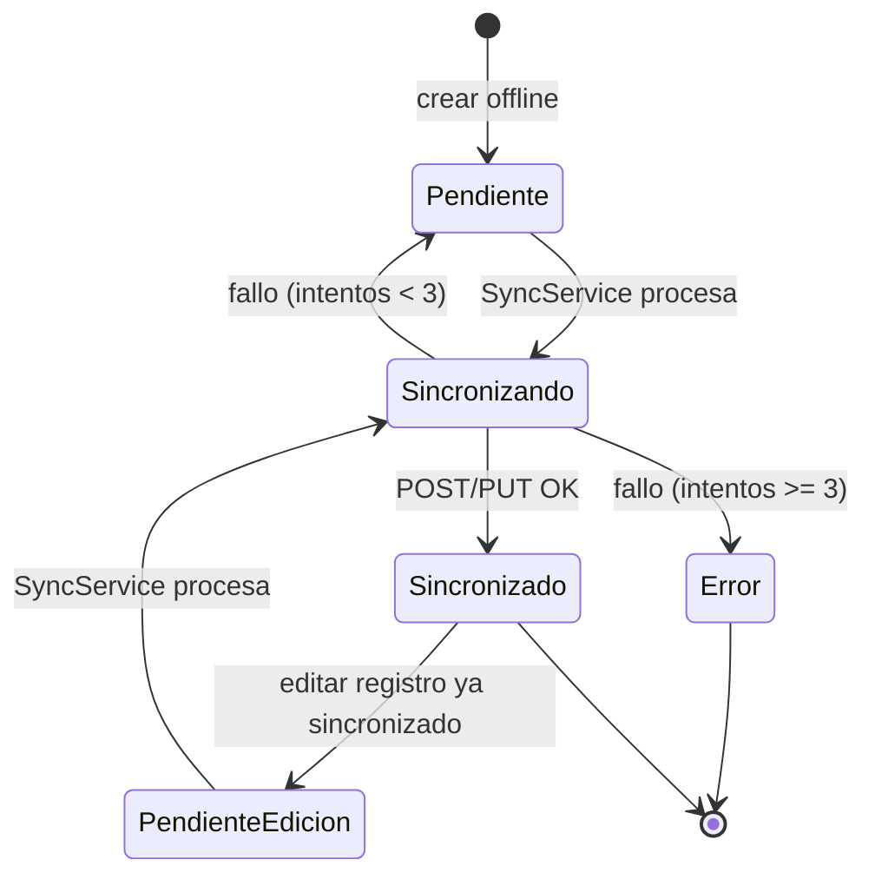

# 04 — Sincronización y arquitectura offline-first

**Última actualización:** 2026-06-29 — validado contra código fuente

IMGA opera **offline-first**: las operaciones de registro de producción se persisten
primero en **SQLite local** y luego se suben al backend ICARUS cuando hay conectividad.
La sincronización es automática (al recuperar internet) y manual.

## Componentes

| Servicio | Ciclo de vida | Responsabilidad |
|----------|---------------|-----------------|
| `LocalDatabaseService` | Singleton | Conexión única a `imga_local.db3`; crea las 4 tablas; `SemaphoreSlim` de init |
| `RegistroOfflineService` | Transient | Crear/editar/consultar registros en SQLite; fija estados de sync |
| `CacheSyncService` | Transient | Descargar y cachear galpones + sesión tras el login (uso offline) |
| `SyncService` | Transient | Subir registros pendientes al backend (POST/PUT), reintentos, notificaciones |
| `ConnectivityService` | Singleton | Monitorear conectividad; disparar sync automático |
| `AppUpdateService` | Singleton | Verificar nueva versión de la app |
| Repositorios | Transient | `RegistroLocalRepository`, `GalponLocalRepository`, `SesionLocalRepository`, `NotificacionSyncRepository` |

### Mapa de código — offline/sync

| Concepto | Ruta real |
|----------|-----------|
| Base de datos | `Core/Data/LocalDatabaseService.cs` |
| Repositorios | `Core/Data/{Registro,Galpon,Sesion}LocalRepository.cs`, `Core/Data/NotificacionSyncRepository.cs` |
| Sincronización | `Core/Services/SyncService.cs` (+ `Models/ResultadoSync.cs`) |
| Conectividad | `Core/Services/ConnectivityService.cs` |
| Offline | `Core/Services/RegistroOfflineService.cs` |
| Caché | `Core/Services/CacheSyncService.cs` |
| Auto-update | `Core/Services/AppUpdateService.cs` |

---

## SyncService — lógica real

`SincronizarPendientesAsync()`:

1. Si no hay internet (`ConnectivityService.TieneInternet`), pospone.
2. Usa un `SemaphoreSlim(1,1)` para evitar sincronizaciones concurrentes (sale si ya hay
   una en curso).
3. Asegura un token JWT válido (`AsegurarTokenValidoAsync` → refresh si expiró; ver
   [05-AUTENTICACION-API.md](05-AUTENTICACION-API.md)).
4. Obtiene los registros pendientes (`GetPendientesAsync`) y los procesa uno a uno,
   verificando internet antes de cada envío y emitiendo evento `ProgresoSync`.
5. Por cada registro:
   - **Nuevo** (`Pendiente`) → `POST mobile/registro-produccion` vía
     `RegistroProduccionService.CrearRegistroProduccionAsync`. Al éxito,
     `MarcarSincronizadoAsync(localId, idServidor, numeroRegistro)`.
   - **Editado** (`PendienteEdicion` con `IdServidor`) → `PUT .../{id}` vía
     `ActualizarRegistroProduccionAsync`.
6. **Reintentos:** `IncrementarIntentosAsync` antes de enviar; máximo **`MaxIntentos = 3`**.
   Al superarlo, `MarcarErrorAsync` (estado `Error`). En cada paso genera una
   `NotificacionSyncLocal` (`Exito` / `Error` / `Reintento`) para feedback en
   `SyncNotificacionesPage`.

`SincronizarRegistroAsync(localId)` permite sincronizar un registro puntual.

---

## ConnectivityService — auto-sync

- `IniciarMonitoreo()` se invoca en el arranque diferido **en el MainThread** (la API
  `Connectivity.Current` de MAUI lo requiere).
- Expone `TieneInternet` y el evento `ConectividadCambio`.
- En `MauiProgram`, al recibir `ConectividadCambio` con internet, se resuelve
  `ISyncService` y se llama `SincronizarPendientesAsync()`.

---

## Flujo: crear offline → sincronizar

```mermaid
sequenceDiagram
    participant U as Trabajador
    participant VM as CrearRegistroProduccionViewModel
    participant Off as RegistroOfflineService
    participant Repo as RegistroLocalRepository
    participant DB as SQLite (imga_local.db3)
    participant Conn as ConnectivityService
    participant Sync as SyncService
    participant API as Backend ICARUS

    U->>VM: Guardar registro
    VM->>Off: Crear registro (offline)
    Off->>Repo: Insert RegistroProduccionLocal (Estado=Pendiente)
    Repo->>DB: INSERT
    Note over DB: Registro persistido localmente (sin internet)

    Conn-->>Sync: ConectividadCambio (internet recuperado)
    Sync->>Sync: SemaphoreSlim + AsegurarTokenValido
    Sync->>Repo: GetPendientesAsync()
    loop por cada pendiente
        Sync->>Repo: IncrementarIntentosAsync
        alt nuevo
            Sync->>API: POST mobile/registro-produccion
        else editado
            Sync->>API: PUT mobile/registro-produccion/{id}
        end
        alt éxito
            API-->>Sync: 200/201 + datos
            Sync->>Repo: MarcarSincronizadoAsync (Estado=Sincronizado)
            Sync->>Repo: Notificación Exito
        else fallo
            API-->>Sync: error
            Sync->>Repo: si IntentosSync>=3 -> MarcarErrorAsync (Estado=Error)
            Sync->>Repo: Notificación Error/Reintento
        end
        Sync-->>VM: evento ProgresoSync
    end
```

---

## Estados de sincronización



| Estado (`EstadoSync`) | Valor | Significado |
|-----------------------|-------|-------------|
| `Pendiente` | 0 | Creado local, falta enviar |
| `Sincronizando` | 1 | En envío |
| `Sincronizado` | 2 | Confirmado por el servidor |
| `Error` | 3 | Falló tras 3 reintentos |
| `PendienteEdicion` | 4 | Ya sincronizado pero editado, re-sincronizar con PUT |

---

## CacheSyncService y AppUpdateService

- **CacheSyncService:** tras un login exitoso, descarga galpones y datos de sesión y los
  guarda en SQLite (`GalponesCache`, `SesionTrabajador`) para permitir operar sin
  conexión. Se invoca desde `LoginViewModel` (no desde `AuthenticationService`) para
  evitar una dependencia circular Auth → Cache → RegistroService → Auth.
- **AppUpdateService:** consulta `GET mobile/check-version?appName=IMGA` y compara con la
  versión instalada (`AppVersionInfo`) para avisar de actualizaciones.
