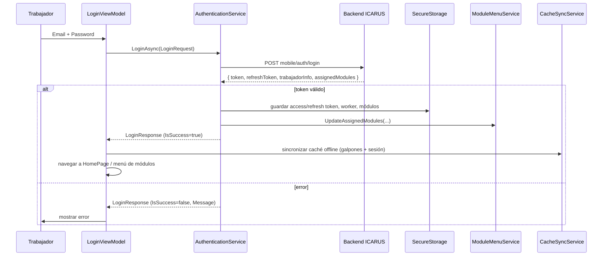

# 05 — Autenticación e integración con la API

**Última actualización:** 2026-06-29 — validado contra código fuente

## HttpClient `IcarusAPI`

Configurado en `MauiProgram.RegisterInfrastructureServices`:

- Named client **`"IcarusAPI"`** vía `AddHttpClient`, con `BaseAddress` según entorno,
  `Timeout = 30s` y header `User-Agent: ICARUS-Mobile/1.0`.
- Además se registra `Transient<HttpClient>` que crea ese cliente mediante
  `IHttpClientFactory.CreateClient("IcarusAPI")`, de modo que los servicios reciben un
  `HttpClient` ya apuntando al backend.
- Cada servicio añade `Accept: application/json` y fija el `Authorization: Bearer {token}`
  por petición (no global), tras validar autenticación.

### URLs por entorno (`GetApiBaseUrl()`)

| Entorno | URL base | Detección |
|---------|----------|-----------|
| DEBUG · emulador | `http://10.0.2.2:5090/api/` | `DeviceInfo` contiene `sdk_gphone`/`Emulator`/`Android SDK` |
| DEBUG · dispositivo físico | `http://192.168.0.106:5090/api/` | resto de dispositivos en DEBUG |
| RELEASE · producción | `https://api.icarus.trajano.online/api/` | compilación Release |

> Flag `USE_PRODUCTION_IN_DEBUG` (const en `MauiProgram.cs`, default `false`): si se pone
> a `true`, en DEBUG apunta también a producción. Ante error al resolver la URL, hace
> fallback a `http://10.0.2.2:5090/api/`.

---

## AuthenticationService

`Core/Services/AuthenticationService.cs` (`IAuthenticationService`, Transient).
Dependencias: `HttpClient`, `IEmulatorLoggingService`, `ILogger`, `IModuleMenuService`,
`ISesionLocalRepository`, `ISecureStorageService`.

### Operaciones

| Método | Descripción | Endpoint |
|--------|-------------|----------|
| `LoginAsync(LoginRequest)` | Autentica; guarda tokens, worker y módulos; actualiza menú | `POST mobile/auth/login` |
| `RefreshTokenAsync(refreshToken)` | Renueva tokens | `POST /auth/refresh` |
| `LogoutAsync()` | Limpia SecureStorage, módulos, header y sesión SQLite | — |
| `IsAuthenticatedAsync()` | Hay token y no expiró | — |
| `IsTokenExpiredAsync()` | Lee `exp` del JWT con `JwtSecurityTokenHandler` | — |
| `GetCurrentTokenAsync()` | Token de acceso almacenado | — |
| `GetCurrentWorkerAsync()` | `WorkerInfo` almacenado | — |
| `LoadStoredModulesAsync()` | Recarga módulos desde almacenamiento local | — |
| `ClearSimulatedDataAsync()` | Limpia datos de simulación heredados | — |

Evento `ModulesUpdated` para notificar cambios de módulos al Shell.

### Validación de token JWT
Usa `System.IdentityModel.Tokens.Jwt` (`JwtSecurityTokenHandler`): si el token no es
legible o `DateTime.UtcNow >= jwt.ValidTo`, se considera expirado. `SyncService` y los
servicios de negocio fuerzan refresh antes de operaciones contra el API.

---

## Almacenamiento seguro (SecureStorage)

`SecureStorageService` (`ISecureStorageService`, Singleton) abstrae el `SecureStorage` de
MAUI. Esta abstracción permite **probar `AuthenticationService` y `SyncService` fuera del
emulador** (ver [06-PRUEBAS.md](06-PRUEBAS.md)).

| Clave | Contenido |
|-------|-----------|
| `icarus_access_token` | Token JWT de acceso |
| `icarus_refresh_token` | Refresh token |
| `icarus_worker_info` | `WorkerInfo` serializado (JSON) |
| `icarus_assigned_modules` | Módulos asignados (`List<ModuleModel>` JSON) |

---

## Flujo de login

> El mapeo JSON usa los nombres del backend (`token`, `refreshToken`, `trabajadorInfo`,
> `assignedModules`) — ver `LoginResponse` en [02-MODELO-DATOS.md](02-MODELO-DATOS.md).

---

## Tabla de endpoints (todos los servicios)

| Servicio | Método | Endpoint |
|----------|--------|----------|
| AuthenticationService | POST | `mobile/auth/login` |
| AuthenticationService | POST | `/auth/refresh` |
| RegistroProduccionService | GET | `mobile/registro-produccion/galpones` |
| RegistroProduccionService | POST | `mobile/registro-produccion` |
| RegistroProduccionService | GET/PUT/DELETE | `mobile/registro-produccion/{id}` |
| RegistroProduccionService | GET | `mobile/registro-produccion/historial?skip&take&fechaInicio&fechaFin&galponId` |
| DespachoHuevoService | GET | `mobile/contabilidad/despachos`, `/precios`, `/{id}`, `/balance` |
| DespachoHuevoService | POST | `mobile/contabilidad/despachos`, `/{id}/despachar` |
| DespachoHuevoService | PUT | `mobile/contabilidad/despachos/{id}`, `/{id}/foto-recibo` |
| DespachoHuevoService | DELETE | `mobile/contabilidad/despachos/{id}` |
| ContabilidadAvicolaService | GET/POST | `api/mobile/contabilidad/despachos` (con prefijo `api/`), `/balance` |
| PedidoAlimentoService | GET | `mobile/contabilidad/pedidos`, `/precios`, `/{id}` |
| PedidoAlimentoService | POST | `mobile/contabilidad/pedidos`, `/{id}/solicitar`, `/{id}/confirmar-recepcion` |
| PedidoAlimentoService | PUT/DELETE | `mobile/contabilidad/pedidos/{id}` |
| NotificacionesService | GET | `mobile/notificaciones/dia`, `/pendientes` |
| NotificacionesService | POST | `mobile/notificaciones/{vacunacion/completar, iluminacion/activar, iluminacion/completar, alimentacion/completar, alimentacion/registrar}` |
| AppUpdateService | GET | `mobile/check-version?appName=IMGA` |

### Manejo de errores
- `ApiResponse<T>.Error(...)` encapsula código y mensaje.
- `RegistroProduccionService.ExtractErrorMessage(...)` parsea respuestas de error del
  backend (incluye errores de FluentValidation y formatos `message`/`title`/`detail`).
- Excepciones de red (`HttpRequestException`, `TaskCanceledException`/timeout) se capturan
  y se traducen a mensajes legibles para el usuario.
