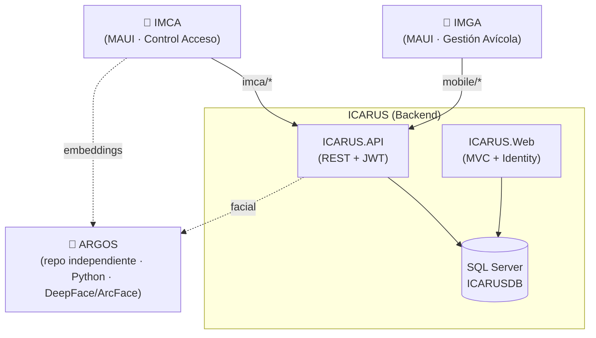

# 📚 Documentación Trajano

**Última actualización:** 2026-07-02 — validado contra código fuente.

Repositorio centralizado de documentación técnica de los tres proyectos del ecosistema **ICARUS**. Toda la documentación está validada contra el código real y optimizada para ser consultada tanto por personas como por **agentes IA** (vía el servidor MCP incluido en `.mcp-server/`).

## 🧩 Proyectos

| Proyecto | Tipo | Descripción | Stack | Código |
|----------|------|-------------|-------|--------|
| [**ICARUS**](./ICARUS/) | Backend + Web | Sistema de gestión empresarial (Clean Architecture + CQRS) con API REST y portal MVC | .NET 10, EF Core 10, SQL Server, MediatR, ASP.NET Identity | `../ICARUS` |
| [**IMGA**](./IMGA/) | App móvil | *Icarus Mobile Gestión Avícola* — app Android offline-first para registro de producción avícola, despachos, pedidos de alimento y tareas | .NET 10 MAUI (Android), CommunityToolkit.Mvvm, SQLite | `../ICARUS_MOBILE/IMGA` |
| [**IMCA**](./IMCA/) | App móvil | *Icarus Mobile Control App* — control de acceso por reconocimiento facial (ONNX local + ARGOS) en modo kiosco offline | .NET 10 MAUI (Android), CommunityToolkit.Mvvm, SQLite, ONNX Runtime | `../IMCA` |
| [**ARGOS**](./ARGOS/) | Microservicio | Reconocimiento facial (embeddings ArcFace) para el módulo de Control de Acceso; repositorio independiente, se comunica con ICARUS.API solo por HTTP/REST | Python 3.9/3.11, Flask, DeepFace | `../ARGOS` |

> **Relación entre proyectos:** IMGA e IMCA son clientes móviles que consumen la **API REST de ICARUS** (`ICARUS.API`) mediante JWT. El reconocimiento facial (IMCA) se apoya en el microservicio **ARGOS**, que es un repositorio propio (no vive dentro de ICARUS) y se integra únicamente por HTTP.



## 📂 Estructura real de la documentación

```
DocumentacionProyectos/
├── README.md                  # Este índice global
├── .mcp-server/               # Servidor MCP que sirve estos docs a agentes IA
├── ICARUS/
│   ├── README.md              # Índice del proyecto
│   ├── 00-RESUMEN-EJECUTIVO-ARQUITECTURA.md
│   ├── 01-DOMAIN-ENTIDADES.md
│   ├── 02-APPLICATION-CQRS.md
│   ├── 03-INFRASTRUCTURE.md
│   ├── 04-API-ENDPOINTS.md
│   ├── 05-WEB-MVC.md
│   ├── 06-MOBILE-ARQUITECTURA.md
│   ├── 07-FLUJOS-NEGOCIO.md
│   ├── SISTEMA-*.md           # Notificaciones / Registro producción
│   └── diagramas/             # clases.md · secuencia.md · estado.md (Mermaid)
├── IMGA/
│   ├── README.md
│   ├── 01-ARQUITECTURA.md
│   ├── 02-MODELO-DATOS.md
│   ├── 03-MODULO-GESTION-AVICOLA.md
│   ├── 04-SINCRONIZACION-OFFLINE.md
│   ├── 05-AUTENTICACION-API.md
│   └── 06-PRUEBAS.md
├── IMCA/
│   ├── README.md
│   ├── 00-HISTORICO.md
│   ├── 01-ARQUITECTURA.md
│   ├── 02-MODELO-DATOS.md
│   ├── 03-RECONOCIMIENTO-FACIAL.md
│   ├── 03-GUIA-ESTILO-CODIGO.md
│   ├── 04-MODO-KIOSCO-Y-OFFLINE.md
│   ├── 05-AUTENTICACION.md
│   ├── GUIA-*.md              # Consultar SQLite, scripts, logs
│   ├── CHANGELOG-2026-01-01.md
│   └── Diagramas Mermaid/
└── ARGOS/
    ├── README.md
    └── 01-ARQUITECTURA.md
```

## 🤖 Acceso para agentes IA (MCP)

El directorio `.mcp-server/` contiene un servidor **Model Context Protocol** que expone esta documentación con las herramientas `search_docs`, `read_doc`, `list_docs`, `create_doc` y `update_doc` (filtrables por proyecto `ICARUS` | `IMCA` | `IMGA` | `ARGOS`). Escanea recursivamente archivos `.md` y `.mmd`, por eso todos los diagramas se mantienen en ese formato.

## 📐 Convenciones

- **Diagramas en Mermaid** dentro de bloques ` ```mermaid ` (renderiza en GitHub y es legible por el MCP).
- Cada proyecto tiene su `README.md` como índice de entrada.
- Documentos en **español con acentos correctos**.
- Cada documento abre con `**Última actualización:** AAAA-MM-DD — validado contra código fuente`.
- Cada documento incluye, donde aplica, una tabla **"Mapa de código"** que relaciona cada concepto con su ruta real de archivo, para facilitar la navegación por agentes IA.
